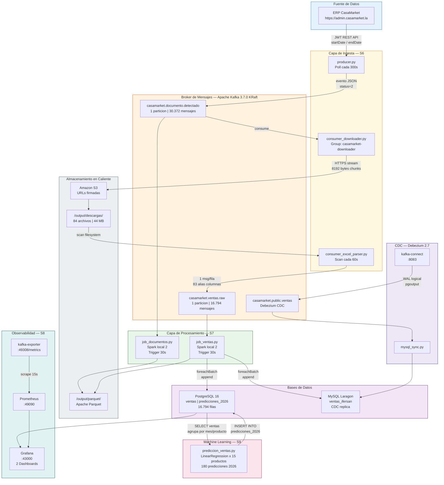
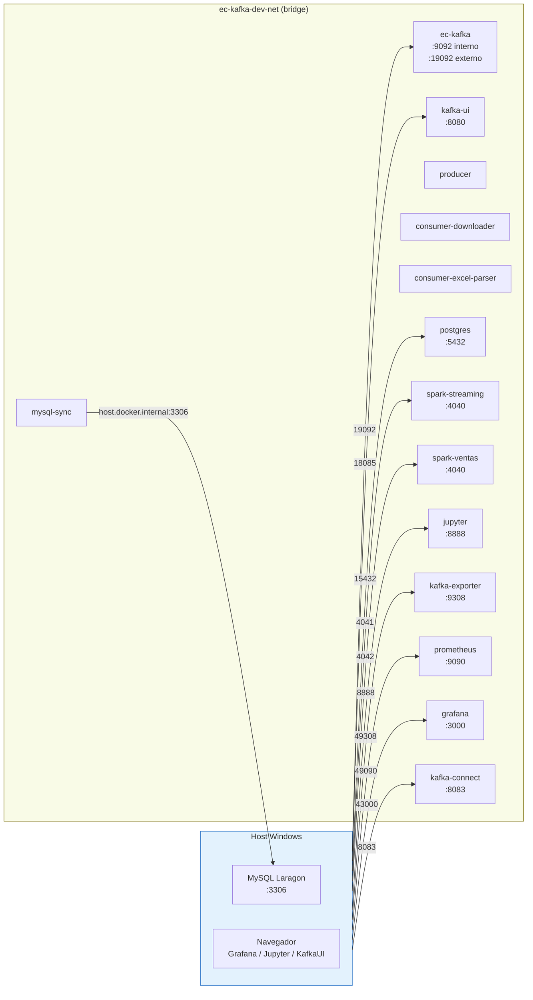

# Arquitectura del Sistema

## Patron Arquitectonico: Kappa Architecture

El pipeline implementa la **arquitectura Kappa**, donde todo el procesamiento ocurre en la capa de streaming. No existe una capa batch separada; el reprocessing se logra recreando los jobs de Spark desde los offsets de Kafka.



---

## Principios de Diseno

### Idempotencia mediante estado persistente
Cada componente mantiene un archivo JSON de IDs o nombres ya procesados. Esto garantiza que reinicios del sistema no generen duplicados en Kafka ni en la base de datos.

| Componente | Archivo de estado | Contenido |
|-----------|------------------|-----------|
| Producer | `producer/state_documentos.json` | 175 IDs de documentos publicados |
| Downloader | `consumer/state_downloads.json` | 175 IDs de documentos descargados |
| Parser | `consumer/state_excel_parsed.json` | 215 nombres de archivos parseados |

### Tolerancia a fallos con retry
Todos los componentes Python implementan retry con backoff lineal de 10 segundos antes de declarar fallo definitivo.

| Componente | Intentos max | Delay |
|-----------|-------------|-------|
| Producer → Kafka | 10 | 10s |
| Downloader → Kafka | 15 | 10s |
| mysql_sync → MySQL | 15 | 10s |
| registrar_conector → Kafka Connect | 20 | 10s |

### Checkpointing de Spark
Spark Structured Streaming persiste sus offsets y estado en directorios locales:

```
output/checkpoints/
├── raw/        # job_ventas.py — ventas raw
├── ventanas/   # job_documentos.py — windowed aggregations
├── metricas/   # job_documentos.py — metricas de latencia
└── agg/        # job_documentos.py — aggregations por extension
```

---

## Red Docker

Todos los servicios comparten la red `ec-kafka-dev-net` (bridge). El servicio `mysql-sync` usa `host.docker.internal:3306` para alcanzar MySQL Laragon en el host Windows.


