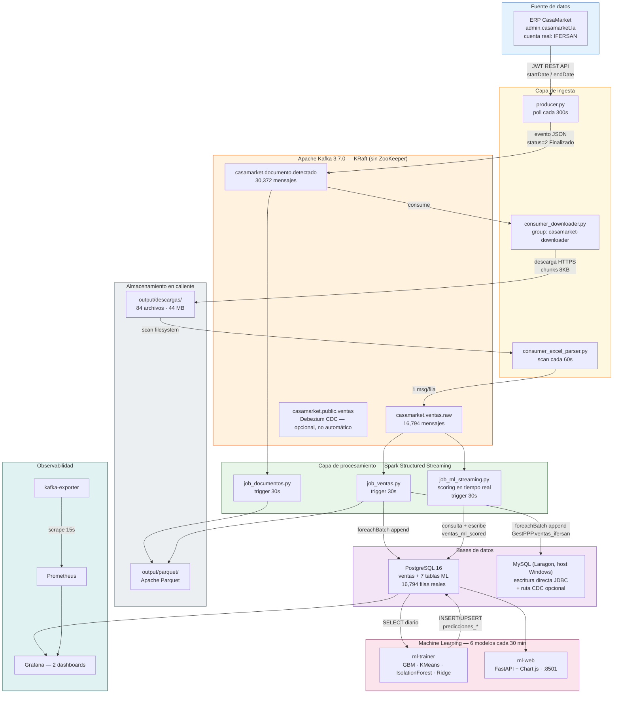
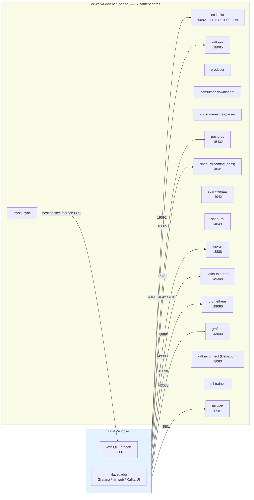

# Arquitectura del Sistema

## Patrón arquitectónico: Kappa Architecture

El pipeline implementa **arquitectura Kappa**: todo el procesamiento ocurre en la capa de streaming, no existe una capa batch separada. Si hay que reprocesar datos, se vuelve a leer Kafka desde el offset que haga falta (`startingOffsets=earliest`) en vez de mantener dos pipelines distintos (uno batch y uno streaming) como en Lambda.



---

## Tres jobs de Spark, no dos

Una particularidad de este pipeline frente a una arquitectura Kappa "de libro" es que hay **tres** jobs de Spark Structured Streaming corriendo en paralelo sobre los mismos topics, cada uno con una responsabilidad distinta:

| Job | Lee de | Hace | Escribe en |
|---|---|---|---|
| `job_documentos.py` | `documento.detectado` | Cuenta documentos, calcula latencia ERP→Spark, agrega por ventanas de 5 min | Parquet (4 sinks) |
| `job_ventas.py` | `ventas.raw` | Castea tipos, persiste cada venta | PostgreSQL `ventas` + MySQL `ventas_ifersan` + Parquet |
| `job_ml_streaming.py` | `ventas.raw` | Por cada micro-batch, **vuelve a consultar PostgreSQL** (no usa el batch en sí) para comparar el acumulado real del día contra la predicción GBM y clasificar el estado de cada producto | PostgreSQL `ventas_ml_scored` |

`job_ml_streaming.py` es el componente más fácil de pasar por alto: no entrena ni carga ningún modelo de ML dentro de Spark — usa Kafka únicamente como "heartbeat" cada 30s para disparar una consulta SQL que compara `SUM(ventas de hoy)` contra la fila de `predicciones_diarias` que generó `ml-trainer`. El detalle completo está en [Spark Streaming](../componentes/spark-streaming.md).

---

## Principios de diseño

### Idempotencia mediante estado persistente

Cada componente Python mantiene un archivo JSON con los IDs o nombres ya procesados, para que un reinicio del contenedor no duplique mensajes en Kafka ni filas en PostgreSQL.

| Componente | Archivo de estado | Contenido |
|-----------|------------------|-----------|
| Producer | `producer/state_documentos.json` | IDs de documentos ya publicados a Kafka |
| Downloader | `consumer/state_downloads.json` | IDs de documentos ya descargados |
| Parser | `consumer/state_excel_parsed.json` | Nombres de archivo ya parseados |

Esto es deduplicación a nivel de aplicación, no la garantía nativa de productor idempotente de Kafka (el `KafkaProducer` del producer usa `acks="all", retries=3`, sin `enable_idempotence`). En la práctica el resultado es **at-least-once delivery + dedup por estado**, que es indistinguible de exactly-once para este caso de uso.

### Tolerancia a fallos con retry

Todos los componentes Python reintentan la conexión a Kafka con backoff lineal de 10 segundos antes de fallar definitivamente (hasta 10–15 intentos según el componente).

### Checkpointing de Spark

Cada query de Structured Streaming tiene su propio directorio de checkpoint, para que un reinicio retome exactamente donde se quedó:

```
output/checkpoints/
├── raw/                  # job_documentos.py — eventos raw
├── agg/                  # job_documentos.py — conteo por extensión
├── ventanas/             # job_documentos.py — ventanas de 5 min
├── metricas/             # job_documentos.py — latencia
├── ventas_raw/           # job_ventas.py — ventas → Parquet
├── ventas_agg/           # job_ventas.py — ventas → PostgreSQL/MySQL
└── ml_streaming_v2/      # job_ml_streaming.py — scoring en tiempo real
```

---

## Red Docker

Todos los servicios comparten la red bridge `ec-kafka-dev-net`. El servicio `mysql-sync` (componente CDC opcional) usa `host.docker.internal:3306` para alcanzar una instancia de MySQL en el host Windows (Laragon).



El detalle de cada uno de los 17 servicios (imagen, puertos, healthchecks) está en [Infraestructura Docker](infraestructura.md).
