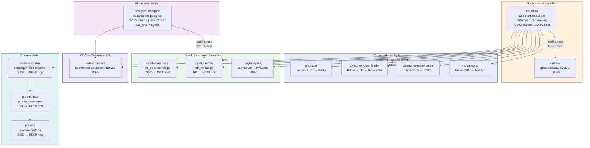
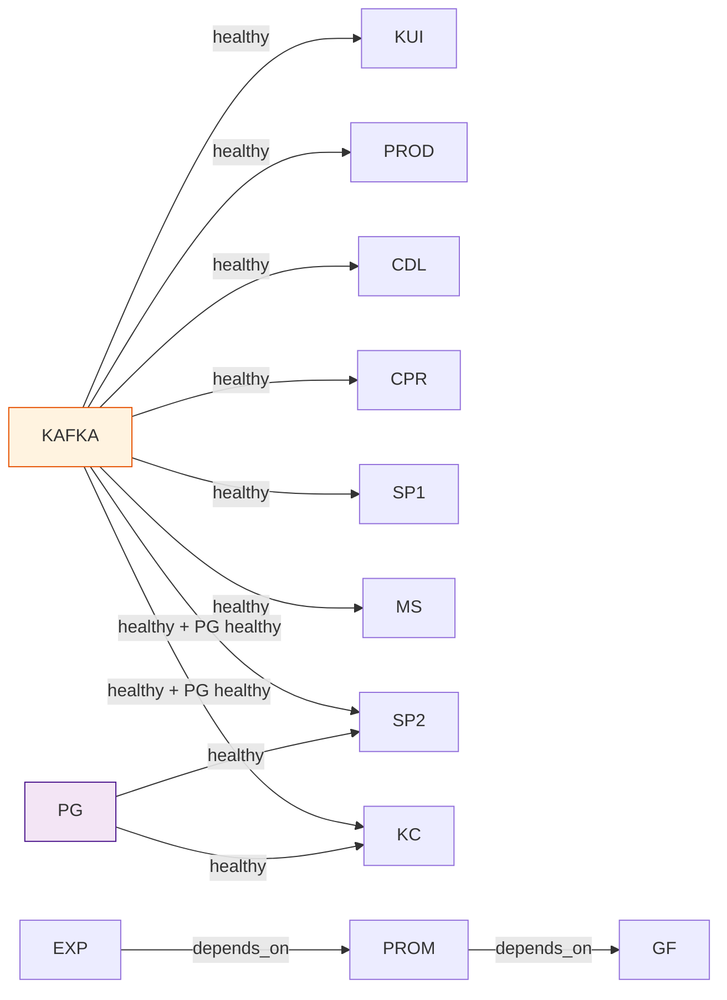

# Infraestructura Docker

## Servicios y Puertos

El sistema se compone de **13 servicios Docker** orquestados en un `docker-compose.yml` de 331 lineas, todos conectados a la red bridge `ec-kafka-dev-net`.



---

## Tabla de Servicios Completa

| Servicio | Imagen | Puerto Host | Puerto Interno | Proposito |
|---------|--------|-------------|----------------|-----------|
| ec-kafka | apache/kafka:3.7.0 | 19092 | 9092 / 9093 | Broker + Controller KRaft |
| kafka-ui | ghcr.io/kafbat/kafka-ui | 18085 | 8080 | Interfaz web de administracion |
| producer | casamarket-python | — | — | Ingesta desde ERP |
| consumer-downloader | casamarket-python | — | — | Descarga de archivos S3 |
| consumer-excel-parser | casamarket-python | — | — | Parseo Excel a Kafka |
| postgres | postgres:16-alpine | 15432 | 5432 | Base de datos principal |
| spark-streaming | jupyter/pyspark-notebook | 4041 | 4040 | job_documentos.py |
| spark-ventas | jupyter/pyspark-notebook | 4042 | 4040 | job_ventas.py |
| jupyter | jupyter/pyspark-notebook | 8888, 4040 | 8888, 4040 | Notebooks interactivos |
| kafka-exporter | danielqsj/kafka-exporter | 49308 | 9308 | Metricas para Prometheus |
| prometheus | prom/prometheus | 49090 | 9090 | Recoleccion de metricas |
| grafana | grafana/grafana | 43000 | 3000 | Visualizacion de dashboards |
| kafka-connect | quay.io/debezium/connect:2.7 | 8083 | 8083 | CDC PostgreSQL → Kafka |
| mysql-sync | casamarket-python | — | — | Kafka CDC → MySQL Laragon |

---

## Configuracion de Kafka KRaft

Kafka 3.7.0 funciona en modo KRaft (sin ZooKeeper), con un nodo que actua como broker y controller simultaneamente:

```yaml
KAFKA_NODE_ID: 1
KAFKA_PROCESS_ROLES: broker,controller
KAFKA_LISTENERS:
  INTERNAL://0.0.0.0:9092    # comunicacion intra-docker
  EXTERNAL://0.0.0.0:19092   # acceso desde host Windows
  CONTROLLER://0.0.0.0:9093  # raft consensus
KAFKA_CONTROLLER_QUORUM_VOTERS: 1@ec-kafka:9093
CLUSTER_ID: 4L6g3nShT-eMCtK--X86sw
```

> **Nota:** Se usa `apache/kafka:3.7.0` en lugar de la imagen Bitnami porque esta ultima no estaba disponible en la region geografica al momento de configurar el entorno.

---

## Volumenes Docker

| Volumen | Montado en | Proposito |
|---------|-----------|-----------|
| kafka_data | /var/lib/kafka/data | Persistencia de logs Kafka |
| postgres_data | /var/lib/postgresql/data | Datos PostgreSQL |
| prometheus_data | /prometheus | Series de tiempo |
| grafana_data | /var/lib/grafana | Dashboards y sesiones |

Ademas de volumenes bind-mount para codigo fuente y archivos de salida:

```
./producer      → /app/producer       (producer)
./consumer      → /app/consumer       (downloader, parser)
./output/descargas → /app/output/descargas (downloader, parser)
./spark_streaming → /home/jovyan/app  (spark-streaming, spark-ventas)
./output        → /home/jovyan/output (spark jobs)
./notebooks     → /home/jovyan/work   (jupyter)
./postgres/init.sql → /docker-entrypoint-initdb.d/init.sql
./observability/ → /etc/prometheus/ y /etc/grafana/
```

---

## Healthchecks y Dependencias



| Servicio | Healthcheck | Intervalo | Retries |
|---------|------------|---------|---------|
| ec-kafka | kafka-topics.sh --list | 15s | 5 |
| postgres | pg_isready -U casamarket | 10s | 5 |

---

## Dockerfile Base

```dockerfile
FROM python:3.12-slim

WORKDIR /app
COPY requirements.txt .
RUN pip install --no-cache-dir -r requirements.txt

COPY . .
```

### Dependencias Python (requirements.txt)

```
requests==2.34.2        # HTTP client para API REST
python-dotenv==1.2.2    # Variables de entorno desde .env
kafka-python-ng         # Cliente Kafka productor/consumidor
pandas                  # Manipulacion de DataFrames
openpyxl                # Lectura de archivos Excel (.xlsx)
lxml                    # Parser HTML para archivos .html
pymysql                 # Cliente MySQL para sincronizacion
```
