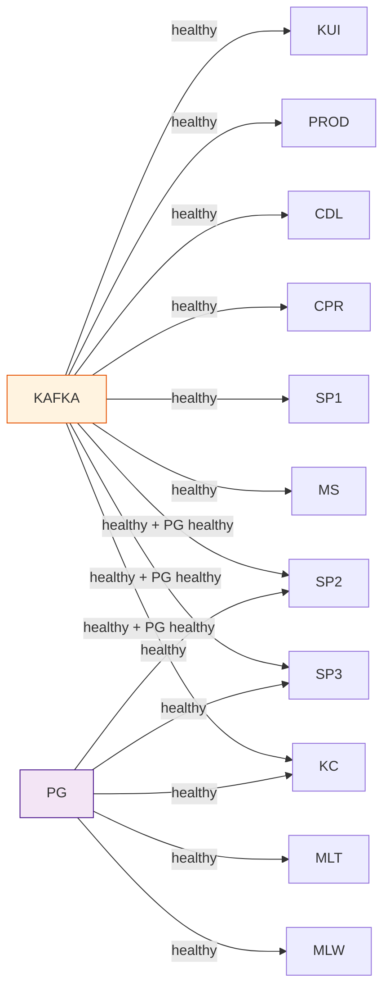

# Infraestructura Docker

## Servicios y puertos

El sistema se compone de **17 servicios Docker** orquestados en `docker-compose.yml`, todos conectados a la red bridge `ec-kafka-dev-net`.

```mermaid
graph TB
    subgraph CORE["Núcleo — Kafka KRaft"]
        KAFKA["ec-kafka\napache/kafka:3.7.0\nKRaft, sin ZooKeeper\n:9092 interno / :19092 host"]
        KUI["kafka-ui\nghcr.io/kafbat/kafka-ui\n:18085"]
    end

    subgraph PYTHON["Contenedores Python — casamarket-python:latest"]
        PROD["producer\nERP -> Kafka"]
        CDL["consumer-downloader\nKafka -> filesystem"]
        CPR["consumer-excel-parser\nfilesystem -> Kafka"]
        MS["mysql-sync\nKafka CDC -> MySQL (opcional)"]
    end

    subgraph DATOS["Almacenamiento"]
        PG["postgres:16-alpine\n:5432 interno / :15432 host\nwal_level=logical"]
    end

    subgraph SPARK["Spark Structured Streaming — jupyter/pyspark-notebook"]
        SP1["spark-streaming\njob_documentos.py\n:4041"]
        SP2["spark-ventas\njob_ventas.py\n:4042"]
        SP3["spark-ml\njob_ml_streaming.py\n:4043"]
        JUP["jupyter-spark\nJupyterLab + PySpark\n:8888"]
    end

    subgraph CDC["CDC opcional — Debezium 2.7"]
        KC["kafka-connect\n:8083"]
    end

    subgraph MLLAYER["Machine Learning — casamarket-ml-web:latest"]
        MLT["ml-trainer\n6 modelos cada 30 min"]
        MLW["ml-web\nFastAPI + Chart.js\n:8501"]
    end

    subgraph OBS["Observabilidad"]
        EXP["kafka-exporter\n:49308"]
        PROM["prometheus\n:49090"]
        GF["grafana\n:43000"]
    end

    KAFKA --> KUI
    KAFKA --> PROD
    KAFKA --> CDL
    KAFKA --> CPR
    KAFKA --> SP1
    KAFKA --> SP2
    KAFKA --> SP3
    KAFKA --> JUP
    KAFKA --> EXP
    KAFKA --> KC
    KAFKA --> MS
    PG --> SP2
    PG --> SP3
    PG --> KC
    PG --> MLT
    PG --> MLW
    EXP --> PROM
    PROM --> GF

    style CORE fill:#FFF3E0,stroke:#E65100
    style PYTHON fill:#E8EAF6,stroke:#283593
    style DATOS fill:#F3E5F5,stroke:#4A148C
    style SPARK fill:#E8F5E9,stroke:#1B5E20
    style CDC fill:#EDE7F6,stroke:#311B92
    style MLLAYER fill:#FCE4EC,stroke:#880E4F
    style OBS fill:#E0F2F1,stroke:#004D40
```



---

## Tabla de servicios completa

| Servicio | Imagen | Puerto host | Puerto interno | Propósito |
|---------|--------|-------------|----------------|-----------|
| `ec-kafka` | `apache/kafka:3.7.0` | 19092 | 9092 / 9093 | Broker + controller KRaft |
| `kafka-ui` | `ghcr.io/kafbat/kafka-ui` | 18085 | 8080 | Interfaz web de administración |
| `producer` | `casamarket-python` | — | — | Ingesta desde el ERP |
| `consumer-downloader` | `casamarket-python` | — | — | Descarga de archivos del ERP |
| `consumer-excel-parser` | `casamarket-python` | — | — | Parseo Excel/HTML → Kafka |
| `postgres` | `postgres:16-alpine` | 15432 | 5432 | Base de datos principal |
| `spark-streaming` | `jupyter/pyspark-notebook` | 4041 | 4040 | `job_documentos.py` |
| `spark-ventas` | `jupyter/pyspark-notebook` | 4042 | 4040 | `job_ventas.py` |
| `spark-ml` | `jupyter/pyspark-notebook` | 4043 | 4040 | `job_ml_streaming.py` (scoring en vivo) |
| `jupyter` | `jupyter/pyspark-notebook` | 8888, 4040 | 8888, 4040 | Notebooks de exploración |
| `kafka-exporter` | `danielqsj/kafka-exporter` | 49308 | 9308 | Métricas Kafka para Prometheus |
| `prometheus` | `prom/prometheus` | 49090 | 9090 | Recolección de métricas |
| `grafana` | `grafana/grafana` | 43000 | 3000 | Dashboards de observabilidad y negocio |
| `kafka-connect` | `quay.io/debezium/connect:2.7` | 8083 | 8083 | CDC PostgreSQL → Kafka (Debezium, opcional) |
| `mysql-sync` | `casamarket-python` | — | — | Kafka CDC → MySQL Laragon (opcional) |
| `ml-trainer` | `casamarket-ml-web` | — | — | Reentrena los 6 modelos cada 30 min |
| `ml-web` | `casamarket-ml-web` | 8501 | 8000 | Panel de predicciones (FastAPI) |

!!! note "Componentes opcionales: `kafka-connect` + `mysql-sync`"
    Estos dos servicios implementan una ruta de sincronización **CDC vía Debezium** hacia una base MySQL local (Laragon) que es completamente independiente de la escritura directa que ya hace `job_ventas.py` por JDBC. El conector de Debezium **no se registra automáticamente** al levantar el stack — hay que ejecutar `mysql_sync/registrar_conector.py` una vez a mano. Si no lo ejecutas, ambos contenedores quedan arriba pero inactivos y el pipeline principal (Kafka → Spark → PostgreSQL → ML → Grafana) funciona exactamente igual. Más detalle en [Sincronización MySQL](../datos/mysql-sync.md).

---

## Configuración de Kafka KRaft

Kafka 3.7.0 corre en modo KRaft (sin ZooKeeper), con un único nodo que actúa como broker y controller a la vez:

```yaml
KAFKA_NODE_ID: 1
KAFKA_PROCESS_ROLES: broker,controller
KAFKA_LISTENERS:
  INTERNAL://0.0.0.0:9092    # comunicación intra-docker
  EXTERNAL://0.0.0.0:19092   # acceso desde el host Windows
  CONTROLLER://0.0.0.0:9093  # consenso Raft
KAFKA_CONTROLLER_QUORUM_VOTERS: 1@ec-kafka:9093
KAFKA_AUTO_CREATE_TOPICS_ENABLE: "true"
```

> Se usa `apache/kafka:3.7.0` (la imagen oficial de la fundación Apache) en vez de la imagen de Bitnami, que no estaba disponible al momento de configurar el entorno.

---

## Volúmenes Docker

| Volumen | Montado en | Propósito |
|---------|-----------|-----------|
| `kafka_data` | `/var/lib/kafka/data` | Persistencia de logs de Kafka |
| `postgres_data` | `/var/lib/postgresql/data` | Datos de PostgreSQL |
| `prometheus_data` | `/prometheus` | Series de tiempo |
| `grafana_data` | `/var/lib/grafana` | Dashboards y sesiones |

Más los bind-mounts de código fuente y salidas:

```
./producer          -> /app/producer
./consumer           -> /app/consumer
./output/descargas   -> /app/output/descargas
./spark_streaming    -> /home/jovyan/app
./output             -> /home/jovyan/output
./notebooks          -> /home/jovyan/work
./ml                 -> /app/ml          (ml-trainer)
./postgres/init.sql  -> /docker-entrypoint-initdb.d/init.sql
./observability/     -> /etc/prometheus/ y /etc/grafana/
```

---

## Healthchecks y dependencias



| Servicio | Healthcheck | Intervalo | Reintentos |
|---------|------------|---------|---------|
| `ec-kafka` | `kafka-topics.sh --list` | 15s | 5 |
| `postgres` | `pg_isready -U casamarket` | 10s | 5 |
| `spark-streaming` / `spark-ventas` / `spark-ml` | `pgrep -f <job>.py` | 30s | 3 |

---

## Dependencias Python

El `Dockerfile` raíz (usado por `producer`, `consumer-downloader`, `consumer-excel-parser`, `mysql-sync`) instala `requirements.txt`:

```
requests==2.34.2        # HTTP client para la API REST del ERP
python-dotenv==1.2.2    # variables de entorno desde .env
kafka-python-ng         # cliente Kafka productor/consumidor
pandas                  # manipulación de DataFrames
openpyxl                # lectura de archivos Excel (.xlsx)
lxml                    # parser HTML para archivos .html
pymysql                 # cliente MySQL (componente CDC opcional)
scikit-learn>=1.4.0     # GBM, KMeans, IsolationForest
numpy>=1.26.0
sqlalchemy>=2.0.0
psycopg2-binary>=2.9.9
```

`ml-trainer` y `ml-web` usan en cambio `ml/Dockerfile.web`, una imagen separada (`casamarket-ml-web:latest`) con dependencias pineadas específicamente para la capa de ML y la API web:

```
fastapi==0.115.0
uvicorn[standard]==0.30.6
sqlalchemy==2.0.36
psycopg2-binary==2.9.9
pandas==2.2.3
numpy==1.26.4
scikit-learn==1.5.2
```
