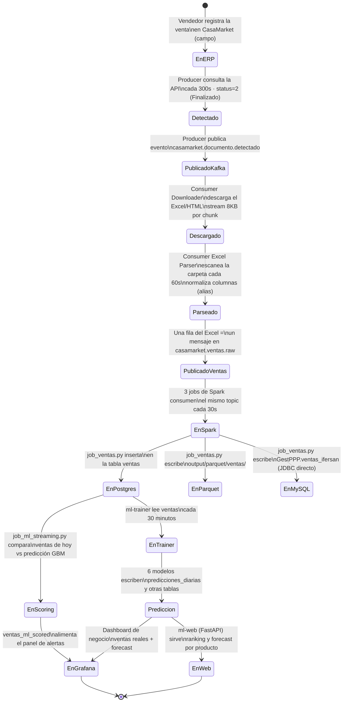
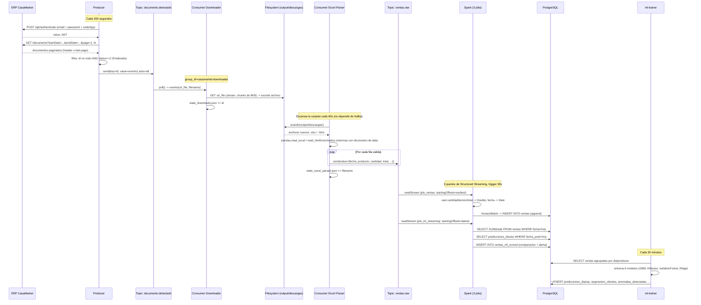
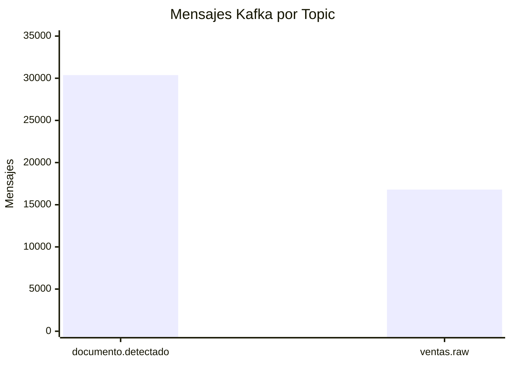

# Pipeline de Datos — Flujo Completo

## Ciclo de vida de una venta

Desde que un vendedor de IFERSAN cierra una venta en CasaMarket hasta que esa venta influye en una predicción visible en Grafana, el dato pasa por los siguientes estados:



---

## Secuencia de mensajes



---

## Esquema de datos — JSON en Kafka

### Topic `casamarket.documento.detectado`

```json
{
  "id": 180472,
  "filename": "detalle_de_ventas__2026_05_19_10_02_47_xlsx_5588.xlsx",
  "extension": "xlsx",
  "status": "Finalizado",
  "url_file": "https://s3.amazonaws.com/casamarket-prod/.../archivo.xlsx",
  "created_at": "2026-04-27T07:32:51Z",
  "usuario": "vendedor@ifersan.example",
  "detectado_en": "2026-05-26T03:47:28.000000+00:00"
}
```

`status` y `url_file` vienen de los campos `statusName` y `urlFile` de la respuesta del API — el código usa explícitamente `urlFile` y no `downloadUrl`, porque este último venía vacío en pruebas.

### Topic `casamarket.ventas.raw`

```json
{
  "fecha": "2026-05-12",
  "hora": "21:30:27",
  "producto": "PEPSI 2000ML",
  "cod_producto": "PEP-001",
  "marca": "LINEA PEPSI",
  "categoria": "GASEOSAS PEPSI",
  "subcategoria": "RETORNABLE 2L",
  "cantidad": "6",
  "precio_unitario": "19.07",
  "total": "144.0",
  "cliente": "YOLANDA GONZA HUANCA",
  "ruc_cliente": "17107",
  "vendedor": "ROSA CUSILAYME",
  "razon_social": "FERNANDEZ CALA TOMAS",
  "zona": "ZONA NORTE",
  "_archivo": "detalle_de_ventas__2026_05_19_xlsx.xlsx",
  "_tipo": "xlsx",
  "_parseado_en": "2026-05-26T03:47:28.000000+00:00"
}
```

Todos los campos numéricos viajan como **strings** — el parser de Excel los lee con `dtype=str` para no perder precisión, y es Spark quien los castea a `DoubleType`/`DateType` en `job_ventas.py`. Solo se incluyen los campos no vacíos de cada fila (`pd.notna(v) and str(v).strip()`), así que el esquema real puede variar ligeramente de un archivo a otro.

---

## Throughput del sistema



| Etapa | Volumen | Velocidad |
|-------|---------|-----------|
| Documentos detectados (únicos) | 175 documentos | ciclo de 300s |
| Mensajes en `documento.detectado` | 30,372 msgs | — |
| Archivos descargados | 84 archivos / 44 MB | chunks de 8 KB |
| Ventas parseadas | 16,794 filas | — |
| Throughput Spark (carga inicial, con checkpoint) | — | ~506 msg/s |
| Throughput Spark (re-proceso completo) | — | **6,074 msg/s** |
| Trigger de los 3 jobs de Spark | — | 30 s |
| Consumer lag final | — | **0 mensajes** |

La diferencia entre 175 documentos únicos y 30,372 mensajes en el topic se debe a que el producer ejecutó muchos ciclos de polling durante desarrollo y pruebas — el downloader evita re-descargar gracias a `state_downloads.json`.
