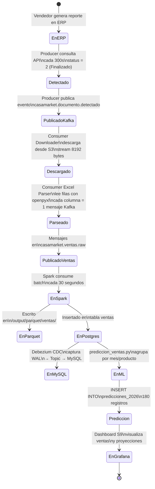
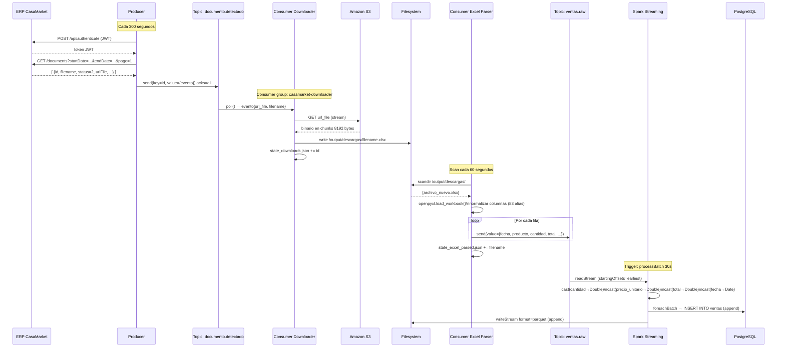
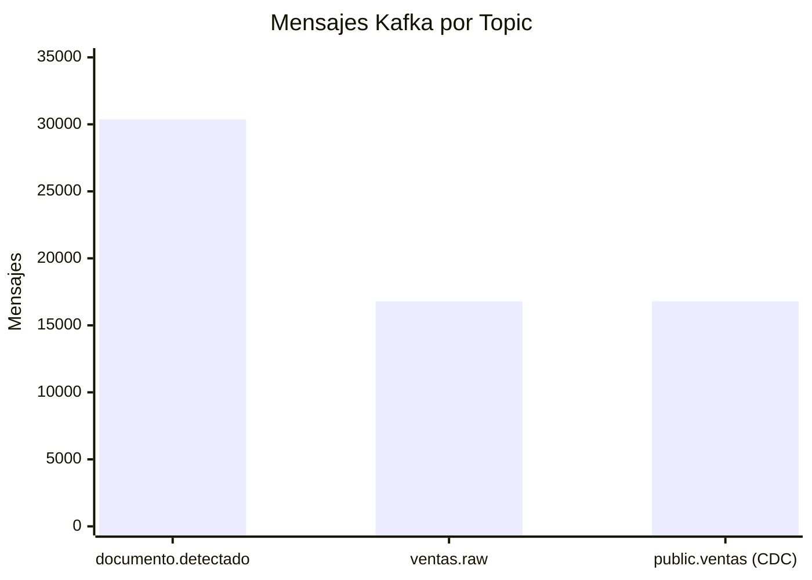

# Pipeline de Datos — Flujo Completo

## Ciclo de Vida de un Documento

Desde que un vendedor genera un reporte en el ERP hasta que los datos aparecen en Grafana, el documento pasa por los siguientes estados:



---

## Secuencia de Mensajes Kafka



---

## Esquema de Datos — JSON en Kafka

### Topic: casamarket.documento.detectado

```json
{
  "id": 180472,
  "filename": "Reporte_de_producto_por_vendedor_agrupado_5588.xlsx",
  "extension": "xlsx",
  "status": "Finalizado",
  "url_file": "https://s3.amazonaws.com/casamarket-prod/docs/...",
  "created_at": "2026-04-27T07:32:51Z",
  "usuario": "admin1@tomas.com",
  "detectado_en": "2026-05-26T03:47:28Z"
}
```

### Topic: casamarket.ventas.raw

```json
{
  "fecha": "2026-05-12",
  "producto": "PEPSI 2000ML",
  "cod_producto": "PEP-001",
  "marca": "LINEA PEPSI",
  "categoria": "GASEOSAS PEPSI",
  "subcategoria": "RETORNABLE 2L",
  "cantidad": "6",
  "precio_unitario": "19.07",
  "total": "144.0",
  "cliente": "YOLANDA GONZA HUANCA",
  "ruc_cliente": "17107",
  "vendedor": "ROSA CUSILAYME",
  "razon_social": "FERNANDEZ CALA TOMAS",
  "zona": "ZONA NORTE",
  "_archivo": "detalle_de_ventas__2026_05_19_xlsx.xlsx",
  "_tipo": "xlsx",
  "_parseado_en": "2026-05-26T03:47:28Z"
}
```

---

## Throughput del Sistema



| Etapa | Volumen | Velocidad |
|-------|---------|-----------|
| Documentos detectados | 175 documentos | 300 s/ciclo |
| Mensajes en documento.detectado | 30.372 msgs | — |
| Archivos descargados | 84 archivos / 44 MB | ~8192 bytes/chunk |
| Ventas parseadas | 16.794 filas | — |
| Throughput Spark (carga inicial) | — | 506 msg/s |
| Throughput Spark (re-proceso) | — | **6.074 msg/s** |
| Latencia batch Spark | — | 30 s (trigger) |
| Consumer lag final | — | **0 mensajes** |
