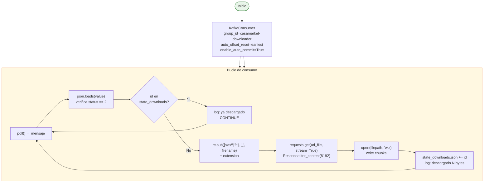

# Consumer Downloader

**Archivo:** `consumer/consumer_downloader.py` — 149 lineas  
**Imagen Docker:** `casamarket-python:latest`  
**Topic de entrada:** `casamarket.documento.detectado`  
**Consumer group:** `casamarket-downloader`

---

## Responsabilidad

Consume eventos del topic `casamarket.documento.detectado`, descarga cada archivo desde su URL de Amazon S3 en modo streaming por chunks, y lo almacena en el directorio compartido `/output/descargas/`. Mantiene estado persistente para no re-descargar archivos ya obtenidos.

---

## Flujo Interno



---

## Descarga con Streaming

El downloader usa HTTP streaming para no cargar el archivo completo en memoria:

```python
response = requests.get(
    url_file,
    stream=True,
    timeout=60
)
response.raise_for_status()

with open(filepath, "wb") as f:
    for chunk in response.iter_content(chunk_size=8192):
        f.write(chunk)
```

**Chunk size:** 8.192 bytes (~8 KB por iteracion)

---

## Sanitizacion de Nombres de Archivo

Los nombres de archivo del ERP pueden contener caracteres que no son validos en sistemas de archivos Windows/Linux:

```python
import re

safe_name = re.sub(r'[<>:"/\\|?*]', '_', filename)
filepath = Path(DOWNLOAD_DIR) / f"{safe_name}.{extension}"
```

Ejemplo:
- **Original:** `Reporte, Nombre de Ruta: JHONATAN/27-04`
- **Sanitizado:** `Reporte_ Nombre de Ruta_ JHONATAN_27-04`

---

## Directorio de Salida

```
output/descargas/                     44 MB total
├── *.xlsx                           Reportes de ventas (mayoria)
├── *.html                           Reportes HTML
└── *.pdf                            Documentos PDF
```

**Total:** 84 archivos descargados del periodo Abril–Mayo 2026.

---

## Estado Persistente

**Archivo:** `consumer/state_downloads.json`

```json
{
  "ids": [180472, 180473, ..., 183454]
}
```

Sincronizado con `state_documentos.json` del producer: los mismos 175 IDs.

---

## Variables de Entorno

| Variable | Valor | Descripcion |
|---------|-------|-------------|
| `KAFKA_BOOTSTRAP` | `ec-kafka:9092` | Bootstrap del broker |
| `DOWNLOAD_DIR` | `/app/output/descargas` | Directorio de destino |
