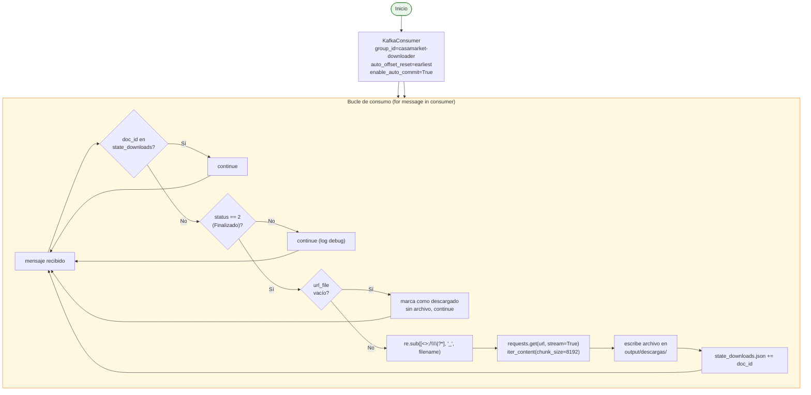

# Consumer Downloader

**Archivo:** `consumer/consumer_downloader.py` — 149 líneas
**Imagen Docker:** `casamarket-python:latest`
**Topic de entrada:** `casamarket.documento.detectado`
**Consumer group:** `casamarket-downloader`

---

## Responsabilidad

Consume eventos del topic `casamarket.documento.detectado`, descarga cada archivo desde su URL en modo streaming por chunks, y lo guarda en el directorio compartido `output/descargas/`. Mantiene estado persistente para no volver a descargar archivos ya obtenidos.

---

## Flujo interno



---

## Descarga con streaming

El downloader no carga el archivo completo en memoria: lo escribe a disco en chunks de 8 KB conforme llegan.

```python
resp = requests.get(url, timeout=60, stream=True)
resp.raise_for_status()

with output_path.open("wb") as f:
    for chunk in resp.iter_content(chunk_size=8192):
        if chunk:
            f.write(chunk)
```

Si el archivo destino ya existe en disco, la descarga se omite directamente (`output_path.exists()`), una segunda capa de protección además del archivo de estado.

---

## Sanitización de nombres de archivo

Los nombres de archivo del ERP pueden traer caracteres inválidos para el sistema de archivos:

```python
safe_name = re.sub(r'[<>:"/\\|?*]', "_", filename)
output_path = DOWNLOAD_DIR / f"{safe_name}.{extension}"
```

---

## Directorio de salida

```
output/descargas/          # 44 MB en total
├── *.xlsx                 # reportes de ventas (mayoría)
├── *.html                 # reportes HTML
└── *.pdf                  # documentos PDF (detectados, no parseados por el siguiente componente)
```

**Total:** 84 archivos descargados en el periodo procesado (27 abril – 19 mayo 2026).

---

## Estado persistente

**Archivo:** `consumer/state_downloads.json`

```json
{
  "ids": [180472, 180473, "...", 183454]
}
```

Sincronizado conceptualmente con `state_documentos.json` del producer — los mismos IDs, pero como archivo de estado independiente (cada componente tiene el suyo, no comparten un único store).

---

## Variables de entorno

| Variable | Valor | Descripción |
|---------|-------|-------------|
| `KAFKA_BOOTSTRAP` | `ec-kafka:9092` (docker) / `localhost:19092` (host) | Bootstrap del broker |
| `DOWNLOAD_DIR` | `/app/output/descargas` (docker) / `output/descargas` (host) | Directorio de destino |
