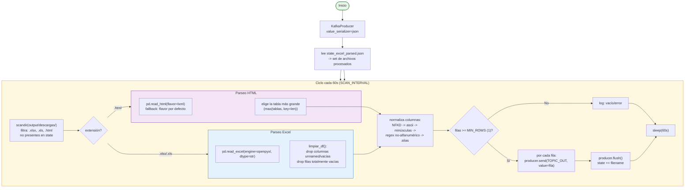

# Consumer Excel/HTML Parser

**Archivo:** `consumer/consumer_excel_parser.py` — 270 líneas
**Imagen Docker:** `casamarket-python:latest`
**Topic de salida:** `casamarket.ventas.raw`

---

## Responsabilidad

A diferencia de los otros dos componentes de ingesta, **este no es un consumer de Kafka**: es un escáner de directorio. Cada 60 segundos revisa `output/descargas/` buscando archivos `.xlsx`/`.xls`/`.html` nuevos, parsea cada fila con pandas y publica cada una como un mensaje independiente en `casamarket.ventas.raw`. Implementa un sistema de normalización de columnas para absorber las variaciones de nombres entre reportes del ERP.

---

## Flujo interno



---

## Normalización de columnas

Los reportes del ERP no siempre usan el mismo nombre de columna para el mismo dato (`"Cliente Nombre"`, `"cliente_nombre"`, `"Nombre Cliente"` pueden referirse a lo mismo). El parser aplica un diccionario de decenas de alias:

```python
_ALIAS = {
    "fecha": "fecha", "fecha_de_venta": "fecha", "date": "fecha", ...
    "producto": "producto", "articulo": "producto", "item": "producto", ...
    "cantidad": "cantidad", "qty": "cantidad", "unidades": "cantidad", ...
    "precio_unitario": "precio_unitario", "precio": "precio_unitario", ...
    "total": "total", "monto_total": "total", "importe": "total", ...
    "cliente": "cliente", "cliente_nombre": "cliente", ...
    "vendedor": "vendedor", "preventista": "vendedor", "empleado_nombre": "vendedor", ...
    "hora": "hora", "hora_venta": "hora", ...       # hora recuperada del CSV original del ERP
    # ...
}
```

**Proceso de normalización (`_norm`)**:

1. Descomposición Unicode NFKD y strip a ASCII (elimina tildes)
2. Minúsculas
3. `re.sub(r"[^a-z0-9]+", "_", col)` — cualquier carácter no alfanumérico se vuelve `_`
4. Búsqueda en el diccionario de alias; si no hay match, se conserva el nombre normalizado tal cual

> Nota de diseño documentada en el propio código: el alias `"descripcion"` fue **retirado deliberadamente** del mapeo hacia `producto`, porque en una versión anterior sobreescribía el campo `producto` real con el contenido de una columna de descripción libre, dejando `producto` vacío en el mensaje final.

---

## Esquema del mensaje JSON

Cada fila del Excel/HTML genera un mensaje con los campos no vacíos detectados (el esquema exacto puede variar levemente entre archivos):

```json
{
  "fecha":           "2026-05-12",
  "hora":             "21:30:27",
  "producto":        "PEPSI 2000ML",
  "cod_producto":    "PEP-001",
  "marca":           "LINEA PEPSI",
  "categoria":       "GASEOSAS PEPSI",
  "subcategoria":    "RETORNABLE 2L",
  "cantidad":        "6",
  "precio_unitario": "19.07",
  "total":           "144.0",
  "cliente":         "YOLANDA GONZA HUANCA",
  "ruc_cliente":     "17107",
  "vendedor":        "ROSA CUSILAYME",
  "razon_social":    "FERNANDEZ CALA TOMAS",
  "zona":            "ZONA NORTE",
  "_archivo":        "detalle_de_ventas__2026_05_19_xlsx.xlsx",
  "_tipo":           "xlsx",
  "_parseado_en":    "2026-05-26T03:47:28.000000+00:00"
}
```

> Todos los campos numéricos se envían como **strings**: el parser lee con `dtype=str` para no perder ceros a la izquierda ni introducir errores de conversión prematuros. Es Spark quien realiza el casting a tipos numéricos en `job_ventas.py`.

---

## Manejo de formatos

=== "Excel (.xlsx)"
    ```python
    df = pd.read_excel(path, engine="openpyxl", dtype=str)
    df = limpiar_df(df)   # drop columnas/filas vacías, columnas "unnamed"
    ```

=== "HTML (.html)"
    ```python
    try:
        tablas = pd.read_html(path, flavor="lxml")
    except Exception:
        tablas = pd.read_html(path)   # flavor por defecto
    df = max(tablas, key=len)   # la tabla con más filas del documento
    ```

=== "PDF (.pdf)"
    Los archivos PDF son detectados por el downloader pero **no** son parseados por este componente — el ERP CasaMarket genera principalmente reportes Excel/HTML, así que el soporte de PDF quedó fuera de alcance.

---

## Estadísticas de procesamiento

| Métrica | Valor |
|---------|-------|
| Archivos procesados | 84 |
| Mensajes publicados | 16,794 |
| Filas promedio por archivo | ~200 |
| Intervalo de escaneo | 60 s |

---

## Variables de entorno

| Variable | Valor | Descripción |
|---------|-------|-------------|
| `KAFKA_BOOTSTRAP` | `ec-kafka:9092` (docker) / `localhost:19092` (host) | Bootstrap del broker |
| `DOWNLOAD_DIR` | `/app/output/descargas` (docker) / `output/descargas` (host) | Directorio a escanear |
