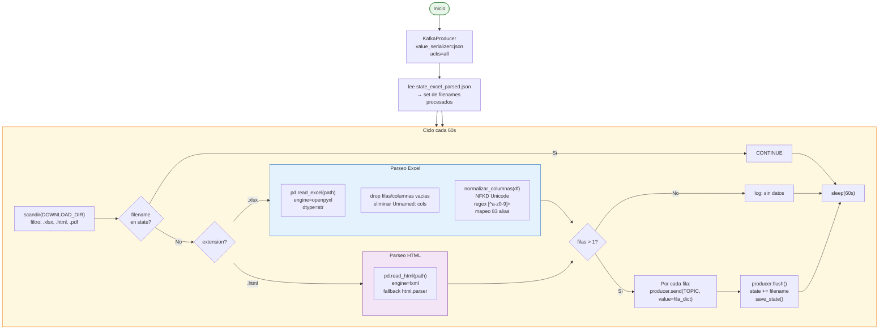

# Consumer Excel Parser

**Archivo:** `consumer/consumer_excel_parser.py` — 265 lineas  
**Imagen Docker:** `casamarket-python:latest`  
**Topic de salida:** `casamarket.ventas.raw`

---

## Responsabilidad

Escanea el directorio `/output/descargas/` cada 60 segundos en busca de archivos nuevos `.xlsx` y `.html`. Parsea cada fila del Excel como un mensaje JSON independiente y lo publica al topic `casamarket.ventas.raw`. Implementa normalizacion avanzada de nombres de columna para manejar las variaciones entre reportes del ERP.

---

## Flujo Interno



---

## Normalizacion de Columnas

Los reportes del ERP usan nombres de columna inconsistentes entre versiones. El parser implementa un sistema de 83 alias para mapear cualquier variacion al nombre canonico:

```python
ALIAS = {
    # Fecha
    "fecha": "fecha",
    "date": "fecha",
    "fec": "fecha",

    # Producto
    "producto": "producto",
    "descripcion": "producto",
    "desc": "producto",
    "articulo": "producto",

    # Cantidad
    "cantidad": "cantidad",
    "cant": "cantidad",
    "qty": "cantidad",
    "unidades": "cantidad",

    # Precio
    "precio_unitario": "precio_unitario",
    "precio": "precio_unitario",
    "p_unit": "precio_unitario",

    # Total
    "total": "total",
    "importe": "total",
    "monto": "total",
    "subtotal": "total",
    # ... 70+ alias mas
}
```

**Proceso de normalizacion:**
1. Convertir a minusculas
2. Aplicar decomposicion Unicode NFKD (eliminar acentos)
3. Reemplazar caracteres no alfanumericos con `_`
4. Eliminar underscores multiples
5. Buscar en diccionario de alias

---

## Schema del Mensaje JSON

Cada fila del Excel genera un mensaje con estos 17 campos:

```json
{
  "fecha":           "2026-05-12",
  "producto":        "PEPSI 2000ML",
  "cod_producto":    "PEP-001",
  "marca":           "LINEA PEPSI",
  "categoria":       "GASEOSAS PEPSI",
  "subcategoria":    "RETORNABLE 2L",
  "cantidad":        "6",
  "precio_unitario": "19.07",
  "total":           "144.0",
  "cliente":         "YOLANDA GONZA HUANCA",
  "ruc_cliente":     "17107",
  "vendedor":        "ROSA CUSILAYME",
  "razon_social":    "FERNANDEZ CALA TOMAS",
  "zona":            "ZONA NORTE",
  "_archivo":        "detalle_de_ventas__2026_05_19_xlsx.xlsx",
  "_tipo":           "xlsx",
  "_parseado_en":    "2026-05-26T03:47:28.000000+00:00"
}
```

> Todos los campos numericos se envian como **strings** en Kafka. Spark realiza el casting a tipos numericos en el job de procesamiento.

---

## Manejo de Formatos

=== "Excel (.xlsx)"
    ```python
    df = pd.read_excel(
        path,
        engine="openpyxl",
        dtype=str           # todo como string para evitar conversiones
    )
    df.dropna(how="all", inplace=True)
    df.dropna(axis=1, how="all", inplace=True)
    df = df.loc[:, ~df.columns.str.startswith("Unnamed:")]
    ```

=== "HTML (.html)"
    ```python
    try:
        tables = pd.read_html(path, flavor="lxml")
    except Exception:
        tables = pd.read_html(path, flavor="html.parser")
    df = tables[0]  # primera tabla del documento
    ```

=== "PDF (.pdf)"
    Los archivos PDF son detectados pero no parseados (solo se registran en el log). El ERP CasaMarket genera principalmente reportes Excel e HTML.

---

## Estadisticas de Procesamiento

| Metrica | Valor |
|---------|-------|
| Archivos procesados | 84 |
| Archivos en `state_excel_parsed.json` | 215 (incluye variantes) |
| Mensajes publicados | 16.794 |
| Filas promedio por archivo | ~200 |
| Tiempo de scan | Cada 60s |

---

## Variables de Entorno

| Variable | Valor | Descripcion |
|---------|-------|-------------|
| `KAFKA_BOOTSTRAP` | `ec-kafka:9092` | Bootstrap del broker |
| `DOWNLOAD_DIR` | `/app/output/descargas` | Directorio a escanear |
