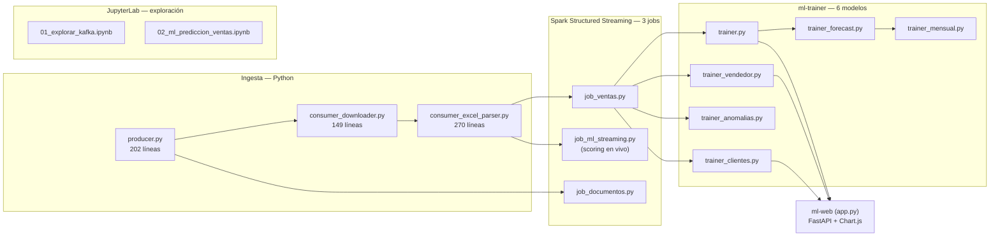

# Componentes del Sistema

## Mapa de componentes

## Resumen por componente

| Componente | Archivo | Líneas | Entrada | Salida |
|-----------|---------|:---:|---------|--------|
| Producer | `producer/producer.py` | 202 | API REST del ERP | Topic `documento.detectado` |
| Downloader | `consumer/consumer_downloader.py` | 149 | Topic Kafka | Archivos en `output/descargas/` |
| Parser | `consumer/consumer_excel_parser.py` | 270 | Filesystem | Topic `ventas.raw` |
| Spark Ventas | `spark_streaming/job_ventas.py` | 217 | Topic `ventas.raw` | Parquet + PostgreSQL + MySQL |
| Spark Documentos | `spark_streaming/job_documentos.py` | 166 | Topic `documento.detectado` | Parquet (4 sinks) |
| Spark ML Streaming | `spark_streaming/job_ml_streaming.py` | 389 | Topic `ventas.raw` (heartbeat) + PostgreSQL | `ventas_ml_scored` |
| ML Trainer | `ml/trainer_main.py` + 6 módulos | ~2,100 | PostgreSQL `ventas` | 7 tablas de predicciones/segmentos/anomalías |
| Web ML | `ml/app.py` | 1,373 | PostgreSQL | Panel FastAPI en `:8501` |
| MySQL Sync (opcional) | `mysql_sync/mysql_sync.py` | 200 | Topic CDC Debezium | MySQL Laragon |
| Registrar CDC (opcional, manual) | `mysql_sync/registrar_conector.py` | 67 | — | Conector Debezium activo |

Cada componente tiene su propia página con el flujo interno explicado paso a paso:

- [Producer](producer.md) — cómo se autentica y detecta documentos nuevos
- [Consumer Downloader](consumer-downloader.md) — descarga de archivos
- [Consumer Excel Parser](consumer-parser.md) — normalización de columnas y publicación a Kafka
- [Spark Streaming](spark-streaming.md) — los 3 jobs, incluido el scoring en tiempo real
- [Los 6 Modelos de ML](ml-prediccion.md) — cada algoritmo, sus hiperparámetros y por qué se diseñó así
- [Web de Predicciones (ml-web)](ml-web.md) — el panel que consume las predicciones
