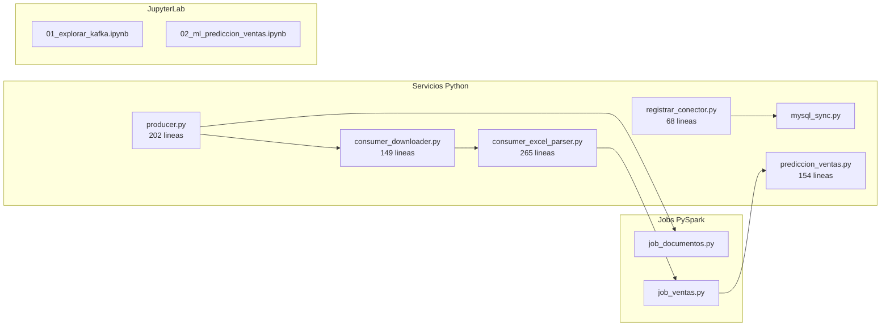

# Componentes del Sistema

## Mapa de Componentes

## Resumen por Componente

| Componente | Archivo | Lineas | Entrada | Salida |
|-----------|---------|--------|---------|--------|
| Producer | `producer/producer.py` | 202 | API REST ERP | Topic `documento.detectado` |
| Downloader | `consumer/consumer_downloader.py` | 149 | Topic Kafka | Archivos en `/output/descargas/` |
| Parser | `consumer/consumer_excel_parser.py` | 265 | Filesystem | Topic `ventas.raw` |
| Spark Docs | `spark_streaming/job_documentos.py` | ~80 | Topic Kafka | Parquet + metricas |
| Spark Ventas | `spark_streaming/job_ventas.py` | ~200 | Topic Kafka | Parquet + PostgreSQL + MySQL |
| ML | `ml/prediccion_ventas.py` | 154 | PostgreSQL | `predicciones_2026` (180 filas) |
| MySQL Sync | `mysql_sync/mysql_sync.py` | ~80 | Topic CDC | MySQL Laragon |
| Registrar CDC | `mysql_sync/registrar_conector.py` | 68 | — | Conector Debezium activo |
