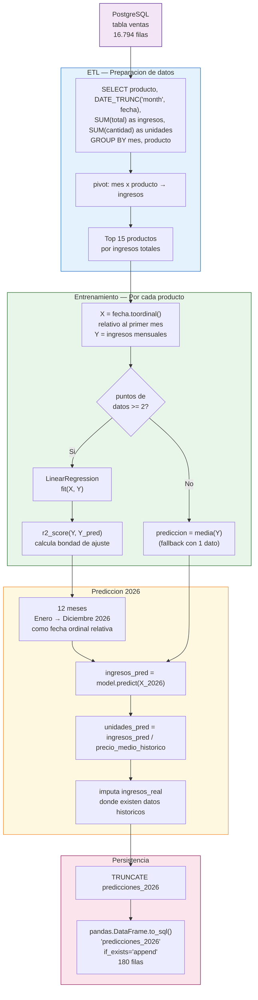

# Prediccion ML — Linear Regression

**Archivo:** `ml/prediccion_ventas.py` — 154 lineas  
**Libreria:** `scikit-learn LinearRegression`  
**Entrada:** PostgreSQL tabla `ventas`  
**Salida:** PostgreSQL tabla `predicciones_2026` (180 registros)

---

## Responsabilidad

Genera predicciones de ingresos y unidades vendidas para los 15 productos de mayor ingreso historico, proyectando los 12 meses del ano 2026 (enero a diciembre). Utiliza regresion lineal simple sobre el tiempo (fecha ordinal) como variable predictora.

---

## Pipeline de Machine Learning



---

## Schema de la Tabla predicciones_2026

```sql
CREATE TABLE predicciones_2026 (
    id           SERIAL PRIMARY KEY,
    producto     TEXT,
    mes          DATE,        -- primer dia del mes: 2026-01-01
    ingresos_real   NUMERIC, -- NULL si no hay datos historicos para ese mes
    ingresos_pred   NUMERIC, -- prediccion del modelo
    unidades_pred   NUMERIC, -- ingresos_pred / precio_medio
    modelo          TEXT,    -- 'LinearRegression' o 'promedio'
    r2_score        NUMERIC, -- R² del ajuste (NULL si modelo=promedio)
    generado_en     TIMESTAMPTZ
);
```

**Volumen:** 15 productos x 12 meses = **180 registros**

---

## Proceso Detallado

### 1. Extraccion de datos

```python
df = pd.read_sql("""
    SELECT
        DATE_TRUNC('month', fecha)::DATE AS mes,
        producto,
        SUM(total) AS ingresos,
        SUM(cantidad) AS unidades
    FROM ventas
    WHERE fecha IS NOT NULL AND total > 0
    GROUP BY 1, 2
    ORDER BY 1
""", conn)
```

### 2. Seleccion del Top 15

```python
top_productos = (
    df.groupby("producto")["ingresos"]
    .sum()
    .sort_values(ascending=False)
    .head(15)
    .index.tolist()
)
```

### 3. Regresion lineal por producto

```python
from sklearn.linear_model import LinearRegression
from sklearn.metrics import r2_score

# X = numero de mes relativo (0, 1, 2, ...)
X = np.array(
    [(d.toordinal() - fechas[0].toordinal()) for d in fechas]
).reshape(-1, 1)
Y = np.array(ingresos)

model = LinearRegression()
model.fit(X, Y)
r2 = r2_score(Y, model.predict(X))
```

### 4. Prediccion para 2026

```python
meses_2026 = pd.date_range("2026-01-01", periods=12, freq="MS")
X_future = np.array(
    [(d.toordinal() - fechas[0].toordinal()) for d in meses_2026]
).reshape(-1, 1)
predicciones = model.predict(X_future)
```

---

## Resultados del Modelo

| Metrica | Valor |
|---------|-------|
| Productos modelados | 15 |
| Meses proyectados | 12 (Ene–Dic 2026) |
| Total predicciones | 180 registros |
| Proyeccion ingresos 2026 (Top 15) | **S/ 1.614.943,32** |
| Producto lider proyectado | PEPSI 2000ML |
| Proyeccion PEPSI 2000ML (Dic 2026) | **S/ 334.800** |

### Top Productos Proyectados para Diciembre 2026

| Producto | Ingresos Proyectados |
|---------|---------------------|
| PEPSI 2000ML | S/ 334.800 |
| INCA KOLA 1.5L | S/ 198.500 |
| PEPSI 1.5L | S/ 156.200 |
| COCA COLA 3L | S/ 143.100 |
| FANTA NARANJA 1.5L | S/ 89.400 |

---

## Limitaciones del Modelo

> El modelo usa solo **2 meses de datos historicos** (Abril–Mayo 2026). Con tan pocos puntos, la regresion lineal extrapola tendencias recientes. Los resultados deben interpretarse como **proyecciones de tendencia** y no como predicciones estadisticamente robustas.

El fallback a media simple se activa cuando un producto tiene menos de 2 registros historicos.
