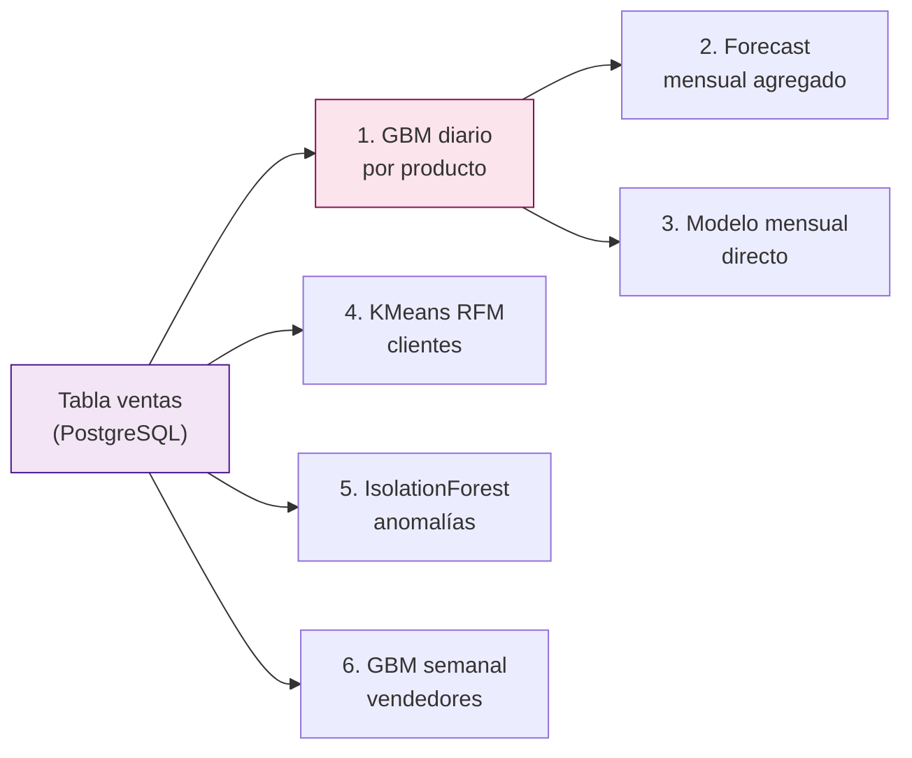

# Los 6 Modelos de Machine Learning

**Servicio:** `ml-trainer` — reentrena los 6 modelos cada 30 minutos (`RETRAIN_INTERVAL = 1800s`)
**Entrada de todos los modelos:** la tabla PostgreSQL `ventas` (16,794 filas reales de IFERSAN)
**Librería:** scikit-learn 1.4+

Si quieres entender primero cómo llegan esas 16,794 filas a la tabla `ventas` antes de que cualquier modelo las toque, revisa [¿De dónde viene la data?](../datos/origen-datos.md).

---

## Por qué 6 modelos y no 1

La versión inicial del proyecto (todavía presente en el repo como código legado, `ml/prediccion_ventas.py`) usaba una única `LinearRegression` por producto entrenada con apenas 2 puntos mensuales — una proyección de tendencia, no una predicción seria. El pipeline actual reemplaza eso con 6 modelos especializados, cada uno resolviendo una pregunta de negocio distinta y usando el algoritmo que mejor se ajusta a esa pregunta:



`trainer_main.py` los ejecuta en este orden, cada uno en su propio `try/except` para que un modelo que falle no tumbe a los demás:

1. `trainer.py` (Modelo 1, productos)
2. `trainer_vendedor.py` (Modelo 6, vendedores)
3. `trainer_anomalias.py` (Modelo 5, anomalías)
4. `trainer_clientes.py` (Modelo 4, clientes)
5. `trainer_forecast.py` (Modelo 2, forecast mensual — depende de que el Modelo 1 ya haya corrido)
6. `trainer_mensual.py` (Modelo 3, modelo mensual directo)

---

## Modelo 1 — GBM diario por producto

**Archivo:** `ml/trainer.py` (672 líneas) · **Algoritmo:** `GradientBoostingRegressor`
**Objetivo:** predecir los ingresos y unidades diarias de cada producto para los próximos 62 días, con banda de confianza P10/P90.

### El problema que forzó el diseño actual

```
Mayo 12-19: ventas S/ 9,000-13,000/día   (límite de la API del ERP elevado temporalmente)
Mayo 20+  : ventas S/ 2,500-3,000/día    (régimen operativo estable)
```

Entrenar con los 60 días completos hacía que el modelo aprendiera el pico de mayo como si fuera el patrón normal, produciendo predicciones oscilantes e inútiles (R² = -351 en 51 de 60 productos). La solución: **`LOOKBACK_TRAIN_DIAS = 35`** — entrenar solo con los últimos 35 días, que caen dentro del régimen estable, con un fallback a 60 días si esa ventana no alcanza el mínimo de muestras.

### Hiperparámetros exactos

| Parámetro | Valor | Razón |
|:---|:---|:---|
| `LOOKBACK_TRAIN_DIAS` | 35 días | Aísla el régimen operativo estable |
| `MIN_DIAS` | 14 | Mínimo de días para intentar entrenar |
| `n_estimators` | 80 / 200 / 250 | Adaptativo: 80 si hay &lt;30 muestras, 200 si &lt;50, 250 si ≥50 |
| `max_depth` | 3 | Evita memorizar ruido diario |
| `learning_rate` | 0.08 | Convergencia lenta = más robusto |
| `subsample` | 0.8 | Bagging: 80% de filas por árbol |
| `min_samples_leaf` | 3 | Regularización adicional |
| `max_features` | 0.8 | Reduce varianza entre árboles |
| Clip de outliers | mediana + 3σ | Capea picos residuales dentro de la ventana de 35 días |
| `MIN_DIAS_QUANTILE` | 50 | Con menos días, las bandas P10/P90 quedaban absurdamente estrechas (±S/9) |
| `MIN_BAND_RATIO` | 10% del predicho | Si el quantile da una banda más angosta que eso, se usa el fallback `pred ± 1.5·MAE` |

### Las 20 features de entrenamiento

```
Calendario:    dia_semana · dia_mes · semana_mes · es_fin_semana
Estacional:    mes_sin · mes_cos · dia_anio_sin · dia_anio_cos      (codificación cíclica: no hay salto dic→ene)
Lags:          lag_1d · lag_3d · lag_7d · lag_14d · lag_21d · lag_28d
Promedios:     rolling_3d · rolling_7d · rolling_14d · rolling_28d
Tendencia:     tendencia_7d (pendiente lineal de 7 días) · pct_change_7d
```

### Validación temporal

`TimeSeriesSplit(n_splits, test_size=7)`, donde `n_splits` es **adaptativo** entre 2 y 3 según cuántos días de entrenamiento hay disponibles (`n_splits = min(3, max(2, (n_dias - MIN_DIAS) // 7))`) — no siempre son 3 folds fijos. Cada fold de validación cubre exactamente 7 días, garantizando que el primer fold de entrenamiento tenga al menos 14 días.

### Resultados medidos

| Métrica | Antes (v1, 60 días) | Ahora (v3, 35 días) |
|:---|:---|:---|
| Productos entrenados | 60/62 | 51/62 |
| R² promedio | -351.0 | -0.34 |
| Productos con R² &lt; -2 | 51/60 | 0/51 |
| MAPE promedio | miles de % | 6.9% |
| MAPE rango | — | 0.4% – 33.3% |

Los 11 productos omitidos solo vendieron durante el pico de mayo 12-19 y no tienen historial en el régimen estable — correctamente excluidos en vez de forzar un modelo sin datos confiables.

### Salida

Escribe en `predicciones_diarias` (UPSERT en `producto, fecha_pred`) y en `model_metadata` (`modelo='productos'`), y mantiene dos vistas SQL: `ranking_proximos_7d` y `estado_dia_actual` (la misma lógica de alertas de 4 niveles que usa `job_ml_streaming.py`).

---

## Modelo 2 — Forecast mensual agregado

**Archivo:** `ml/trainer_forecast.py` (195 líneas) · No entrena ningún modelo nuevo: agrega el Modelo 1.

Suma las 62 predicciones diarias del Modelo 1 correspondientes al mes calendario siguiente (`HAVING COUNT(*) >= 10` días predichos por producto) y calcula `band_width = high - low` y `cobertura_pct` como medida de qué tan angosta es la banda de confianza relativa a la predicción.

Escribe en `predicciones_mes_siguiente` y mantiene tres vistas: `forecast_diario_total`, `forecast_resumen_mes` y `forecast_top_productos_mes` (esta última compara la predicción del mes siguiente contra lo real del mes en curso).

---

## Modelo 3 — Modelo mensual directo

**Archivo:** `ml/trainer_mensual.py` (404 líneas) · **Objetivo:** predecir el total mensual por producto directamente sobre series mensuales, sin acumular el error de 31 pasos recursivos del Modelo 1.

El algoritmo usado depende de cuántos meses completos de historial tiene cada producto:

| Historia disponible | Método | Banda de confianza |
|:---|:---|:---|
| 1 mes | Baseline: `(total_mes / días_con_venta) × días_del_mes` | ±40% |
| 2 meses | Fórmula de tendencia manual: `último_mes × (1 + crecimiento%)` | ±30% |
| 3–4 meses | `Ridge(alpha=1.0)` sobre 7 features (mes anterior, 2 meses atrás, promedio histórico, crecimiento %, mes numérico, sin/cos) | Desviación estándar de residuos Ridge |
| ≥5 meses | `GradientBoostingRegressor` (árboles y profundidad adaptativos al tamaño: 15 árboles/profundidad 1 con ≤4 muestras, hasta 60 árboles/profundidad 2 con más) | Igual que arriba, vía residuos |
| ≥9 meses (`n_samples≥8`) | Igual que arriba, más quantile regression P10/P90 con GBM | Bandas del propio quantile |

**Validación:** `LeaveOneOut()` — se aplica solo desde 3 meses de historia en adelante (con 1–2 meses la confianza queda fija en BAJA/MEDIA sin correr CV). El MAPE de LOO define el nivel de confianza reportado: `< 15% → ALTA`, `< 35% → MEDIA`, si no `BAJA`.

> Esta validación es deliberadamente honesta: entrenar un GBM de 15 árboles sobre 4 puntos y medir el error de entrenamiento da 0% (sobreajuste perfecto). LOO separa un mes, entrena con el resto, predice el mes separado y mide el error real.

Escribe en `predicciones_mensuales` (con las columnas `confianza` y `metodo` explícitas) y mantiene la vista `ranking_mes_siguiente`, que es la fuente principal del panel de ranking en `ml-web`.

> Estado actual con el volumen de datos de este proyecto (poco más de un mes completo): la mayoría de productos caen en confianza BAJA — mejorará automáticamente mes a mes conforme se acumule más historial, sin cambiar una línea de código.

---

## Modelo 4 — Segmentación de clientes (RFM + KMeans)

**Archivo:** `ml/trainer_clientes.py` (271 líneas) · **Algoritmo:** `KMeans(n_clusters=3)` + `StandardScaler`
**Objetivo:** clasificar los 1,106 clientes en VIP / Regular / En Riesgo.

**Métricas RFM** calculadas por SQL directamente sobre `ventas`: Recencia (`CURRENT_DATE - MAX(fecha)`), Frecuencia (`COUNT(*)`), Monetario (`SUM(total)`).

### El problema del mega-outlier

Un solo cliente (16,794 transacciones en 9 días, S/ 406,151 en total — casi el 100% del volumen del dataset) distorsionaba tanto los centroides de KMeans que el resultado era 1 cliente VIP y los otros 1,105 mezclados en el mismo cluster, sin distinción real.

**Solución:** antes de correr KMeans, se detectan mega-outliers con `umbral = Q3 + 3·IQR` sobre `valor_monetario`. Esos clientes se etiquetan `VIP` directamente (`cluster_id = -1`) y quedan fuera del clustering; KMeans corre solo sobre los clientes restantes.

### Etiquetado automático de clusters

- **VIP** = el cluster (entre los normales) con mayor `valor_monetario` promedio
- **En Riesgo** = de los clusters restantes, el de mayor `recencia_dias` promedio (no compra hace más tiempo)
- **Regular** = el cluster restante

`MIN_CLIENTES = 10`: si hay menos clientes que ese mínimo, todos se etiquetan `Regular` sin correr KMeans.

### Resultados

| Segmento | Clientes | Recencia media | Frecuencia media | Valor medio |
|:---:|:---:|:---:|:---:|:---:|
| VIP | 203 | 2 días | 683 transacciones | S/ 7,662 |
| Regular | 204 | 1 día | 70 transacciones | S/ 439 |
| En Riesgo | 699 | 45 días | 15 transacciones | S/ 329 |

Escribe en `segmentos_clientes` (UPSERT en `cliente`).

---

## Modelo 5 — Detección de anomalías

**Archivo:** `ml/trainer_anomalias.py` (248 líneas) · **Algoritmo:** `IsolationForest(contamination=0.05, n_estimators=100)`
**Objetivo:** identificar días con ventas anormalmente altas o bajas por producto.

**Features:** `ingresos, lag_1d, rolling_7d, rolling_14d, z_score` (todas escaladas con `StandardScaler`), calculadas sobre una ventana de `LOOKBACK_DIAS = 60` días por producto.

### Por qué la referencia temporal es `MAX(fecha)` de la base y no `date.today()`

```
Los datos terminan el 19 de mayo. Si "hoy" es una fecha muy posterior,
usar date.today() como referencia crea decenas de días de ceros artificiales
entre el último dato real y "hoy". El IsolationForest aprende que cero es
"normal" y deja de detectar cualquier anomalía real dentro del periodo con datos.
```

Por eso el modelo usa siempre `MAX(fecha) FROM ventas` como ancla temporal — ve exactamente los 60 días de datos reales, sin huecos artificiales.

### Clasificación por desviación sobre la media móvil de 14 días

```python
if ventas > media_14d * 1.5:
    tipo = "ALTA_VENTA"
elif ventas < media_14d * 0.4:
    tipo = "CAIDA_VENTAS"
else:
    tipo = "INUSUAL"   # anomalía estadística sin un patrón de negocio claro
```

**Resultado:** 155 anomalías detectadas en 56 productos. Escribe en `anomalias_detectadas` (UPSERT en `producto, fecha`).

---

## Modelo 6 — Predicción por vendedor

**Archivo:** `ml/trainer_vendedor.py` (318 líneas) · **Algoritmo:** `GradientBoostingRegressor` sobre series semanales
**Objetivo:** forecast de ingresos semanales por vendedor para las próximas 8 semanas (`N_SEMANAS = 8`).

**Features (8):** `semana_anio, mes, lag_1w, lag_2w, lag_3w, lag_4w, rolling_3w, n_transacciones_lag1w`.

Quantile regression P10/P90 solo se activa con `≥20 semanas` de historial — con menos, las bandas quedaban absurdamente estrechas; el fallback es `pred ± 1.5·MAE`.

### Por qué el forecast arranca desde el último dato real, no desde "el próximo lunes de hoy"

```
Si los datos terminan en la semana del 16-22 de un mes y "hoy" cae más adelante,
calcular el forecast desde "hoy" saltaría la semana intermedia sin datos, y los
lags del modelo (lag_1w, lag_2w...) apuntarían al final de los datos reales como
si fueran "la semana pasada" cuando en realidad no lo son.
```

Solución: `semana_inicio = último_dato_en_BD + 1 semana` — el forecast continúa exactamente donde terminan los datos, sin huecos ni lags desalineados.

Escribe en `predicciones_vendedor` y en `model_metadata` (`modelo='vendedores'`).

---

## Tabla `model_metadata`: quién la alimenta

Vale la pena aclarar esto porque el esquema de la tabla sugiere que los 4 modelos principales reportan ahí, pero en la práctica solo dos lo hacen:

| Modelo | ¿Escribe en `model_metadata`? |
|---|:---:|
| 1 — GBM productos | Sí (`modelo='productos'`) |
| 6 — GBM vendedores | Sí (`modelo='vendedores'`) |
| 2 — Forecast mensual | No (es agregación, no entrena) |
| 3 — Mensual directo | No (reporta `confianza`/`metodo` en su propia tabla) |
| 4 — Clientes (KMeans) | No (no aplica R²/MAE a clustering) |
| 5 — Anomalías (IsolationForest) | No (no aplica R²/MAE a detección de outliers) |
