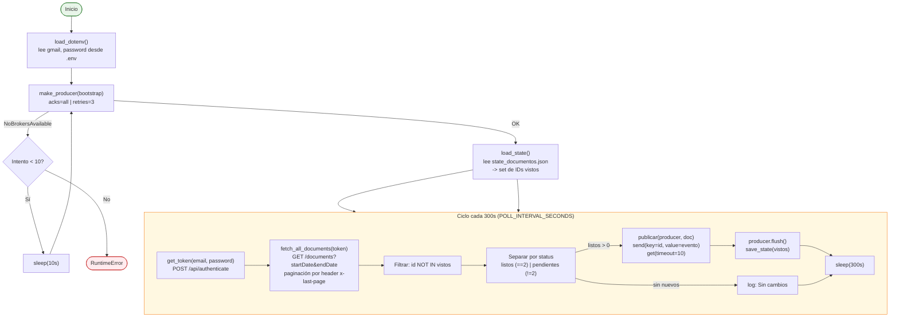

# Producer

**Archivo:** `producer/producer.py` — 202 líneas
**Imagen Docker:** `casamarket-python:latest`
**Topic de salida:** `casamarket.documento.detectado`

---

## Responsabilidad

Cada 300 segundos, consulta la API REST del ERP CasaMarket, detecta documentos nuevos con `status == 2` ("Finalizado") y publica un evento por cada uno al broker Kafka. Mantiene estado persistente en `state_documentos.json` para garantizar que cada documento se publique una sola vez aunque el contenedor se reinicie.

---

## Flujo interno



---

## Autenticación con el ERP

```http
POST https://acl.casamarketapp.com/api/authenticate
Content-Type: application/json

{
  "email":    "<usuario del ERP>",
  "password": "<contraseña del ERP>",
  "codeApp":  "quipuadmin"
}
```

**Respuesta:**
```json
{
  "token": "eyJhbGciOiJIUzI1NiIsInR5cCI6IkpXVCJ9...",
  "domains": [...]
}
```

El token JWT se usa en el header `Authorization: Bearer <token>` para todas las llamadas posteriores. Las credenciales reales (`gmail`, `password`) viven exclusivamente en el archivo `.env` local, que **no está versionado en git** (ver [`.gitignore`](#)) — en ningún punto de esta documentación se muestra una contraseña real.

---

## Consulta de documentos

```
GET https://n5.report.casamarketapp.com/documents
Authorization: Bearer <token>
Origin: https://admin.casamarket.la

Params:
  startDate = YYYY-MM-DD   (hoy - DAYS_BACK días)
  endDate   = YYYY-MM-DD   (hoy)
  limit     = 50
  page      = 1..N
```

**Headers de paginación en la respuesta:**

- `x-last-page`: número total de páginas
- `x-quantity`: total de documentos

El producer pagina automáticamente hasta `page > x-last-page`, acumulando todos los documentos del rango en una sola lista antes de filtrar.

---

## Evento publicado en Kafka

```json
{
  "id":           180472,
  "filename":     "detalle_de_ventas__2026_05_19_10_02_47_xlsx_5588.xlsx",
  "extension":    "xlsx",
  "status":       "Finalizado",
  "url_file":     "https://s3.amazonaws.com/casamarket-prod/...",
  "created_at":   "2026-04-27T07:32:51Z",
  "usuario":      "<email del usuario que generó el documento>",
  "detectado_en": "2026-05-26T03:47:28.000000+00:00"
}
```

> **Importante:** se usa el campo `urlFile` de la respuesta del API (no `downloadUrl`), porque este último venía vacío en pruebas y rompía la descarga.

---

## Configuración de variables de entorno

| Variable | Valor por defecto | Descripción |
|---------|------------------|-------------|
| `gmail` | — (requerido en `.env`) | Usuario de acceso al ERP |
| `password` | — (requerido en `.env`) | Contraseña del ERP |
| `KAFKA_BOOTSTRAP` | `localhost:19092` (host) / `ec-kafka:9092` (docker) | Bootstrap del broker |
| `POLL_INTERVAL_SECONDS` | `300` | Segundos entre ciclos |
| `DAYS_BACK` | `30` | Ventana de búsqueda de documentos hacia atrás |

El `.env` tiene además una tercera clave, `dominio_casa_market`, que actualmente no se usa en ningún punto del código (es metadata heredada de una versión anterior del script).

---

## Configuración del KafkaProducer

```python
KafkaProducer(
    bootstrap_servers=bootstrap,
    value_serializer=lambda v: json.dumps(v, ensure_ascii=False).encode("utf-8"),
    key_serializer=lambda k: str(k).encode("utf-8"),
    acks="all",   # confirmación de todas las réplicas ISR
    retries=3,
)
```

Esto da **at-least-once delivery**: si el broker confirma pero la respuesta se pierde en la red, el producer podría reintentar y duplicar el envío. No se usa `enable_idempotence=True`, así que la garantía real de "un documento, un mensaje" la da la deduplicación por `state_documentos.json`, no Kafka.

---

## Estado persistente

**Archivo:** `producer/state_documentos.json`

```json
{
  "ids": [180472, 180473, "...", 183454]
}
```

- 175 IDs almacenados en el periodo procesado (rango `180472`–`183454`)
- Se reescribe completo en cada ciclo exitoso
- Garantiza idempotencia ante reinicios del contenedor: si el producer se reinicia, no vuelve a publicar documentos ya enviados
