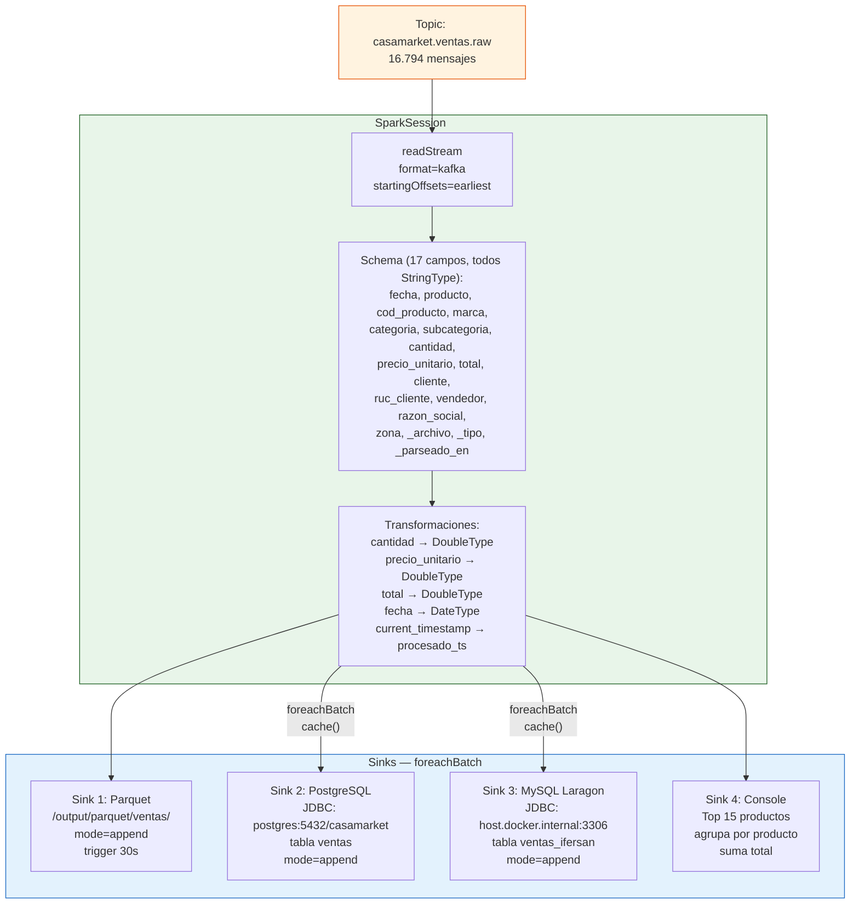
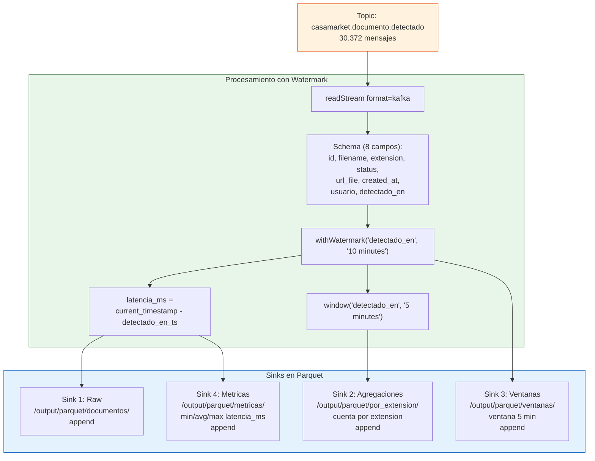

# Spark Structured Streaming

El sistema cuenta con **dos jobs de Spark** que consumen topics de Kafka en tiempo real con trigger de 30 segundos.

---

## job_ventas.py — Procesamiento de Ventas

**Archivo:** `spark_streaming/job_ventas.py`  
**Contenedor:** `spark-ventas` — Spark UI en `http://localhost:4042`  
**Topic de entrada:** `casamarket.ventas.raw`

### Diagrama de Flujo



### Configuracion de Spark

```python
spark = SparkSession.builder \
    .appName("CasaMarket-Ventas-Streaming") \
    .config("spark.sql.shuffle.partitions", "2") \
    .config("spark.streaming.stopGracefullyOnShutdown", "true") \
    .getOrCreate()
```

### Checkpoints

```
output/checkpoints/
├── raw/          # checkpoint del sink Parquet
│   ├── commits/
│   ├── offsets/
│   └── sources/0/
└── agg/          # checkpoint del sink PostgreSQL/MySQL
    ├── commits/
    ├── offsets/
    └── sources/0/
```

### Dependencias Maven (spark-submit)

```
--packages org.apache.spark:spark-sql-kafka-0-10_2.12:3.5.1,
           org.postgresql:postgresql:42.7.3,
           mysql:mysql-connector-java:8.0.33
```

---

## job_documentos.py — Metricas de Documentos

**Archivo:** `spark_streaming/job_documentos.py`  
**Contenedor:** `spark-streaming` — Spark UI en `http://localhost:4041`  
**Topic de entrada:** `casamarket.documento.detectado`

### Diagrama de Flujo



### Calculo de Latencia

El job calcula la latencia de extremo a extremo entre el momento en que el Producer detecta el documento y el momento en que Spark lo procesa:

```python
df = df.withColumn(
    "latencia_ms",
    (col("procesado_ts").cast("long") - col("detectado_en_ts").cast("long")) * 1000
)
```

### Configuracion

```
Watermark:  10 minutos  (tolerancia para datos tardios)
Window:     5 minutos   (agregacion por ventana de tiempo)
Trigger:    30 segundos (processBatch)
Checkpoints:
  /output/checkpoints/raw/
  /output/checkpoints/agg/
  /output/checkpoints/ventanas/
  /output/checkpoints/metricas/
```

---

## Rendimiento Observado

| Metrica | Valor |
|---------|-------|
| Throughput carga inicial | ~506 msg/s |
| Throughput re-proceso (desde checkpoint) | **~6.074 msg/s** |
| Latencia de batch | ~30 s |
| Consumer lag al finalizar | **0 mensajes** |
| Particiones shuffle | 2 (optimizado para local[2]) |
| Modo master | `local[2]` |
