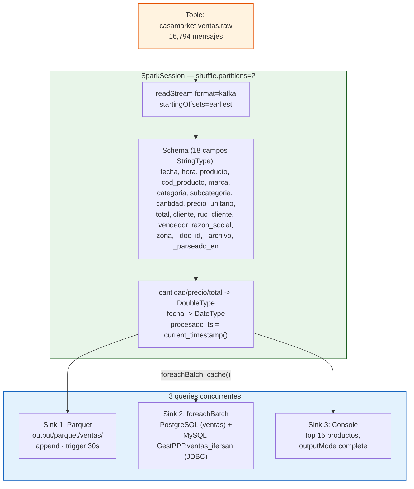
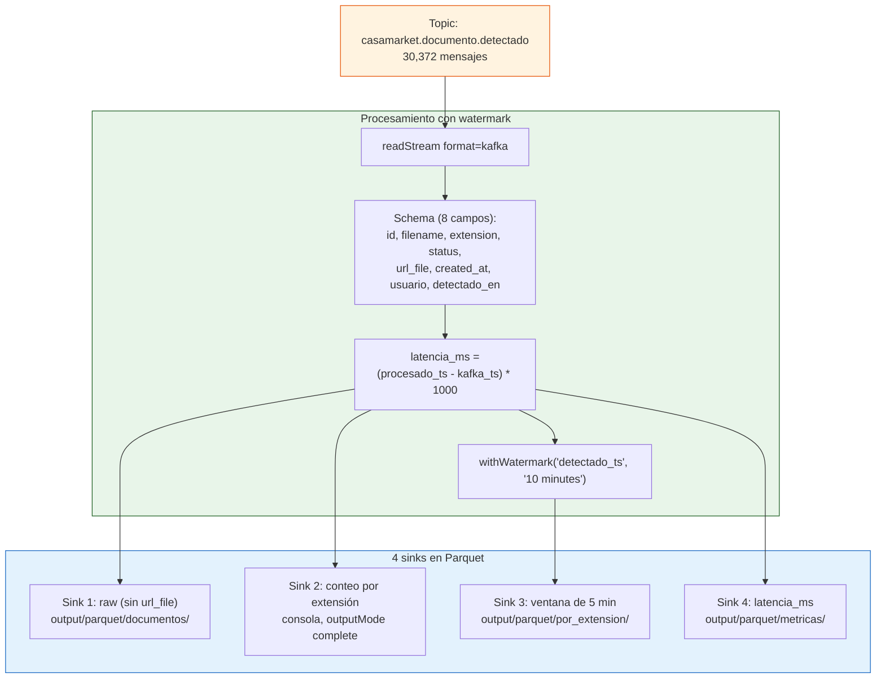
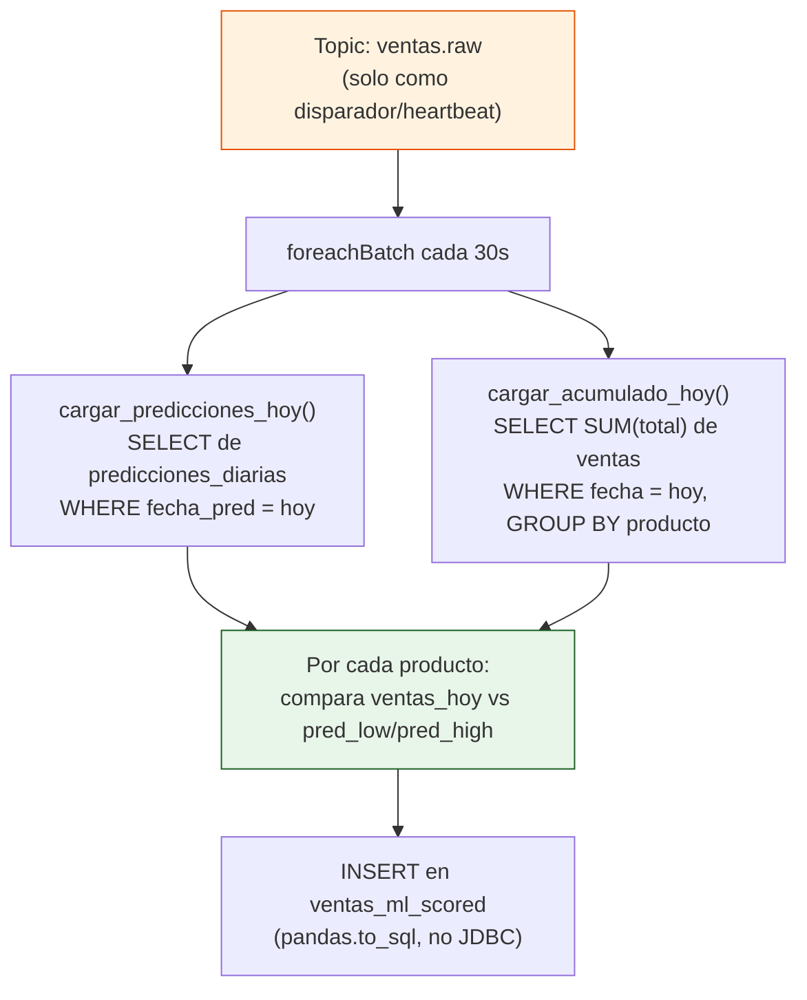

# Spark Structured Streaming

El sistema corre **tres jobs de Spark Structured Streaming** en paralelo, todos con trigger de 30 segundos, cada uno en su propio contenedor con su propio Spark UI.

| Job | Contenedor | Spark UI | Lee de |
|---|---|---|---|
| `job_documentos.py` | `spark-streaming` | `localhost:4041` | `casamarket.documento.detectado` |
| `job_ventas.py` | `spark-ventas` | `localhost:4042` | `casamarket.ventas.raw` |
| `job_ml_streaming.py` | `spark-ml` | `localhost:4043` | `casamarket.ventas.raw` |

---

## job_ventas.py — Procesamiento de ventas

**Archivo:** `spark_streaming/job_ventas.py`
**Topic de entrada:** `casamarket.ventas.raw`

### Diagrama de flujo



### El sink doble a PostgreSQL y MySQL

`write_to_postgres_and_mysql(batch_df, batch_id)` cachea el micro-batch una vez y lo escribe **dos veces** por JDBC — a PostgreSQL (`ventas`) y a una base MySQL local en Laragon (`GestPPP.ventas_ifersan`), como ejercicio de portabilidad multi-motor pedido en el curso:

```python
PG_URL   = "jdbc:postgresql://postgres:5432/casamarket"
MYSQL_URL = "jdbc:mysql://host.docker.internal:3306/GestPPP?useSSL=false&allowPublicKeyRetrieval=true"

ventas.write.jdbc(url=PG_URL, table="ventas", mode="append", properties=PG_PROPS)
ventas.write.jdbc(url=MYSQL_URL, table="ventas_ifersan", mode="append", properties=MYSQL_PROPS)
```

Si MySQL no está disponible (por ejemplo, corriendo en Linux sin Laragon), ese `try/except` falla silenciosamente en el log sin tumbar el resto del pipeline — PostgreSQL sigue recibiendo todas las ventas con normalidad.

### Checkpoints

```
output/checkpoints/
├── ventas_raw/     # checkpoint del sink Parquet
└── ventas_agg/     # checkpoint del sink PostgreSQL + MySQL
```

---

## job_documentos.py — Métricas de documentos

**Archivo:** `spark_streaming/job_documentos.py`
**Topic de entrada:** `casamarket.documento.detectado`

### Diagrama de flujo



### Cálculo de latencia

Mide el tiempo entre que el mensaje llega a Kafka y Spark lo procesa (no la latencia ERP→Kafka, esa la marca el producer con `detectado_en`):

```python
.withColumn("latencia_ms", (
    unix_timestamp(col("procesado_ts")) - unix_timestamp(col("kafka_ts"))
).cast("long") * 1000)
```

### Configuración

```
Watermark:  10 minutos (tolerancia a datos tardíos)
Window:     5 minutos  (agregación por ventana de tiempo)
Trigger:    30 segundos
```

---

## job_ml_streaming.py — Scoring en tiempo real

**Archivo:** `spark_streaming/job_ml_streaming.py` (389 líneas)
**Topic de entrada:** `casamarket.ventas.raw` (con `startingOffsets="latest"`, a diferencia de los otros dos jobs)

Este es el componente más fácil de mal-entender: **no carga ningún modelo de scikit-learn ni entrena nada dentro de Spark**. Su función es comparar, cada 30 segundos, cuánto se ha vendido de cada producto *hoy* contra lo que predijo el modelo GBM diario (`ml/trainer.py`), y clasificar el resultado en 4 niveles de alerta.



**Por qué usa `startingOffsets=latest`:** los otros dos jobs procesan desde el principio del topic para reconstruir el histórico completo en PostgreSQL. Este job solo necesita "despertar" cada 30s — no le importan los mensajes viejos, así que arrancar desde `latest` evita reprocesar miles de eventos antiguos cada vez que se reinicia el contenedor.

**Por qué re-consulta PostgreSQL en vez de usar el contenido del micro-batch:** sumar solo las filas que llegaron en los últimos 30 segundos daría un acumulado incompleto. En cambio, cada batch dispara una consulta `SELECT SUM(total) ... WHERE fecha = CURRENT_DATE` que siempre refleja el acumulado real del día completo hasta ese instante.

### Clasificación de alertas

```python
if pred_high > 0 and ventas_hoy > pred_high:
    alerta = "SOBRE_META"      # superó la banda P90 del modelo
elif pred_low > 0 and ventas_hoy >= pred_low:
    alerta = "EN_META"         # dentro del intervalo P10-P90
elif pred_hoy > 0 and ventas_hoy >= pred_hoy * 0.5:
    alerta = "EN_RIESGO"       # por debajo pero no crítico
else:
    alerta = "BAJO_META"       # muy por debajo de lo esperado
```

Esta misma lógica de 4 niveles está también implementada como vista SQL (`estado_dia_actual`, definida en `ml/trainer.py`) — dos implementaciones independientes de la misma regla de negocio, una en Spark/Python y otra en una vista de PostgreSQL, que hoy son consistentes entre sí pero conviene tener presente si se modifica una sin la otra.

### Tabla de salida: `ventas_ml_scored`

| Columna | Descripción |
|---|---|
| `producto` | Producto evaluado |
| `ventas_hoy` | Acumulado real del día (consulta a `ventas`) |
| `prediccion_hoy` | Predicción central del GBM para hoy |
| `pred_low` / `pred_high` | Banda P10/P90 del modelo |
| `pct_completado` | `ventas_hoy / prediccion_hoy * 100` |
| `alerta` | `SOBRE_META` / `EN_META` / `EN_RIESGO` / `BAJO_META` |

Esta tabla alimenta el panel de "Estado del Día" tanto en Grafana como en `ml-web`.

---

## Rendimiento observado

| Métrica | Valor |
|---------|-------|
| Throughput carga inicial | ~506 msg/s |
| Throughput re-proceso (desde offset 0) | **~6,074 msg/s** |
| Latencia de batch | ~30 s (trigger de los 3 jobs) |
| Consumer lag al finalizar | **0 mensajes** |
| Partición de shuffle | 2 (ajustado a `local[2]`) |
| Modo master | `local[2]` en los 3 jobs |
