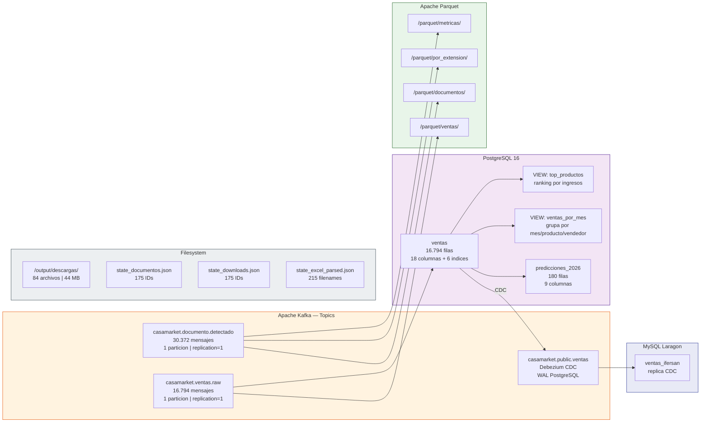

# Datos del Sistema

## Mapa de Datos

## Volumenes de Datos

| Almacen | Formato | Filas/Mensajes | Tamano |
|---------|---------|----------------|--------|
| Topic: documento.detectado | JSON en Kafka | 30.372 msgs | — |
| Topic: ventas.raw | JSON en Kafka | 16.794 msgs | — |
| PostgreSQL: ventas | Relacional | 16.794 filas | ~5 MB |
| PostgreSQL: predicciones_2026 | Relacional | 180 filas | < 1 MB |
| Parquet: ventas | Columnar | ~16.794 filas | ~2 MB |
| Archivos descargados | Excel/HTML/PDF | 84 archivos | 44 MB |
| Estado persistente JSON | JSON | 3 archivos | < 50 KB |
