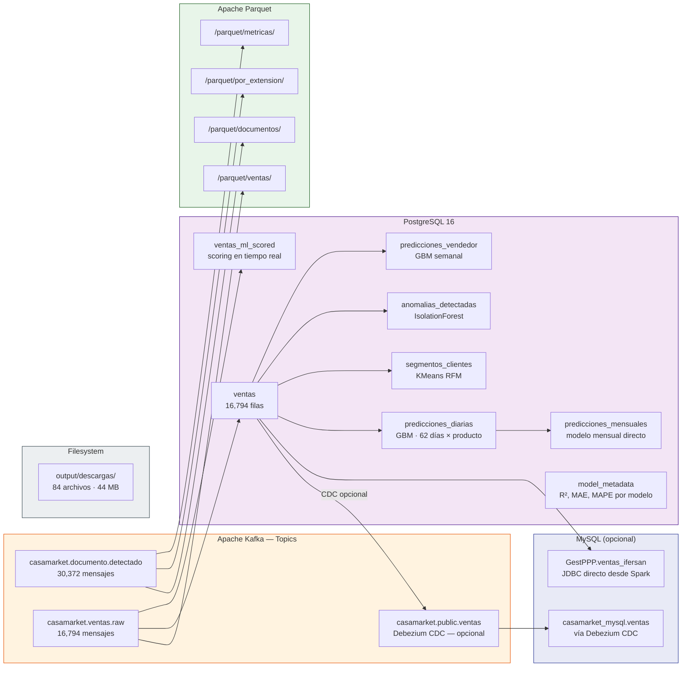

# Datos del Sistema

> Si buscas la explicación de dónde sale cada dato desde el negocio real hasta el modelo de ML, empieza por [¿De dónde viene la data?](origen-datos.md). Esta página es el mapa técnico de dónde vive cada dato *dentro* de la infraestructura.

## Mapa de datos

## Volúmenes de datos

| Almacén | Formato | Filas/Mensajes | Tamaño |
|---------|---------|----------------|--------|
| Topic `documento.detectado` | JSON en Kafka | 30,372 msgs | — |
| Topic `ventas.raw` | JSON en Kafka | 16,794 msgs | — |
| PostgreSQL: `ventas` | Relacional | 16,794 filas | ~5 MB |
| PostgreSQL: 6 tablas de ML + `model_metadata` | Relacional | miles de filas (predicciones diarias × producto × 62 días, etc.) | &lt; 5 MB |
| Parquet: `ventas` | Columnar | ~16,794 filas | ~2 MB |
| Archivos descargados | Excel/HTML/PDF | 84 archivos | 44 MB |
| Estado persistente JSON | JSON | 3 archivos | &lt; 50 KB |

## Páginas de esta sección

| Página | Contenido |
|---|---|
| [¿De dónde viene la data?](origen-datos.md) | El recorrido completo desde la venta real hasta el modelo de ML |
| [Tópicos Kafka](kafka-topics.md) | Esquema de cada mensaje, consumidores, offsets |
| [PostgreSQL](postgresql.md) | Esquema completo de las 8 tablas y vistas |
| [Sincronización MySQL (opcional)](mysql-sync.md) | El componente CDC vía Debezium, cómo activarlo |
