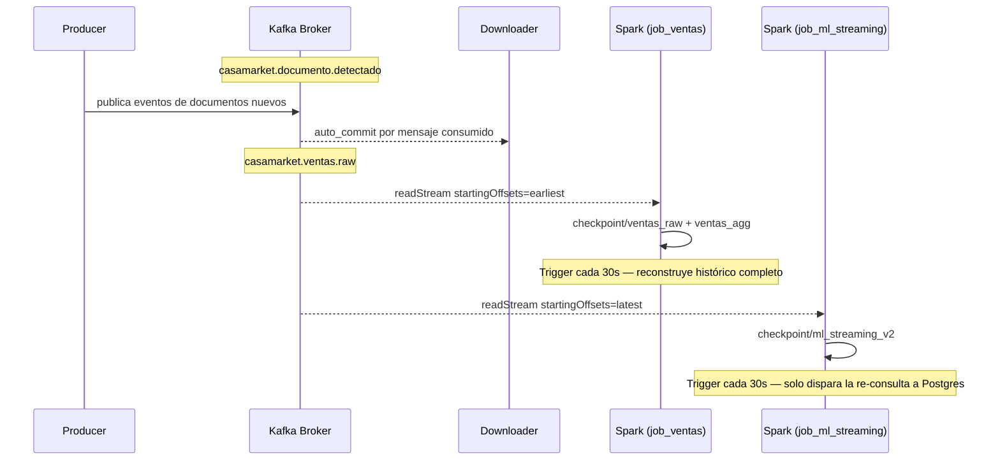

# Tópicos de Kafka

## Configuración del broker

**Imagen:** `apache/kafka:3.7.0` · **Modo:** KRaft (sin ZooKeeper) · **UI de administración:** `http://localhost:18085`

```
Listeners:
  INTERNAL:   ec-kafka:9092       (comunicación intra-docker)
  EXTERNAL:   localhost:19092     (acceso desde el host)
  CONTROLLER: ec-kafka:9093       (consenso Raft)
```

---

## casamarket.documento.detectado

**Propósito:** eventos de documentos detectados en el ERP CasaMarket con status finalizado.

| Propiedad | Valor |
|-----------|-------|
| Particiones | 1 |
| Factor de replicación | 1 |
| Mensajes totales | **30,372** |
| Retención | 7 días (default) |
| Creación | auto-create habilitado |

### Schema del mensaje

```json
{
  "id":           180472,
  "filename":     "detalle_de_ventas__2026_05_19_10_02_47_xlsx_5588.xlsx",
  "extension":    "xlsx",
  "status":       "Finalizado",
  "url_file":     "https://s3.amazonaws.com/casamarket-prod/...",
  "created_at":   "2026-04-27T07:32:51Z",
  "usuario":      "<email del usuario del ERP>",
  "detectado_en": "2026-05-26T03:47:28.000000+00:00"
}
```

**Clave del mensaje:** ID del documento (entero).

### Consumidores

| Consumer group | Componente | Offset inicial |
|---------------|-----------|---------------|
| `casamarket-downloader` | `consumer_downloader.py` | `earliest` |
| — (Spark) | `job_documentos.py` | `earliest` |

---

## casamarket.ventas.raw

**Propósito:** una fila de venta parseada por cada mensaje. Generado por el parser al procesar cada Excel/HTML descargado.

| Propiedad | Valor |
|-----------|-------|
| Particiones | 1 |
| Factor de replicación | 1 |
| Mensajes totales | **16,794** |
| Retención | 7 días (default) |

### Schema del mensaje

```json
{
  "fecha":           "2026-05-12",
  "hora":            "21:30:27",
  "producto":        "PEPSI 2000ML",
  "cod_producto":    "PEP-001",
  "marca":           "LINEA PEPSI",
  "categoria":       "GASEOSAS PEPSI",
  "subcategoria":    "RETORNABLE 2L",
  "cantidad":        "6",
  "precio_unitario": "19.07",
  "total":           "144.0",
  "cliente":         "YOLANDA GONZA HUANCA",
  "ruc_cliente":     "17107",
  "vendedor":        "ROSA CUSILAYME",
  "razon_social":    "FERNANDEZ CALA TOMAS",
  "zona":            "ZONA NORTE",
  "_archivo":        "detalle_de_ventas__2026_05_19_xlsx.xlsx",
  "_tipo":           "xlsx",
  "_parseado_en":    "2026-05-26T03:47:28.000000+00:00"
}
```

**Clave del mensaje:** ninguna (null) — la partición única hace que el orden de llegada se preserve igual.

### Consumidores

Este topic tiene **dos** consumidores Spark independientes, cada uno con un propósito distinto:

| Consumer | Componente | Offset inicial | Para qué |
|---------------|-----------|---------------|---|
| `job_ventas.py` | Spark (`spark-ventas`) | `earliest` | Reconstruir el histórico completo en PostgreSQL/MySQL/Parquet |
| `job_ml_streaming.py` | Spark (`spark-ml`) | `latest` | Disparar (cada 30s) la comparación de ventas de hoy vs predicción |

---

## casamarket.public.ventas (CDC — opcional)

**Propósito:** cambios capturados por Debezium desde el WAL de PostgreSQL sobre la tabla `ventas`. Este topic **solo existe si alguien registró manualmente el conector** — no se crea automáticamente al levantar el stack (ver [Sincronización MySQL](mysql-sync.md)).

| Propiedad | Valor |
|-----------|-------|
| Generado por | Debezium `PostgresConnector` 2.7 |
| Slot WAL | `debezium_ventas_slot` |
| Publication | `debezium_ventas_pub` |
| Plugin WAL | `pgoutput` |
| Prefijo de topic | `casamarket` |

### Schema del mensaje CDC (simplificado)

```json
{
  "payload": {
    "before": null,
    "after": { "id": 1, "fecha": "2026-05-12", "producto": "PEPSI 2000ML", "total": 144.0, "...": "..." },
    "source": { "connector": "postgresql", "db": "casamarket", "table": "ventas" },
    "op": "c",
    "ts_ms": 1748260048123
  }
}
```

`op`: `c` = create, `u` = update, `d` = delete, `r` = snapshot inicial.

---

## Configuración del conector Debezium (si se registra)

```json
{
  "name": "pg-ventas-debezium",
  "connector.class": "io.debezium.connector.postgresql.PostgresConnector",
  "database.hostname": "postgres",
  "database.port": "5432",
  "database.dbname": "casamarket",
  "topic.prefix": "casamarket",
  "table.include.list": "public.ventas",
  "plugin.name": "pgoutput",
  "publication.name": "debezium_ventas_pub",
  "slot.name": "debezium_ventas_slot",
  "snapshot.mode": "initial"
}
```

---

## Diagrama de flujo de offsets


