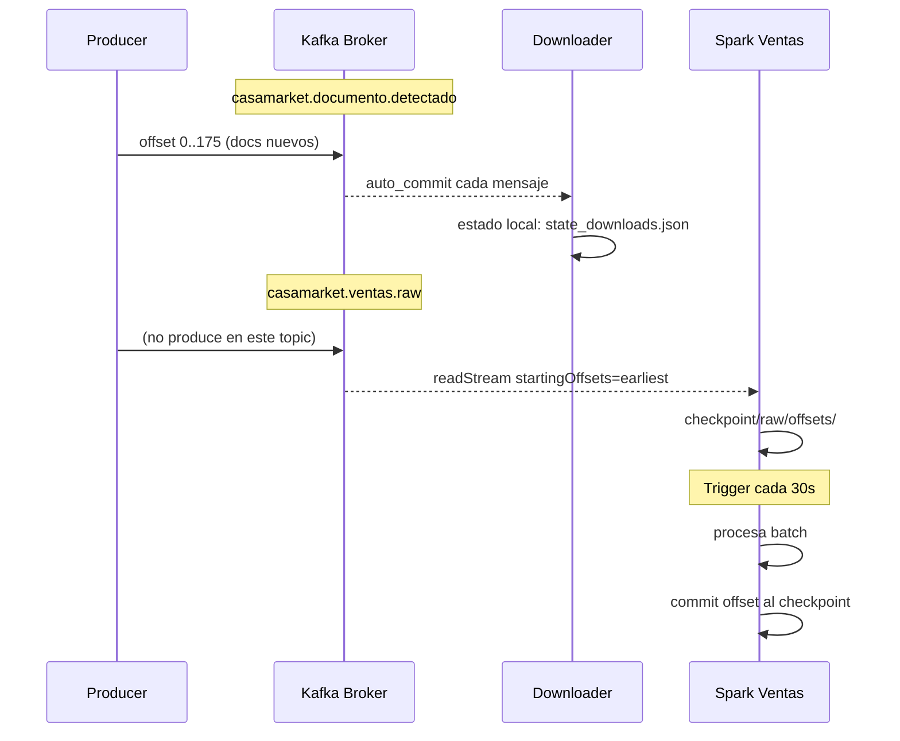

# Topics de Kafka

## Configuracion del Broker

**Imagen:** `apache/kafka:3.7.0`  
**Modo:** KRaft (sin ZooKeeper)  
**Cluster ID:** `4L6g3nShT-eMCtK--X86sw`  
**UI de administracion:** `http://localhost:18085`

```
Listeners:
  INTERNAL: ec-kafka:9092       (comunicacion intra-docker)
  EXTERNAL: localhost:19092     (acceso desde host)
  CONTROLLER: ec-kafka:9093     (raft consensus)
```

---

## casamarket.documento.detectado

**Proposito:** Eventos de documentos detectados en el ERP con status finalizado.

| Propiedad | Valor |
|-----------|-------|
| Particiones | 1 |
| Factor de replicacion | 1 |
| Mensajes totales | **30.372** |
| Retencion | 7 dias (default) |
| Creacion | Auto-create habilitado |

### Schema del Mensaje

```json
{
  "id":           180472,
  "filename":     "detalle_de_ventas__2026_05_19_10_02_47_xlsx_5588.xlsx",
  "extension":    "xlsx",
  "status":       "Finalizado",
  "url_file":     "https://s3.amazonaws.com/casamarket-prod/...",
  "created_at":   "2026-04-27T07:32:51Z",
  "usuario":      "admin1@tomas.com",
  "detectado_en": "2026-05-26T03:47:28.000000+00:00"
}
```

**Clave del mensaje:** ID del documento (como string UTF-8)

### Consumidores

| Consumer Group | Componente | Offset Policy |
|---------------|-----------|---------------|
| `casamarket-downloader` | consumer_downloader.py | earliest |
| Spark job_documentos | spark-streaming | earliest |

---

## casamarket.ventas.raw

**Proposito:** Una fila de transaccion de venta por cada mensaje. Generado por el parser al procesar archivos Excel.

| Propiedad | Valor |
|-----------|-------|
| Particiones | 1 |
| Factor de replicacion | 1 |
| Mensajes totales | **16.794** |
| Retencion | 7 dias (default) |

### Schema del Mensaje

```json
{
  "fecha":           "2026-05-12",
  "producto":        "PEPSI 2000ML",
  "cod_producto":    "PEP-001",
  "marca":           "LINEA PEPSI",
  "categoria":       "GASEOSAS PEPSI",
  "subcategoria":    "RETORNABLE 2L",
  "cantidad":        "6",
  "precio_unitario": "19.07",
  "total":           "144.0",
  "cliente":         "YOLANDA GONZA HUANCA",
  "ruc_cliente":     "17107",
  "vendedor":        "ROSA CUSILAYME",
  "razon_social":    "FERNANDEZ CALA TOMAS",
  "zona":            "ZONA NORTE",
  "_archivo":        "detalle_de_ventas__2026_05_19_xlsx.xlsx",
  "_tipo":           "xlsx",
  "_parseado_en":    "2026-05-26T03:47:28.000000+00:00"
}
```

**Clave del mensaje:** no tiene clave definida (null)

### Consumidores

| Consumer Group | Componente | Offset Policy |
|---------------|-----------|---------------|
| Spark spark-ventas | job_ventas.py | earliest |

---

## casamarket.public.ventas (CDC)

**Proposito:** Cambios capturados por Debezium desde el WAL de PostgreSQL. Cada INSERT/UPDATE/DELETE en la tabla `ventas` genera un evento CDC.

| Propiedad | Valor |
|-----------|-------|
| Generado por | Debezium PostgresConnector 2.7 |
| Slot WAL | `debezium_ventas_slot` |
| Publication | `debezium_ventas_pub` |
| Plugin WAL | `pgoutput` |
| Prefijo de topic | `casamarket` |

### Schema del Mensaje CDC (simplificado)

```json
{
  "schema": { "...": "..." },
  "payload": {
    "before": null,
    "after": {
      "id": 1,
      "fecha": "2026-05-12",
      "producto": "PEPSI 2000ML",
      "total": 144.0,
      "...": "..."
    },
    "source": {
      "version": "2.7.0.Final",
      "connector": "postgresql",
      "name": "casamarket",
      "ts_ms": 1748260048000,
      "snapshot": "false",
      "db": "casamarket",
      "table": "ventas"
    },
    "op": "c",
    "ts_ms": 1748260048123
  }
}
```

**Operaciones CDC:** `c` = create, `u` = update, `d` = delete, `r` = read (snapshot)

---

## Topics Internos de Debezium

Kafka Connect utiliza tres topics internos para persistir su estado:

| Topic | Proposito |
|-------|-----------|
| `debezium.connect.configs` | Configuraciones de conectores |
| `debezium.connect.offsets` | Offsets de lectura WAL |
| `debezium.connect.status` | Estado de los conectores |

---

## Configuracion del Conector Debezium

```json
{
  "name": "ventas-pg-connector",
  "connector.class": "io.debezium.connector.postgresql.PostgresConnector",
  "database.hostname": "postgres",
  "database.port": "5432",
  "database.user": "casamarket",
  "database.password": "casamarket",
  "database.dbname": "casamarket",
  "topic.prefix": "casamarket",
  "table.include.list": "public.ventas",
  "plugin.name": "pgoutput",
  "publication.name": "debezium_ventas_pub",
  "slot.name": "debezium_ventas_slot",
  "snapshot.mode": "initial",
  "heartbeat.interval.ms": "10000",
  "decimal.handling.mode": "double",
  "time.precision.mode": "connect"
}
```

---

## Diagrama de Flujo de Offsets


