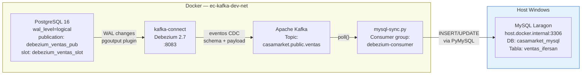
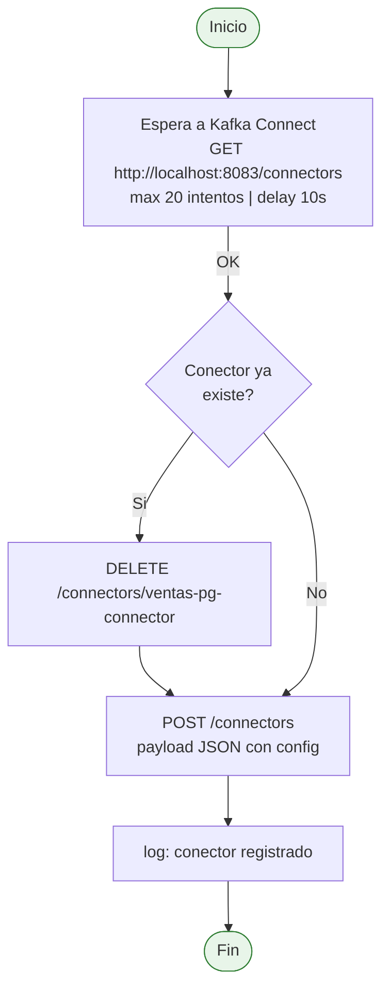

# Sincronizacion MySQL — Debezium CDC

El sistema implementa **Change Data Capture (CDC)** para replicar en tiempo real los datos de PostgreSQL hacia una instancia MySQL de Laragon en el host Windows.

---

## Diagrama de Flujo CDC



---

## Componente: registrar_conector.py

**Archivo:** `mysql_sync/registrar_conector.py` — 68 lineas  
**Proposito:** Registra el conector Debezium via REST API en Kafka Connect

### Proceso de registro



### Payload de registro

```json
{
  "name": "ventas-pg-connector",
  "config": {
    "connector.class":           "io.debezium.connector.postgresql.PostgresConnector",
    "database.hostname":         "postgres",
    "database.port":             "5432",
    "database.user":             "casamarket",
    "database.password":         "casamarket",
    "database.dbname":           "casamarket",
    "topic.prefix":              "casamarket",
    "table.include.list":        "public.ventas",
    "plugin.name":               "pgoutput",
    "publication.name":          "debezium_ventas_pub",
    "slot.name":                 "debezium_ventas_slot",
    "snapshot.mode":             "initial",
    "snapshot.include.collection.list": "public.ventas",
    "heartbeat.interval.ms":     "10000",
    "decimal.handling.mode":     "double",
    "time.precision.mode":       "connect"
  }
}
```

---

## Componente: mysql_sync.py

**Archivo:** `mysql_sync/mysql_sync.py`  
**Topic de entrada:** `casamarket.public.ventas`  
**Consumer group:** `debezium-consumer`

### Configuracion

| Variable | Valor | Descripcion |
|---------|-------|-------------|
| `KAFKA_BOOTSTRAP` | `ec-kafka:9092` | Broker interno Docker |
| `MYSQL_HOST` | `host.docker.internal` | MySQL Laragon en host |
| `MYSQL_PORT` | `3306` | Puerto MySQL estandar |
| `MYSQL_DB` | `casamarket_mysql` | Base de datos destino |
| `MYSQL_USER` | `root` | Usuario MySQL |
| `MYSQL_PASSWORD` | `""` (vacio) | Sin password (Laragon default) |

### extra_hosts en docker-compose

```yaml
mysql-sync:
  extra_hosts:
    - "host.docker.internal:host-gateway"
```

Esta linea permite que el contenedor Docker resuelva `host.docker.internal` hacia la IP gateway del host, necesario para alcanzar MySQL Laragon en Windows.

---

## Tabla Destino en MySQL

```sql
-- Base de datos: casamarket_mysql
CREATE TABLE IF NOT EXISTS ventas_ifersan (
    id              BIGINT AUTO_INCREMENT PRIMARY KEY,
    fecha           DATE,
    producto        VARCHAR(500),
    cod_producto    VARCHAR(200),
    marca           VARCHAR(200),
    categoria       VARCHAR(200),
    subcategoria    VARCHAR(200),
    cantidad        DOUBLE,
    precio_unitario DOUBLE,
    total           DOUBLE,
    cliente         VARCHAR(500),
    ruc_cliente     VARCHAR(100),
    vendedor        VARCHAR(200),
    razon_social    VARCHAR(200),
    zona            VARCHAR(200),
    procesado_ts    DATETIME DEFAULT CURRENT_TIMESTAMP
);
```

---

## Kafka Connect REST API

| Endpoint | Metodo | Descripcion |
|---------|--------|-------------|
| `/connectors` | GET | Lista conectores activos |
| `/connectors` | POST | Registra nuevo conector |
| `/connectors/{name}` | GET | Estado del conector |
| `/connectors/{name}` | DELETE | Elimina conector |
| `/connectors/{name}/status` | GET | Detalle de tareas |
| `/connectors/{name}/restart` | POST | Reinicia conector |

```bash
# Verificar estado del conector
curl http://localhost:8083/connectors/ventas-pg-connector/status

# Ver conectores activos
curl http://localhost:8083/connectors
```
