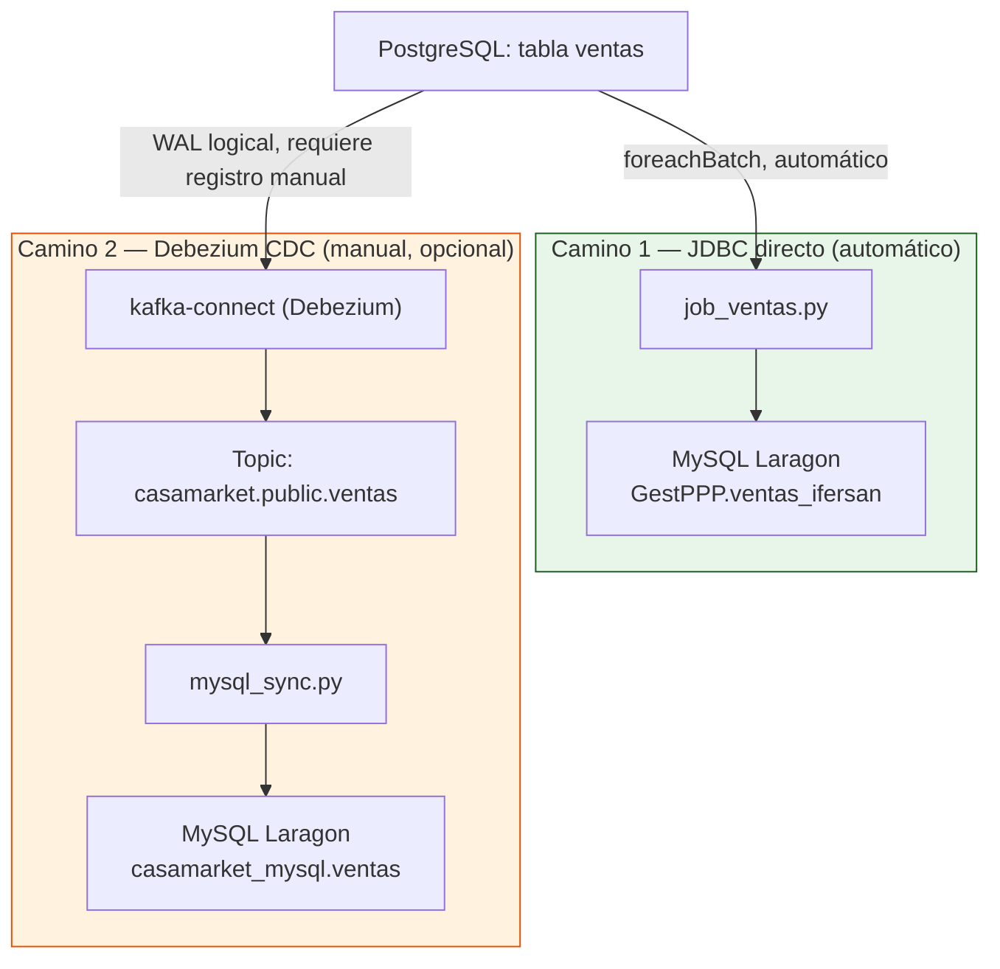
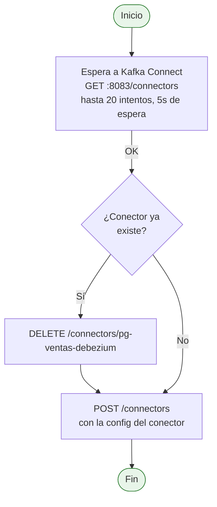

# Sincronización MySQL (componente opcional)

Esta parte del sistema **no es necesaria para que el pipeline principal funcione** (Kafka → Spark → PostgreSQL → 6 modelos de ML → Grafana/ml-web funcionan sin ella). Se documenta porque está presente en el `docker-compose.yml` y responde a un requisito del curso de mostrar interoperabilidad con un segundo motor de base de datos (MySQL), pero conviene entender exactamente qué hace y qué no hace automáticamente.

---

## Dos caminos independientes hacia MySQL

El repositorio implementa **dos mecanismos completamente distintos** para llevar datos a MySQL, que conviven pero no se coordinan entre sí:



| | Camino 1 — JDBC directo | Camino 2 — Debezium CDC |
|---|---|---|
| ¿Se activa solo al hacer `docker compose up`? | **Sí** | **No** — requiere un paso manual |
| Base/tabla destino | `GestPPP.ventas_ifersan` | `casamarket_mysql.ventas` |
| Cómo escribe | `job_ventas.py` hace `df.write.jdbc(...)` en cada micro-batch, igual que hace con PostgreSQL | `mysql_sync.py` consume eventos CDC de Kafka y hace `INSERT` fila por fila con PyMySQL |
| Captura updates/deletes | No (solo inserta lo que llega por Kafka) | Sí (Debezium captura `c`/`u`/`d` desde el WAL) |

En la práctica, **si solo levantas el stack con `docker compose up -d`, ya tienes datos en MySQL** vía el Camino 1 — el Camino 2 es un ejercicio adicional sobre Change Data Capture.

---

## Por qué el Camino 2 no arranca solo

`registrar_conector.py` registra el conector de Debezium contra la API REST de Kafka Connect, pero **nada en `docker-compose.yml` ni en ningún entrypoint lo ejecuta automáticamente**. Si no corres ese script a mano:

- El contenedor `kafka-connect` queda arriba y saludable, pero sin ningún conector registrado.
- El topic `casamarket.public.ventas` nunca se crea (Debezium es quien lo crea al registrarse).
- `mysql-sync` queda escuchando ese topic indefinidamente sin recibir nada.

### Activarlo manualmente

```bash
# 1. Verificar que kafka-connect esté arriba
curl http://localhost:8083/connectors

# 2. Registrar el conector (una sola vez)
python mysql_sync/registrar_conector.py

# 3. Verificar que quedó activo
curl http://localhost:8083/connectors/pg-ventas-debezium/status
```

---

## Componente: `registrar_conector.py`

**Archivo:** `mysql_sync/registrar_conector.py` (67 líneas)



---

## Componente: `mysql_sync.py`

**Archivo:** `mysql_sync/mysql_sync.py` (200 líneas)
**Topic de entrada:** `casamarket.public.ventas` · **Consumer group:** `mysql-sync-group`

Consume en batches de hasta 200 mensajes, parsea el sobre JSON de Debezium (`payload.op` ∈ `c`/`r`/`u`/`d`, usa `payload.after`), convierte las codificaciones de Debezium (`DATE` como días desde epoch, `TIMESTAMPTZ` como microsegundos desde epoch) a formatos que MySQL entiende, e inserta con `cursor.executemany(...)`. Los `DELETE` se detectan pero solo se registran en el log — no se replican.

### Configuración

| Variable | Valor por defecto | Descripción |
|---------|-------|-------------|
| `KAFKA_BOOTSTRAP` | `ec-kafka:9092` | Broker interno de Docker |
| `MYSQL_HOST` | `host.docker.internal` | MySQL Laragon en el host Windows |
| `MYSQL_PORT` | `3306` | Puerto MySQL estándar |
| `MYSQL_DB` | `casamarket_mysql` | Base de datos destino |
| `MYSQL_USER` | `root` | Usuario MySQL local |
| `MYSQL_PASSWORD` | *(vacío por defecto en Laragon)* | Password MySQL — configúralo si tu instalación de Laragon tiene una contraseña distinta |

```yaml
# extra_hosts en docker-compose — necesario para que el contenedor
# alcance el MySQL corriendo en el host Windows, no en otro contenedor
mysql-sync:
  extra_hosts:
    - "host.docker.internal:host-gateway"
```

---

## Kafka Connect REST API

| Endpoint | Método | Descripción |
|---------|--------|-------------|
| `/connectors` | GET | Lista conectores activos |
| `/connectors` | POST | Registra un conector nuevo |
| `/connectors/{name}/status` | GET | Estado del conector |
| `/connectors/{name}` | DELETE | Elimina el conector |
| `/connectors/{name}/restart` | POST | Reinicia el conector |
