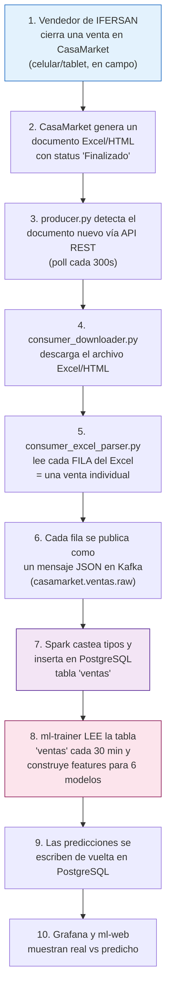

# ¿De dónde viene la data?

Esta página existe para responder la pregunta que normalmente queda implícita en un proyecto de Big Data: **¿de dónde sale, literalmente, cada número que termina en una predicción de Machine Learning?** No hay datos sintéticos ni generados con un script — todo el dataset son transacciones reales de una empresa real, capturadas exactamente como las registró su equipo de ventas.

---

## El origen: una distribuidora real usando un ERP real

**IFERSAN** es una distribuidora de bebidas en Juliaca, Puno, Perú — distribuye Pepsi, Inca Kola, Coca-Cola, Escocesa y Pilsen, entre otras marcas. Sus vendedores visitan bodegas, ferreterías y tiendas todos los días y cierran ventas en campo.

Para registrar esas ventas, IFERSAN usa **CasaMarket**, un ERP comercial peruano (`admin.casamarket.la`) que miles de distribuidoras usan para gestión de ventas, no es un sistema construido para este proyecto. Cada vez que un vendedor cierra una venta desde su celular o tablet, esa transacción queda registrada en el backend de CasaMarket — no en nuestra infraestructura.

El problema que resolvimos: CasaMarket expone esos datos como **reportes Excel/HTML generados bajo demanda**, no como una API de streaming. Alguien tenía que entrar al sistema, generar el reporte y descargarlo manualmente — típicamente **un día después** de que ocurrieron las ventas.

---

## El camino completo, dato por dato



### Paso a paso

1. **La venta ocurre en el mundo real.** Un vendedor de IFERSAN (por ejemplo ROSA CUSILAYME, la vendedora líder del periodo con S/ 101,500 en ventas) cierra una venta de "PEPSI 2000ML" a un cliente. Esto queda registrado en CasaMarket con fecha, hora, producto, cantidad, precio, cliente y vendedor.

2. **CasaMarket agrupa las ventas en un documento.** El ERP no expone cada venta individual por API en tiempo real — genera reportes periódicos (`detalle_de_ventas__...xlsx`) que agregan muchas ventas en un solo archivo, marcados con `status = 2` ("Finalizado") cuando están listos para descargar.

3. **`producer.py` los detecta.** Cada 300 segundos, el producer se autentica contra `acl.casamarketapp.com` con las credenciales de la cuenta de IFERSAN y consulta `GET /documents` filtrando por rango de fechas. Compara los IDs recibidos contra los que ya conoce (`state_documentos.json`) y publica un evento por cada documento nuevo en el topic `casamarket.documento.detectado`. **Este es el primer punto donde el dato entra a nuestra infraestructura** — antes de esto, todo vive exclusivamente en los servidores de CasaMarket.

4. **`consumer_downloader.py` trae el archivo.** Consume el evento de Kafka y descarga el Excel/HTML real desde la URL firmada que entrega el ERP, guardándolo en `output/descargas/`.

5. **`consumer_excel_parser.py` abre el Excel fila por fila.** Aquí es donde una "venta" del mundo real se convierte en un registro de datos: cada fila de la hoja de cálculo (una transacción: fecha, producto, cantidad, precio unitario, total, cliente, vendedor, zona) se lee con `pandas`, se normalizan los nombres de columna (el Excel de CasaMarket no siempre nombra las columnas igual) y se publica como **un mensaje JSON independiente** en el topic `casamarket.ventas.raw`.

6. **Spark las persiste.** `job_ventas.py` consume ese topic, castea los campos (que llegan como texto) a tipos numéricos/fecha reales, e inserta cada fila en la tabla `ventas` de PostgreSQL — la misma tabla que van a leer los 6 modelos de ML.

7. **Los modelos leen `ventas`, no el Excel.** Ningún modelo de Machine Learning toca un archivo Excel ni la API del ERP directamente. Todos — el GBM diario, el forecast mensual, el modelo mensual directo, el KMeans de clientes, el IsolationForest de anomalías y el GBM de vendedores — parten de una consulta SQL sobre la tabla `ventas`. Por ejemplo, el modelo GBM diario por producto arranca con exactamente esta consulta:

   ```sql
   SELECT
       fecha,
       TRIM(producto) AS producto,
       ROUND(SUM(total)::NUMERIC, 2) AS ingresos,
       COALESCE(SUM(cantidad), 0)    AS unidades,
       COUNT(*)                      AS n_ventas
   FROM ventas
   WHERE fecha IS NOT NULL AND total > 0
     AND producto IS NOT NULL AND TRIM(producto) != ''
   GROUP BY fecha, TRIM(producto)
   ORDER BY fecha, producto
   ```

   A partir de esas filas agregadas por día y producto, el modelo construye 20 features (lags, promedios móviles, estacionalidad) y entrena. El detalle completo de qué consulta usa cada uno de los 6 modelos está en [Los 6 Modelos de ML](../componentes/ml-prediccion.md).

8. **Las predicciones vuelven a PostgreSQL, no a un archivo aparte.** `ml-trainer` escribe sus resultados en tablas nuevas (`predicciones_diarias`, `predicciones_mensuales`, `segmentos_clientes`, `anomalias_detectadas`, `predicciones_vendedor`) dentro de la misma base de datos — así Grafana y `ml-web` pueden mostrar en el mismo dashboard el dato real junto a la predicción, con un simple JOIN.

---

## Por qué esto importa para entender el proyecto

- **No hay "datos de prueba".** Los 16,794 registros de la tabla `ventas` son ventas reales de IFERSAN entre el 27 de abril y el 19 de mayo. Un pico extraño en las ventas de mediados de mayo (que rompió varios modelos en su primera versión, ver [Los 6 Modelos de ML](../componentes/ml-prediccion.md)) resultó ser un cambio real y temporal en un límite de la API del ERP — no un bug del pipeline.
- **El pipeline no modifica ni depende del ERP.** CasaMarket sigue funcionando exactamente igual para IFERSAN; este proyecto solo *lee* documentos ya generados por el flujo normal de trabajo de la empresa, vía la misma API que usaría cualquier integración externa.
- **Cada modelo de ML es tan bueno como la columna que usa.** Por eso la normalización de columnas del parser (paso 5) es más importante de lo que parece a primera vista: si `producto` llega vacío o mal mapeado en una fila, ese registro nunca llega a formar parte del entrenamiento de ningún modelo.

---

## Credenciales del ERP

Las credenciales reales usadas para autenticarse contra CasaMarket (usuario y contraseña de la cuenta de IFERSAN) viven **únicamente** en un archivo `.env` local, excluido de git mediante `.gitignore`. Ningún archivo de este repositorio ni de esta documentación contiene la contraseña real — donde el código o los ejemplos necesitan mostrar el formato de las credenciales, se usa un valor de ejemplo. Ver [Despliegue](../despliegue/index.md#variables-de-entorno) para el detalle de qué variables hacen falta y cómo configurarlas sin exponer nada sensible.
