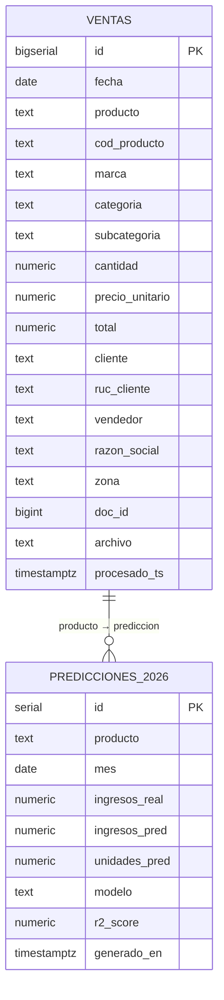

# PostgreSQL 16

**Imagen:** `postgres:16-alpine`  
**Contenedor:** `casamarket-postgres`  
**Puerto host:** `15432`  
**Credenciales:** `casamarket / casamarket / casamarket`

---

## Configuracion WAL para CDC

PostgreSQL esta configurado con nivel logico de WAL para permitir que Debezium capture cambios en tiempo real:

```
wal_level              = logical
max_replication_slots  = 5
max_wal_senders        = 5
```

Esta configuracion es obligatoria para el plugin `pgoutput` de Debezium.

---

## Diagrama Entidad-Relacion



---

## Tabla: ventas

Script de creacion (`postgres/init.sql`):

```sql
CREATE TABLE IF NOT EXISTS ventas (
    id               BIGSERIAL PRIMARY KEY,
    fecha            DATE,
    producto         TEXT,
    cod_producto     TEXT,
    marca            TEXT,
    categoria        TEXT,
    subcategoria     TEXT,
    cantidad         NUMERIC,
    precio_unitario  NUMERIC,
    total            NUMERIC,
    cliente          TEXT,
    ruc_cliente      TEXT,
    vendedor         TEXT,
    razon_social     TEXT,
    zona             TEXT,
    doc_id           BIGINT,
    archivo          TEXT,
    procesado_ts     TIMESTAMPTZ DEFAULT NOW()
);
```

**Filas actuales:** 16.794  
**Insertadas por:** Spark `job_ventas.py` via JDBC (modo append)

---

## Indices

```sql
CREATE INDEX idx_ventas_fecha     ON ventas (fecha);
CREATE INDEX idx_ventas_producto  ON ventas (producto);
CREATE INDEX idx_ventas_vendedor  ON ventas (vendedor);
CREATE INDEX idx_ventas_marca     ON ventas (marca);
CREATE INDEX idx_ventas_categoria ON ventas (categoria);
CREATE INDEX idx_ventas_cliente   ON ventas (cliente);
```

Los indices aceleran las consultas de Grafana (filtros por fecha/producto) y del modulo ML (agrupaciones por mes/producto).

---

## Vistas

### ventas_por_mes

```sql
CREATE OR REPLACE VIEW ventas_por_mes AS
SELECT
    DATE_TRUNC('month', fecha)::DATE AS mes,
    producto, marca, categoria, vendedor,
    COUNT(*)                              AS transacciones,
    SUM(cantidad)                         AS cantidad_total,
    ROUND(SUM(total)::NUMERIC, 2)         AS monto_total
FROM ventas
WHERE fecha IS NOT NULL
  AND total IS NOT NULL
  AND total > 0
GROUP BY 1, 2, 3, 4, 5
ORDER BY 1, monto_total DESC;
```

Usada por el modulo ML para la regresion mensual.

### top_productos

```sql
CREATE OR REPLACE VIEW top_productos AS
SELECT
    producto, marca, categoria,
    COUNT(*)          AS transacciones,
    SUM(cantidad)     AS unidades_vendidas,
    ROUND(SUM(total)::NUMERIC, 2) AS ingresos_totales
FROM ventas
WHERE producto IS NOT NULL AND total > 0
GROUP BY 1, 2, 3
ORDER BY ingresos_totales DESC;
```

Usada por el dashboard de Grafana (panel Top 15 productos).

---

## Tabla: predicciones_2026

Creada dinamicamente por `prediccion_ventas.py` via `pandas.DataFrame.to_sql()`:

```python
df_pred.to_sql(
    "predicciones_2026",
    engine,
    if_exists="append",
    index=False
)
```

**Schema inferido:**

| Columna | Tipo | Descripcion |
|---------|------|-------------|
| id | SERIAL | PK auto-generada |
| producto | TEXT | Nombre del producto |
| mes | DATE | Primer dia del mes 2026 |
| ingresos_real | NUMERIC | Ingresos reales (NULL si no hay datos) |
| ingresos_pred | NUMERIC | Prediccion del modelo |
| unidades_pred | NUMERIC | Unidades estimadas |
| modelo | TEXT | `LinearRegression` o `promedio` |
| r2_score | NUMERIC | Bondad del ajuste (0–1) |
| generado_en | TIMESTAMPTZ | Timestamp de generacion |

**Filas:** 15 productos × 12 meses = **180 registros**

---

## Conexion JDBC desde Spark

```python
# PostgreSQL
df.write.format("jdbc") \
    .option("url",      "jdbc:postgresql://postgres:5432/casamarket") \
    .option("dbtable",  "ventas") \
    .option("user",     "casamarket") \
    .option("password", "casamarket") \
    .option("driver",   "org.postgresql.Driver") \
    .mode("append") \
    .save()
```

### Acceso desde el host

```bash
psql -h localhost -p 15432 -U casamarket -d casamarket

# Consultas utiles
SELECT COUNT(*) FROM ventas;
SELECT * FROM top_productos LIMIT 15;
SELECT * FROM predicciones_2026 ORDER BY mes, producto;
```
