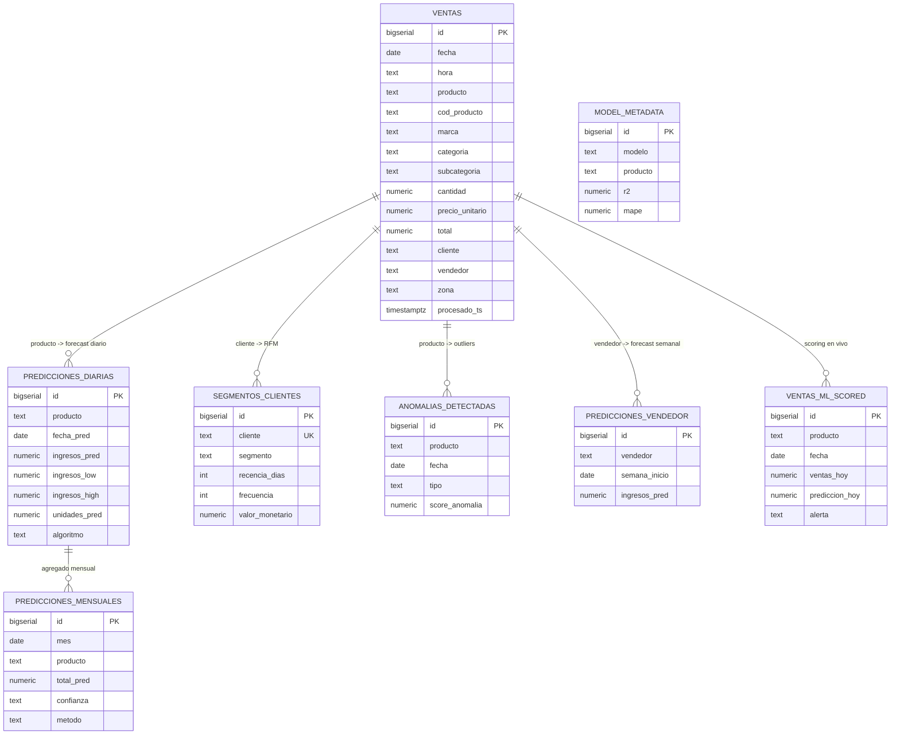

# PostgreSQL 16

**Imagen:** `postgres:16-alpine` · **Contenedor:** `casamarket-postgres`
**Puerto host:** `15432` · **Base de datos:** `casamarket`

---

## Configuración WAL para CDC

PostgreSQL corre con nivel lógico de WAL para permitir que Debezium (componente CDC opcional) capture cambios en tiempo real:

```
wal_level              = logical
max_replication_slots  = 5
max_wal_senders        = 5
```

Esta configuración es obligatoria para el plugin `pgoutput` de Debezium, aunque el CDC en sí sea opcional — ver [Sincronización MySQL](mysql-sync.md).

---

## Diagrama entidad-relación (simplificado)



---

## Tabla: `ventas`

La tabla central — todo lo demás en el sistema depende de esta. La llena `job_ventas.py` vía JDBC (`mode="append"`) a partir de `casamarket.ventas.raw`.

```sql
CREATE TABLE IF NOT EXISTS ventas (
    id               BIGSERIAL PRIMARY KEY,
    fecha            DATE,
    hora             TEXT,            -- HH:MM:SS recuperado del CSV original del ERP
    producto         TEXT,
    cod_producto     TEXT,
    marca            TEXT,
    categoria        TEXT,
    subcategoria     TEXT,
    cantidad         NUMERIC,
    precio_unitario  NUMERIC,
    total            NUMERIC,
    cliente          TEXT,
    ruc_cliente      TEXT,
    vendedor         TEXT,
    razon_social     TEXT,
    zona             TEXT,
    doc_id           BIGINT,
    archivo          TEXT,
    procesado_ts     TIMESTAMPTZ DEFAULT NOW()
);
```

**Filas reales:** 16,794 · **Índices:** `fecha`, `producto`, `vendedor`, `marca`, `categoria`, `cliente`, `hora` — aceleran tanto las agrupaciones diarias/mensuales de los 6 modelos de ML como los filtros de Grafana.

---

## Tablas de Machine Learning

### `predicciones_diarias` (Modelo 1 — GBM diario)

```sql
CREATE TABLE IF NOT EXISTS predicciones_diarias (
    id              BIGSERIAL PRIMARY KEY,
    producto        TEXT NOT NULL,
    fecha_pred      DATE NOT NULL,
    ingresos_pred   NUMERIC(14,2),
    ingresos_low    NUMERIC(14,2),   -- banda P10
    ingresos_high   NUMERIC(14,2),   -- banda P90
    unidades_pred   NUMERIC(10,2),
    algoritmo       TEXT DEFAULT 'GBM_v3',
    entrenado_en    TIMESTAMPTZ DEFAULT NOW(),
    UNIQUE(producto, fecha_pred)
);
```

### `predicciones_mensuales` (Modelo 3 — mensual directo)

```sql
CREATE TABLE IF NOT EXISTS predicciones_mensuales (
    id              BIGSERIAL PRIMARY KEY,
    mes             DATE NOT NULL,
    producto        TEXT NOT NULL,
    total_pred      NUMERIC(14,2),
    total_low       NUMERIC(14,2),
    total_high      NUMERIC(14,2),
    confianza       TEXT,            -- ALTA / MEDIA / BAJA
    metodo          TEXT,            -- GBM_mensual / Ridge_mensual / tendencia_lineal_2m / baseline_1mes
    meses_historia  INT,
    UNIQUE(mes, producto)
);
```

### `segmentos_clientes` (Modelo 4 — KMeans RFM)

```sql
CREATE TABLE IF NOT EXISTS segmentos_clientes (
    id                  BIGSERIAL PRIMARY KEY,
    cliente             TEXT NOT NULL UNIQUE,
    segmento            TEXT,        -- VIP / Regular / En Riesgo
    cluster_id          INT,         -- -1 para mega-outliers (VIP directo, fuera del clustering)
    recencia_dias       INT,
    frecuencia          INT,
    valor_monetario     NUMERIC(14,2),
    ticket_promedio     NUMERIC(10,2),
    ultima_compra       DATE
);
```

### `anomalias_detectadas` (Modelo 5 — IsolationForest)

```sql
CREATE TABLE IF NOT EXISTS anomalias_detectadas (
    id                BIGSERIAL PRIMARY KEY,
    producto          TEXT NOT NULL,
    fecha             DATE NOT NULL,
    ventas_reales     NUMERIC(14,2),
    media_historica   NUMERIC(14,2),
    desviacion_pct    NUMERIC(12,2),
    score_anomalia    NUMERIC(8,4),
    tipo              TEXT,          -- ALTA_VENTA / CAIDA_VENTAS / INUSUAL
    UNIQUE(producto, fecha)
);
```

### `predicciones_vendedor` (Modelo 6 — GBM semanal)

```sql
CREATE TABLE IF NOT EXISTS predicciones_vendedor (
    id                   BIGSERIAL PRIMARY KEY,
    vendedor             TEXT NOT NULL,
    semana_inicio        DATE NOT NULL,   -- lunes de la semana pronosticada
    ingresos_pred        NUMERIC(14,2),
    ingresos_low         NUMERIC(14,2),
    ingresos_high        NUMERIC(14,2),
    n_transacciones_pred NUMERIC(10,0),
    UNIQUE(vendedor, semana_inicio)
);
```

### `ventas_ml_scored` (scoring en tiempo real, `job_ml_streaming.py`)

```sql
CREATE TABLE IF NOT EXISTS ventas_ml_scored (
    id                 BIGSERIAL PRIMARY KEY,
    batch_id           BIGINT,
    producto           TEXT,
    fecha              DATE,
    ventas_hoy         NUMERIC(14,2),
    prediccion_hoy     NUMERIC(14,2),
    pred_low           NUMERIC(14,2),
    pred_high          NUMERIC(14,2),
    pct_completado     NUMERIC(8,2),
    alerta             TEXT             -- SOBRE_META / EN_META / EN_RIESGO / BAJO_META
);
```

### `model_metadata` (calidad de los modelos)

```sql
CREATE TABLE IF NOT EXISTS model_metadata (
    id           BIGSERIAL PRIMARY KEY,
    modelo       TEXT NOT NULL,   -- 'productos' | 'vendedores'
    producto     TEXT,
    algoritmo    TEXT,
    r2           NUMERIC(14,4),
    mae          NUMERIC(14,4),
    rmse         NUMERIC(14,4),
    mape         NUMERIC(10,2),
    n_muestras   INT,
    UNIQUE(modelo, producto)
);
```

> Solo `trainer.py` (`modelo='productos'`) y `trainer_vendedor.py` (`modelo='vendedores'`) escriben aquí — los otros 4 modelos guardan sus propias métricas de confianza en su tabla respectiva (`confianza`/`metodo` en `predicciones_mensuales`, por ejemplo), porque R²/MAE no aplican igual a clustering o detección de anomalías.

### `predicciones_2026` (legado, no se usa activamente)

Tabla original del prototipo con `LinearRegression`. Sigue existiendo para compatibilidad pero el pipeline actual ya no escribe en ella — el modelo mensual vigente es `predicciones_mensuales` (Modelo 3).

---

## Vistas

| Vista | Para qué | Usada por |
|---|---|---|
| `top_productos` | Ranking histórico por ingresos totales | Grafana |
| `ventas_por_mes` | Agregación mensual por producto/vendedor | Grafana |
| `ventas_heatmap_horario` | Ventas por hora del día × día de la semana | Grafana |
| `ranking_proximos_7d` | Suma de `predicciones_diarias` para los próximos 7 días | Grafana |
| `estado_dia_actual` | Real vs predicho de hoy + alerta (misma lógica que `job_ml_streaming.py`) | `ml-web`, Grafana |
| `forecast_resumen_mes` / `forecast_top_productos_mes` | Resumen del forecast del mes siguiente | Grafana |
| `ranking_mes_siguiente` | Ranking de `predicciones_mensuales` para el mes siguiente | `ml-web` |

```sql
-- estado_dia_actual: la vista que decide las 4 alertas de negocio
CREATE OR REPLACE VIEW estado_dia_actual AS
WITH ref AS (SELECT MAX(fecha) AS ultimo_dia FROM ventas WHERE total > 0)
SELECT
    v.producto,
    ROUND(SUM(v.total)::NUMERIC, 2) AS ventas_hoy,
    COALESCE(p.ingresos_pred, 0)    AS prediccion_hoy,
    CASE
        WHEN p.ingresos_high IS NOT NULL AND SUM(v.total) > p.ingresos_high THEN 'SOBRE_META'
        WHEN p.ingresos_low  IS NOT NULL AND SUM(v.total) >= p.ingresos_low  THEN 'EN_META'
        WHEN p.ingresos_pred IS NOT NULL AND SUM(v.total) >= p.ingresos_pred * 0.5 THEN 'EN_RIESGO'
        ELSE 'BAJO_META'
    END AS alerta
FROM ventas v
JOIN ref ON v.fecha = ref.ultimo_dia
LEFT JOIN predicciones_diarias p ON TRIM(v.producto) = p.producto
WHERE v.total > 0 AND v.producto IS NOT NULL
GROUP BY v.producto, p.ingresos_pred, p.ingresos_low, p.ingresos_high;
```

---

## Consultas rápidas

```sql
-- Top 5 productos por ingresos reales
SELECT producto, ROUND(SUM(total)::NUMERIC, 2) AS ingresos
FROM ventas WHERE total > 0
GROUP BY producto ORDER BY ingresos DESC LIMIT 5;

-- Ranking de vendedores
SELECT vendedor, ROUND(SUM(total)::NUMERIC, 2) AS ingresos, COUNT(*) AS transacciones
FROM ventas WHERE total > 0
GROUP BY vendedor ORDER BY ingresos DESC;

-- Estado de hoy: real vs predicho con alerta
SELECT producto, ventas_hoy, prediccion_hoy, alerta FROM estado_dia_actual;

-- Segmentos de clientes
SELECT segmento, COUNT(*) AS clientes, ROUND(AVG(valor_monetario)::NUMERIC, 2) AS valor_medio
FROM segmentos_clientes GROUP BY segmento ORDER BY valor_medio DESC;

-- Calidad de los modelos entrenados
SELECT modelo, producto, ROUND(r2::NUMERIC, 3) AS r2, ROUND(mape::NUMERIC, 1) AS mape_pct, n_muestras
FROM model_metadata ORDER BY modelo, mape;
```

### Acceso desde el host

```bash
psql -h localhost -p 15432 -U casamarket -d casamarket
```

Credencial de la base de datos local (no confundir con las credenciales del ERP): usuario y base `casamarket`, contraseña definida en `docker-compose.yml` como variable de entorno del contenedor — es una credencial de infraestructura local, no la cuenta real de IFERSAN en CasaMarket.
