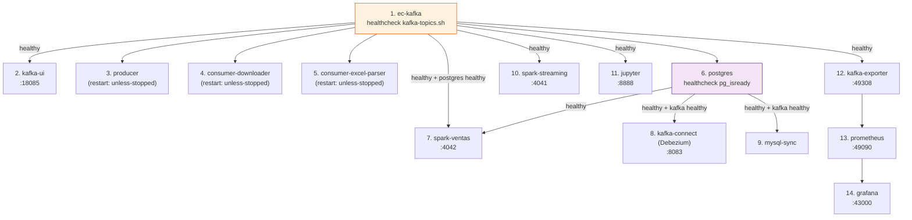

# Despliegue del Sistema

## Requisitos Previos

| Requisito | Version minima | Proposito |
|-----------|---------------|-----------|
| Docker Desktop | 4.x | Orquestacion de contenedores |
| Docker Compose | v2 | `docker compose` (sin guion) |
| RAM disponible | 8 GB | Spark necesita al menos 4 GB |
| Disco libre | 10 GB | Imagenes + datos + checkpoints |
| MySQL Laragon | 8.x | Destino CDC (opcional) |
| Python | 3.12 | Ejecucion local (opcional) |

---

## Variables de Entorno

**Archivo:** `.env` en la raiz del proyecto

```bash
gmail    = admin1@tomas.com
password = 76284084
dominio_casa_market = https://admin.casamarket.la/login
```

---

## Inicio Rapido

### 1. Levantar el stack completo

```bash
# Construir imagen Python y levantar todos los servicios
docker compose up --build -d

# Verificar que todos los servicios esten healthy
docker compose ps
```

### 2. Verificar el broker Kafka

```bash
# Comprobar que el broker responde
docker exec ec-kafka /opt/kafka/bin/kafka-topics.sh \
    --bootstrap-server localhost:9092 --list

# Ver detalles de un topic
docker exec ec-kafka /opt/kafka/bin/kafka-topics.sh \
    --bootstrap-server localhost:9092 \
    --describe --topic casamarket.ventas.raw
```

### 3. Registrar el conector Debezium (CDC)

```bash
# Ejecutar el script de registro desde el host
python mysql_sync/registrar_conector.py

# O desde el entorno virtual
.venv\Scripts\python mysql_sync\registrar_conector.py

# Verificar que el conector este activo
curl http://localhost:8083/connectors/ventas-pg-connector/status
```

### 4. Ejecutar las predicciones ML

```bash
# Ejecutar una vez que PostgreSQL tenga datos
.venv\Scripts\python ml\prediccion_ventas.py
```

---

## Orden de Inicio de Servicios



---

## Comandos de Operacion

```bash
# Ver logs de un servicio
docker compose logs -f producer
docker compose logs -f spark-ventas
docker compose logs -f consumer-excel-parser

# Reiniciar un servicio
docker compose restart producer

# Detener todo (preserva volumenes y datos)
docker compose down

# Detener y eliminar volumenes (DESTRUCTIVO — borra todos los datos)
docker compose down -v

# Ver uso de recursos
docker stats
```

---

## Acceso a Interfaces Web

| Interfaz | URL | Credenciales |
|---------|-----|-------------|
| Grafana | http://localhost:43000 | admin / casamarket |
| Kafka UI | http://localhost:18085 | — |
| JupyterLab | http://localhost:8888 | token: casamarket |
| Prometheus | http://localhost:49090 | — |
| Spark UI — ventas | http://localhost:4042 | — |
| Spark UI — docs | http://localhost:4041 | — |
| Kafka Connect REST | http://localhost:8083 | — |
| Kafka Exporter | http://localhost:49308/metrics | — |

---

## Instalar MkDocs y Levantar la Documentacion

```bash
# Instalar dependencias de documentacion
pip install mkdocs-material mkdocs-mermaid2-plugin

# Servir la documentacion en modo desarrollo
mkdocs serve
# Disponible en http://localhost:8000

# Generar sitio estatico
mkdocs build
# Salida en /site/
```

---

## Estructura del Proyecto

```
UnidadII/
├── docker-compose.yml          # 13 servicios Docker
├── Dockerfile                  # Python 3.12-slim base
├── requirements.txt            # Dependencias Python
├── .env                        # Credenciales ERP (no versionar)
├── mkdocs.yml                  # Configuracion de esta documentacion
│
├── producer/
│   ├── producer.py             # Ingesta desde ERP CasaMarket
│   └── state_documentos.json   # Estado persistente (175 IDs)
│
├── consumer/
│   ├── consumer_downloader.py  # Descarga archivos S3
│   ├── consumer_excel_parser.py# Parsea Excel → Kafka
│   ├── state_downloads.json    # Estado persistente (175 IDs)
│   └── state_excel_parsed.json # Estado persistente (215 archivos)
│
├── spark_streaming/
│   ├── job_documentos.py       # Consume documento.detectado → Parquet
│   └── job_ventas.py           # Consume ventas.raw → PG + MySQL + Parquet
│
├── ml/
│   └── prediccion_ventas.py    # LinearRegression → predicciones_2026
│
├── mysql_sync/
│   ├── mysql_sync.py           # CDC Kafka → MySQL
│   └── registrar_conector.py   # Registra conector Debezium
│
├── postgres/
│   └── init.sql                # DDL: ventas, indices, vistas
│
├── observability/
│   ├── prometheus.yml          # Scrape config
│   ├── alertas.yml             # 3 reglas de alerta
│   └── grafana/
│       ├── provisioning/       # Datasources + dashboard provisioning
│       └── dashboards/         # kafka_spark.json | ventas_casamarket.json
│
├── notebooks/
│   ├── 01_explorar_kafka.ipynb
│   └── 02_ml_prediccion_ventas.ipynb
│
├── output/
│   ├── descargas/              # 84 archivos (44 MB)
│   ├── checkpoints/            # Spark checkpoints
│   └── parquet/                # Datos en formato columnar
│
└── docs/                       # Esta documentacion (MkDocs)
    ├── index.md
    ├── arquitectura/
    ├── componentes/
    ├── datos/
    ├── observabilidad/
    ├── resultados/
    └── despliegue/
```
