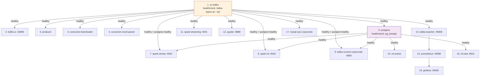

# Despliegue del Sistema

## Requisitos previos

| Requisito | Versión mínima | Propósito |
|-----------|---------------|-----------|
| Docker Desktop | 4.x | Orquestación de contenedores |
| Docker Compose | v2 (`docker compose`, sin guion) | Levantar los 17 servicios |
| RAM disponible | 8 GB | Spark necesita al menos 4 GB para sus 3 jobs |
| Disco libre | 10 GB | Imágenes + datos + checkpoints |
| Cuenta activa en CasaMarket | — | Credenciales del ERP para el `producer` |
| MySQL (Laragon u otro) | 8.x | Solo si se usa el sink de MySQL — opcional |
| Python | 3.12 | Solo para ejecutar scripts localmente (opcional) |

---

## Variables de entorno

**Archivo:** `.env` en la raíz del proyecto — **no está versionado en git** (`.gitignore` lo excluye explícitamente).

```bash
gmail    = tu_usuario@ejemplo.com
password = ********
dominio_casa_market = https://admin.casamarket.la/login
```

!!! warning "No subas tu `.env` a git ni lo publiques"
    `gmail` y `password` son las credenciales reales de tu cuenta en CasaMarket — con ellas cualquiera podría autenticarse contra el ERP como si fuera tu empresa. Este repositorio incluye `.env` en `.gitignore`; verifica que siga así antes de hacer cualquier commit o de publicar tu fork. Esta documentación **nunca** muestra un valor real de `password`, ni aquí ni en ninguna otra página — donde hace falta un ejemplo, se usa un placeholder.

El resto de "credenciales" que aparecen en `docker-compose.yml` (usuario/clave de PostgreSQL, admin de Grafana, token de Jupyter) son credenciales de infraestructura **local**, definidas por variables de entorno del propio `docker-compose.yml` — no corresponden a ninguna cuenta real ni dan acceso a nada fuera de tu propia máquina. Aun así, si vas a exponer estos servicios más allá de `localhost`, cámbialas por tus propios valores antes de hacerlo.

---

## Inicio rápido

### 1. Levantar el stack completo

```bash
docker compose up --build -d
docker compose ps
```

### 2. Verificar el broker Kafka

```bash
docker exec ec-kafka /opt/kafka/bin/kafka-topics.sh \
    --bootstrap-server localhost:9092 --list

docker exec ec-kafka /opt/kafka/bin/kafka-topics.sh \
    --bootstrap-server localhost:9092 \
    --describe --topic casamarket.ventas.raw
```

### 3. (Opcional) Registrar el conector CDC de Debezium

Solo si quieres activar la sincronización opcional a MySQL vía Debezium — ver [Sincronización MySQL](../datos/mysql-sync.md). El pipeline principal no lo necesita.

```bash
python mysql_sync/registrar_conector.py
curl http://localhost:8083/connectors/pg-ventas-debezium/status
```

### 4. Verificar que el ML esté generando predicciones

`ml-trainer` arranca automáticamente y corre su primer ciclo apenas PostgreSQL tenga datos de `ventas`. No hace falta ejecutar nada a mano:

```bash
docker compose logs -f ml-trainer
```

---

## Orden de arranque de los servicios



Kafka tarda unos segundos en arrancar en modo KRaft; todos los servicios dependientes esperan su healthcheck antes de iniciar, así que un `docker compose up -d` desde cero puede tardar ~60 segundos en estabilizarse completamente.

---

## Comandos de operación

```bash
# Ver logs de un servicio
docker compose logs -f producer
docker compose logs -f spark-ventas
docker compose logs -f ml-trainer

# Reiniciar un servicio
docker compose restart producer

# Forzar reentrenamiento de los 6 modelos de ML
docker compose restart ml-trainer

# Ver uso de recursos
docker stats

# Detener todo (conserva volúmenes y datos)
docker compose down

# Detener y eliminar volúmenes — DESTRUCTIVO, borra todos los datos
docker compose down -v
```

---

## Acceso a interfaces web

| Interfaz | URL | Credenciales |
|---------|-----|-------------|
| Grafana | `http://localhost:43000` | definidas en `docker-compose.yml` (local) |
| ml-web — Predicciones | `http://localhost:8501` | — |
| Kafka UI | `http://localhost:18085` | — |
| JupyterLab | `http://localhost:8888` | token definido en `docker-compose.yml` (local) |
| Prometheus | `http://localhost:49090` | — |
| Spark UI — ventas | `http://localhost:4042` | — |
| Spark UI — documentos | `http://localhost:4041` | — |
| Spark UI — ML streaming | `http://localhost:4043` | — |
| Kafka Connect REST (opcional) | `http://localhost:8083` | — |
| Kafka Exporter | `http://localhost:49308/metrics` | — |
| PostgreSQL | `localhost:15432` | definidas en `docker-compose.yml` (local) |

---

## Levantar esta documentación (MkDocs)

```bash
pip install mkdocs-material mkdocs-mermaid2-plugin

mkdocs serve
# http://localhost:8000

mkdocs build
# salida estática en /site/
```

---

## Estructura del proyecto

```
UnidadII/
├── docker-compose.yml          # 17 servicios Docker
├── Dockerfile                  # Python 3.12-slim (producer, consumers, mysql-sync)
├── requirements.txt
├── .env                        # credenciales del ERP — NO versionado
├── mkdocs.yml                  # configuración de esta documentación
│
├── producer/
│   ├── producer.py
│   └── state_documentos.json
│
├── consumer/
│   ├── consumer_downloader.py
│   ├── consumer_excel_parser.py
│   ├── state_downloads.json
│   └── state_excel_parsed.json
│
├── spark_streaming/
│   ├── job_documentos.py
│   ├── job_ventas.py
│   └── job_ml_streaming.py     # scoring en tiempo real
│
├── ml/
│   ├── app.py                  # ml-web — FastAPI + Chart.js
│   ├── Dockerfile.web
│   ├── trainer_main.py         # orquestador de los 6 modelos
│   ├── trainer.py               # Modelo 1 — GBM diario
│   ├── trainer_forecast.py      # Modelo 2 — forecast mensual
│   ├── trainer_mensual.py       # Modelo 3 — mensual directo
│   ├── trainer_clientes.py      # Modelo 4 — KMeans RFM
│   ├── trainer_anomalias.py     # Modelo 5 — IsolationForest
│   ├── trainer_vendedor.py      # Modelo 6 — GBM semanal
│   └── prediccion_ventas.py     # legado — LinearRegression, ya no se usa
│
├── postgres/
│   └── init.sql                # DDL: ventas + 7 tablas ML + vistas
│
├── observability/
│   ├── prometheus.yml
│   ├── alertas.yml
│   └── grafana/
│       ├── provisioning/
│       └── dashboards/         # kafka_spark.json · ventas_casamarket.json
│
├── mysql_sync/                 # componente CDC opcional
│   ├── mysql_sync.py
│   └── registrar_conector.py
│
├── notebooks/
│   ├── 01_explorar_kafka.ipynb
│   └── 02_ml_prediccion_ventas.ipynb
│
├── output/                     # generado en runtime, no versionado
│   ├── descargas/
│   ├── checkpoints/
│   └── parquet/
│
└── docs/                       # esta documentación (MkDocs)
```
