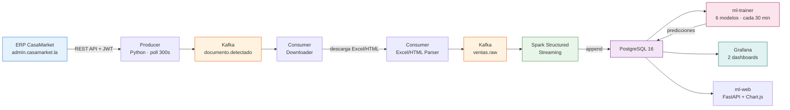

# CasaMarket BigData Pipeline

**Pipeline de Big Data en tiempo real (arquitectura Kappa) con 6 modelos de Machine Learning, construido sobre datos reales de una distribuidora de bebidas**

---

## El problema que resolvemos

**CasaMarket** es un ERP peruano de gestión de ventas que usan distribuidoras, ferreterías y bodegas. Sus vendedores en campo cierran ventas todo el día, pero la gerencia solo puede ver esos datos **al día siguiente**, en un Excel de cientos de filas que alguien debe descargar y revisar a mano.

Este proyecto usa como caso real a **IFERSAN**, una distribuidora de bebidas (Pepsi, Inca Kola, Coca-Cola, Escocesa, Pilsen) en Juliaca, Puno, que opera dentro de CasaMarket. Construimos un pipeline que toma esos mismos datos — sin cambiar el ERP del cliente — y los convierte en información en tiempo real con predicciones de Machine Learning.

> Si quieres entender exactamente de dónde sale cada dato y cómo llega hasta el modelo de ML, la página **[¿De dónde viene la data?](datos/origen-datos.md)** sigue el camino completo: desde el vendedor cerrando una venta en el celular hasta la predicción que aparece en Grafana.

---

## La idea: Arquitectura Kappa

En vez de tener un proceso batch nocturno (que es como sigue funcionando CasaMarket hoy) optamos por **arquitectura Kappa**: todo pasa por un único stream de eventos en Kafka, sin una capa batch separada que mantener.

Cada venta registrada en CasaMarket aparece en Grafana en **menos de 8 minutos**, con predicciones ML actualizadas cada 30 minutos — sin que nadie tenga que abrir un Excel.

---

## Métricas reales del periodo procesado (27 abril – 19 mayo 2026)

16,794

Transacciones reales

S/ 406,150.50

Ingresos registrados

62

Productos únicos

1,106

Clientes únicos

30,372

Mensajes Kafka totales

6,074 msg/s

Throughput Spark (re-proceso)

Estos números no son sintéticos: son el resultado de correr el pipeline completo contra la cuenta real de IFERSAN en CasaMarket. El detalle completo está en **[Resultados](resultados/index.md)**.

---

## Los 6 modelos de Machine Learning

A diferencia de un modelo único, el sistema entrena **6 modelos especializados** cada 30 minutos, cada uno respondiendo una pregunta de negocio distinta:

| # | Modelo | Algoritmo | Pregunta que responde |
|:---:|:---|:---|:---|
| 1 | GBM diario por producto | `GradientBoostingRegressor` + quantile P10/P90 | ¿Cuánto venderá cada producto cada día de los próximos 62 días? |
| 2 | Forecast mensual agregado | Agregación de (1) | ¿Cuánto venderemos el próximo mes en total, con banda de incertidumbre? |
| 3 | Modelo mensual directo | GBM / Ridge / baseline (adaptativo) | ¿Cuál será el total del próximo mes por producto, sin acumular error diario? |
| 4 | Segmentación de clientes | `KMeans` sobre RFM | ¿Qué clientes son VIP, cuáles están en riesgo de irse? |
| 5 | Detección de anomalías | `IsolationForest` | ¿Qué días tuvo un producto ventas anormales (pico o caída)? |
| 6 | Predicción por vendedor | `GradientBoostingRegressor` semanal | ¿Cuánto venderá cada vendedor en las próximas 8 semanas? |

Cada modelo se construyó iterando sobre problemas reales encontrados en los datos (regímenes de venta que cambiaron a mitad del periodo, un cliente que distorsionaba los clusters, bandas de confianza inútiles, etc.) — el detalle de cada decisión de diseño está en **[Los 6 Modelos de ML](componentes/ml-prediccion.md)**.

---

## Módulos del sistema

=== "Ingesta"
    **Producer** se autentica contra la API REST del ERP CasaMarket cada 300 segundos, detecta documentos nuevos y publica un evento por cada uno al topic `casamarket.documento.detectado`.

=== "Descarga y parseo"
    **Consumer Downloader** descarga cada archivo Excel/HTML. **Consumer Excel Parser** escanea esa carpeta cada 60s, normaliza columnas con un diccionario de alias y publica cada fila de venta como mensaje en `casamarket.ventas.raw`.

=== "Procesamiento"
    **Spark Structured Streaming** consume ambos topics con triggers de 30s: persiste en PostgreSQL y Parquet, y un tercer job (`job_ml_streaming.py`) compara en tiempo real las ventas del día contra la predicción del modelo GBM.

=== "Machine Learning"
    **ml-trainer** reentrena los 6 modelos cada 30 minutos contra PostgreSQL. **ml-web** expone un panel FastAPI + Chart.js con el ranking de productos, forecast por producto y segmentos de clientes.

=== "Observabilidad"
    **Prometheus + Grafana**: un dashboard operativo de Kafka/Spark y un dashboard de negocio con ventas reales + predicciones ML.

---

## Stack tecnológico

| Capa | Tecnología | Versión |
|------|-----------|---------|
| Mensajería | Apache Kafka (KRaft, sin ZooKeeper) | 3.7.0 |
| Procesamiento en streaming | Apache Spark Structured Streaming | 3.5.1 |
| Almacenamiento | PostgreSQL | 16 |
| Machine Learning | scikit-learn (GradientBoosting, KMeans, IsolationForest, Ridge) | 1.4+ |
| Web de predicciones | FastAPI + Chart.js | — |
| Observabilidad | Prometheus + Grafana | latest |
| Orquestación | Docker Compose | 17 servicios |
| Lenguaje | Python | 3.12 |

---

## Mapa de esta documentación

| Sección | Qué vas a encontrar |
|---------|---------------------|
| [Arquitectura](arquitectura/index.md) | Patrón Kappa, diagrama completo, red Docker |
| [Componentes](componentes/index.md) | Cada script del pipeline, línea por línea explicado |
| [Datos](datos/index.md) | De dónde viene la data, topics de Kafka, esquema PostgreSQL |
| [Observabilidad](observabilidad/index.md) | Dashboards Grafana, métricas Prometheus, alertas |
| [Resultados](resultados/index.md) | Números reales del pipeline corriendo con datos de IFERSAN |
| [Despliegue](despliegue/index.md) | Cómo levantar el sistema completo con Docker Compose |

> **Nota sobre credenciales:** esta documentación está pensada para mostrarse a otros estudiantes. Las credenciales reales del ERP CasaMarket (usuario/clave de IFERSAN) viven únicamente en un archivo `.env` que **no está versionado en git** y no aparece en ninguna página de este sitio. Donde antes había una contraseña real, ahora hay un valor de ejemplo.