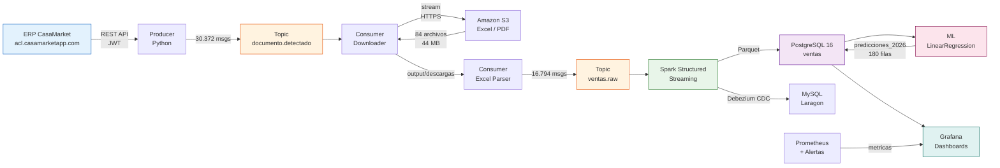

# CasaMarket BigData Pipeline

**Pipeline de ingesta y procesamiento de datos en tiempo real para distribucion de bebidas**

---

## Descripcion General

El sistema implementa una **arquitectura Kappa** de Big Data que captura documentos de ventas desde el ERP CasaMarket, los procesa mediante Apache Kafka y Apache Spark Structured Streaming, y genera predicciones de demanda con Machine Learning para los 15 productos principales.

Los datos corresponden a transacciones reales de la empresa distribuidora **Fernandez Cala Tomas (IFERSAN)**, procesando ventas del periodo **Abril — Mayo 2026**.

---

## Diagrama de Alto Nivel

---

## Metricas Clave

| Indicador | Valor |
|-----------|-------|
| Transacciones procesadas | **16.794** |
| Ingresos registrados | **S/ 406.150,50** |
| Productos unicos | **62** |
| Clientes unicos | **1.106** |
| Documentos descargados | **84 archivos (44 MB)** |
| Mensajes en Kafka | **47.166 total** |
| Throughput Spark (carga) | **6.074 msg/s** |
| Proyeccion ML 2026 | **S/ 1.614.943,32** |

---

## Modulos del Sistema

=== "Ingesta"
    **Producer** autentica contra la API REST del ERP cada 300 segundos, descarga el listado de documentos finalizados y publica cada evento al topic `casamarket.documento.detectado`.

=== "Descarga"
    **Consumer Downloader** consume el topic de documentos y descarga los archivos Excel/PDF directamente desde las URLs firmadas de Amazon S3, almacenandolos en `/output/descargas/`.

=== "Parseo"
    **Consumer Excel Parser** escanea el directorio de descargas cada 60 segundos, parsea los archivos Excel con `openpyxl` y publica cada fila de venta como un mensaje JSON al topic `casamarket.ventas.raw`.

=== "Procesamiento"
    **Spark Structured Streaming** consume ambos topics con trigger de 30 segundos, escribe en formato Parquet, persiste en PostgreSQL y sincroniza con MySQL via Debezium CDC.

=== "Observabilidad"
    **Prometheus + Grafana** con dos dashboards: metricas operativas Kafka/Spark (S8) y analisis de ventas con predicciones ML (S9).

---

## Stack Tecnologico

| Capa | Tecnologia | Version |
|------|-----------|---------|
| Mensaje | Apache Kafka (KRaft) | 3.7.0 |
| Procesamiento | Apache Spark Structured Streaming | 3.5.1 |
| Almacenamiento | PostgreSQL | 16 |
| Replicacion | Debezium CDC | 2.7 |
| Machine Learning | scikit-learn LinearRegression | — |
| Observabilidad | Prometheus + Grafana | Latest |
| Orquestacion | Docker Compose | — |
| Lenguaje | Python | 3.12 |

---

## Sesiones del Curso

| Sesion | Tema | Componente |
|--------|------|-----------|
| S6 | Kafka para ingesta en tiempo real | Producer + Consumer Downloader |
| S7 | Procesamiento en Streaming con Spark | Consumer Parser + Spark Jobs |
| S8 | Observabilidad de pipelines | Prometheus + Grafana (kafka_spark.json) |
| S9 | ML distribuido con regresion | prediccion_ventas.py + Dashboard ventas |
