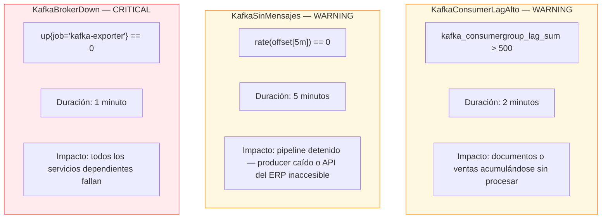

# Alertas — Prometheus

**Archivo:** `observability/alertas.yml` · **Evaluación:** cada 15 segundos

---

## Reglas configuradas

```yaml
groups:
  - name: kafka_alertas
    rules:

      - alert: KafkaConsumerLagAlto
        expr: kafka_consumergroup_lag_sum > 500
        for: 2m
        labels:
          severity: warning
        annotations:
          summary: "Consumer lag alto en {{ $labels.consumergroup }}"

      - alert: KafkaSinMensajes
        expr: rate(kafka_topic_partition_current_offset[5m]) == 0
        for: 5m
        labels:
          severity: warning
        annotations:
          summary: "Sin mensajes nuevos en Kafka"

      - alert: KafkaBrokerDown
        expr: up{job="kafka-exporter"} == 0
        for: 1m
        labels:
          severity: critical
        annotations:
          summary: "Kafka Exporter caído"
```

---

## Detalle de cada alerta



| Alerta | Severidad | Tiempo para disparar | Causa típica |
|--------|-----------|---------------------|-------------|
| `KafkaConsumerLagAlto` | WARNING | 2 min | Spark detenido o pico de carga de documentos |
| `KafkaSinMensajes` | WARNING | 5 min | `producer.py` caído o la API del ERP inaccesible |
| `KafkaBrokerDown` | CRITICAL | 1 min | Contenedor `ec-kafka` detenido |

Nota importante: estas 3 reglas cubren únicamente la **capa de infraestructura** (Kafka). No hay alertas de Prometheus sobre la calidad de las predicciones de ML — ese control de calidad vive en la sección "Precisión del Sistema" del dashboard de negocio y en la tabla `model_metadata`, no en Alertmanager.

---

## Consultar alertas

```bash
curl http://localhost:49090/api/v1/alerts
curl http://localhost:49090/api/v1/rules
curl http://localhost:49090/api/v1/targets
```

---

## Integración con Grafana

El dashboard "CasaMarket — Kafka + Spark S8" incluye un panel de tipo **Alert list** (`Alertas activas S8`) que muestra el estado en vivo de las 3 reglas. Para notificaciones (email, Slack, webhook) hay que configurar un **Contact point** desde `Alerting > Contact points` en la interfaz de Grafana — no viene provisionado por defecto en este proyecto.
