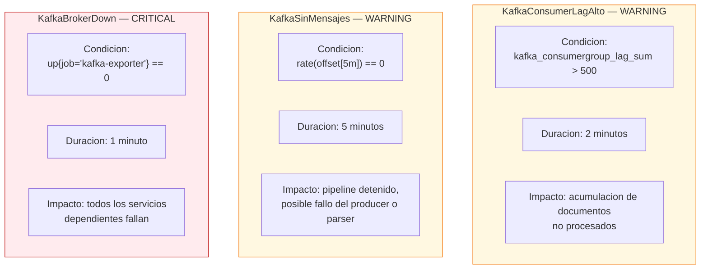

# Alertas — Prometheus

**Archivo:** `observability/alertas.yml`  
**Evaluacion:** Cada 15 segundos (segun `global.evaluation_interval`)

---

## Reglas de Alerta Configuradas

```yaml
groups:
  - name: casamarket-kafka
    rules:

      - alert: KafkaConsumerLagAlto
        expr: kafka_consumergroup_lag_sum > 500
        for: 2m
        labels:
          severity: warning
        annotations:
          summary: "Consumer lag alto en Kafka"
          description: "El lag del consumer group supera 500 mensajes por mas de 2 minutos."

      - alert: KafkaSinMensajes
        expr: rate(kafka_topic_partition_current_offset[5m]) == 0
        for: 5m
        labels:
          severity: warning
        annotations:
          summary: "Sin flujo de mensajes en Kafka"
          description: "No hay nuevos mensajes en ningun topic en los ultimos 5 minutos."

      - alert: KafkaBrokerDown
        expr: up{job="kafka-exporter"} == 0
        for: 1m
        labels:
          severity: critical
        annotations:
          summary: "Kafka broker caido"
          description: "El kafka-exporter no responde — el broker puede estar inactivo."
```

---

## Detalle de Alertas



| Alerta | Severidad | Tiempo para disparar | Causa tipica |
|--------|-----------|---------------------|-------------|
| KafkaConsumerLagAlto | WARNING | 2 min | Consumer detenido o lento, carga alta |
| KafkaSinMensajes | WARNING | 5 min | Producer caido, API del ERP inaccesible |
| KafkaBrokerDown | CRITICAL | 1 min | Contenedor ec-kafka detenido |

---

## Consultar alertas en Prometheus

```bash
# Ver alertas activas
curl http://localhost:49090/api/v1/alerts

# Ver reglas cargadas
curl http://localhost:49090/api/v1/rules

# Verificar estado de un target
curl http://localhost:49090/api/v1/targets
```

---

## Integracion con Grafana

Las alertas de Prometheus pueden visualizarse en Grafana mediante el panel de tipo **Alert list** o configurando un **Contact point** (email, Slack, webhook) desde `Alerting > Contact points` en la interfaz de Grafana (`http://localhost:43000`).

El dashboard `kafka_spark.json` incluye un panel de **Consumer Lag Gauge** con umbrales visuales:

| Rango | Color |
|-------|-------|
| 0 — 100 | Verde |
| 100 — 500 | Amarillo |
| 500+ | Rojo |
