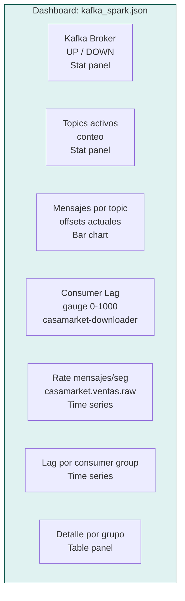
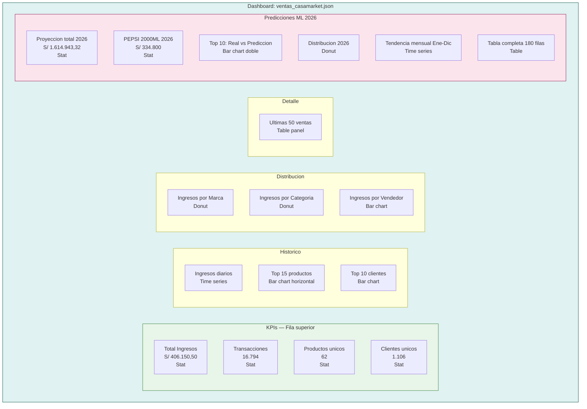

# Grafana — Dashboards

**Imagen:** `grafana/grafana:latest`  
**Contenedor:** `grafana`  
**Puerto host:** `43000`  
**URL:** `http://localhost:43000`  
**Credenciales:** `admin / casamarket`

---

## Datasources Provisionados

Los datasources se cargan automaticamente al iniciar el contenedor desde `observability/grafana/provisioning/datasources/ds.yml`:

| Nombre | Tipo | URL / Host | Default |
|--------|------|-----------|---------|
| casamarket-prom | Prometheus | `http://prometheus:9090` | Si |
| casamarket-pg | PostgreSQL | `postgres:5432` / db: casamarket | No |

---

## Dashboard S8: Kafka + Spark

**Archivo:** `observability/grafana/dashboards/kafka_spark.json`  
**Proposito:** Metricas operativas del pipeline en tiempo real  
**Datasource:** Prometheus



### Paneles del Dashboard S8

| Panel | Tipo | Metrica PromQL |
|-------|------|---------------|
| Kafka Broker UP/DOWN | Stat | `up{job="kafka-exporter"}` |
| Topics activos | Stat | `count(kafka_topic_partitions)` |
| Offset actual — documento.detectado | Stat | `kafka_topic_partition_current_offset{topic="casamarket.documento.detectado"}` |
| Offset actual — ventas.raw | Stat | `kafka_topic_partition_current_offset{topic="casamarket.ventas.raw"}` |
| Consumer Lag (Gauge) | Gauge (0-1000) | `kafka_consumergroup_lag_sum` |
| Rate mensajes/s | Time series | `rate(kafka_topic_partition_current_offset{topic="casamarket.ventas.raw"}[5m])` |
| Lag por consumer group | Time series | `kafka_consumergroup_lag` |
| Tabla de grupos | Table | `kafka_consumergroup_lag_sum` |

---

## Dashboard S9: Ventas CasaMarket

**Archivo:** `observability/grafana/dashboards/ventas_casamarket.json`  
**Proposito:** Analisis de ventas historicas y predicciones ML 2026  
**Datasource:** PostgreSQL



### Consultas SQL del Dashboard S9

=== "KPIs"
    ```sql
    -- Total ingresos
    SELECT ROUND(SUM(total)::NUMERIC, 2) FROM ventas WHERE total > 0;

    -- Total transacciones
    SELECT COUNT(*) FROM ventas;

    -- Productos unicos
    SELECT COUNT(DISTINCT producto) FROM ventas;

    -- Clientes unicos
    SELECT COUNT(DISTINCT cliente) FROM ventas;
    ```

=== "Historico"
    ```sql
    -- Ingresos diarios (Time series)
    SELECT
        fecha AS time,
        ROUND(SUM(total)::NUMERIC, 2) AS ingresos
    FROM ventas
    WHERE fecha IS NOT NULL AND total > 0
    GROUP BY fecha
    ORDER BY fecha;

    -- Top 15 productos
    SELECT producto, ROUND(SUM(total)::NUMERIC, 2) AS ingresos
    FROM ventas WHERE total > 0
    GROUP BY producto
    ORDER BY ingresos DESC
    LIMIT 15;
    ```

=== "Predicciones"
    ```sql
    -- Proyeccion total 2026
    SELECT ROUND(SUM(ingresos_pred)::NUMERIC, 2)
    FROM predicciones_2026;

    -- Tendencia mensual
    SELECT
        mes AS time,
        SUM(ingresos_pred) AS prediccion,
        SUM(ingresos_real) AS real
    FROM predicciones_2026
    GROUP BY mes
    ORDER BY mes;

    -- Top 10 real vs prediccion
    SELECT
        producto,
        ROUND(SUM(ingresos_real)::NUMERIC, 2) AS real,
        ROUND(SUM(ingresos_pred)::NUMERIC, 2) AS prediccion
    FROM predicciones_2026
    GROUP BY producto
    ORDER BY prediccion DESC
    LIMIT 10;
    ```

---

## Provisioning Automatico

Los dashboards se cargan automaticamente via archivo de provisioning:

**`observability/grafana/provisioning/dashboards/dashboard.yml`**

```yaml
apiVersion: 1

providers:
  - name: CasaMarket
    folder: CasaMarket
    type: file
    disableDeletion: false
    updateIntervalSeconds: 30
    options:
      path: /var/lib/grafana/dashboards
```

Cualquier archivo `.json` colocado en `observability/grafana/dashboards/` es cargado automaticamente al iniciar o actualizado cada 30 segundos.
