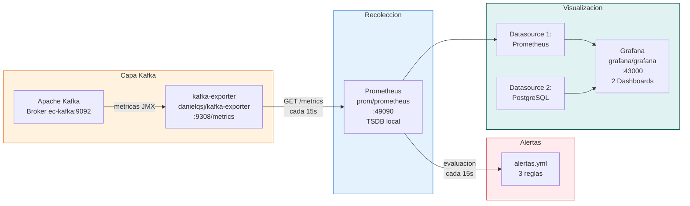

# Observabilidad del Sistema

## Stack de Observabilidad — S8

El sistema implementa el patron **Metrics → Scrape → Store → Visualize** con tres componentes:

---

## Dashboards Disponibles

| Dashboard | Archivo | Datasource | Proposito |
|-----------|---------|-----------|-----------|
| Kafka + Spark | `kafka_spark.json` | Prometheus | Metricas operativas del pipeline |
| Ventas CasaMarket | `ventas_casamarket.json` | PostgreSQL | Analisis de ventas + predicciones ML |

---

## Acceso a Servicios

| Servicio | URL | Credenciales |
|---------|-----|-------------|
| Grafana | `http://localhost:43000` | admin / casamarket |
| Prometheus | `http://localhost:49090` | — |
| Kafka Exporter | `http://localhost:49308/metrics` | — |
| Kafka UI | `http://localhost:18085` | — |
| Spark UI (ventas) | `http://localhost:4042` | — |
| Spark UI (docs) | `http://localhost:4041` | — |
| JupyterLab | `http://localhost:8888` | token: casamarket |
| Kafka Connect REST | `http://localhost:8083` | — |
