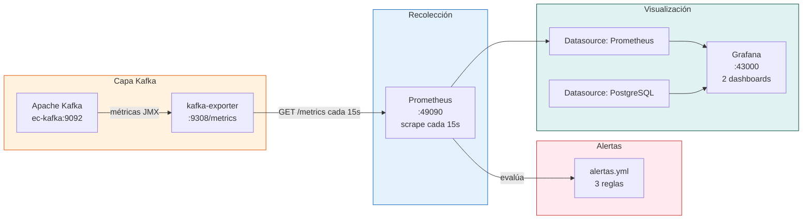

# Observabilidad del Sistema

## Stack de observabilidad

El patrón es **Metrics → Scrape → Store → Visualize**, con tres piezas:

---

## Los dos dashboards

| Dashboard | Archivo | Datasource | Paneles | Propósito |
|-----------|---------|-----------|:---:|-----------|
| **CasaMarket — Kafka + Spark S8** | `kafka_spark.json` | Prometheus | 10 | Salud operativa del pipeline: broker, topics, consumer lag, throughput |
| **IFERSAN — Panel de Ventas y Predicciones** | `ventas_casamarket.json` | PostgreSQL | 41 | Negocio real + los 6 modelos de ML: ventas, forecast, clientes, precisión |

El segundo dashboard es, en la práctica, la "cara" del proyecto de cara al negocio — cubre desde los KPIs generales hasta el detalle de precisión de cada modelo. Ver [Grafana](grafana.md) para el detalle panel por panel.

---

## Acceso a servicios

| Servicio | URL | Credenciales |
|---------|-----|-------------|
| Grafana | `http://localhost:43000` | ver nota abajo |
| Prometheus | `http://localhost:49090` | — |
| Kafka Exporter | `http://localhost:49308/metrics` | — |
| Kafka UI | `http://localhost:18085` | — |
| Spark UI — ventas | `http://localhost:4042` | — |
| Spark UI — documentos | `http://localhost:4041` | — |
| Spark UI — ML streaming | `http://localhost:4043` | — |
| JupyterLab | `http://localhost:8888` | ver nota abajo |
| Kafka Connect REST (opcional) | `http://localhost:8083` | — |
| ml-web | `http://localhost:8501` | — |

!!! note "Sobre las credenciales de Grafana y Jupyter"
    Grafana y JupyterLab usan credenciales **locales de infraestructura**, definidas como variables de entorno en `docker-compose.yml` (no son cuentas reales de nadie ni credenciales del ERP CasaMarket). Si vas a levantar el proyecto tú mismo, revisa `docker-compose.yml` y cámbialas por tu propio valor — no se publican en esta documentación.
