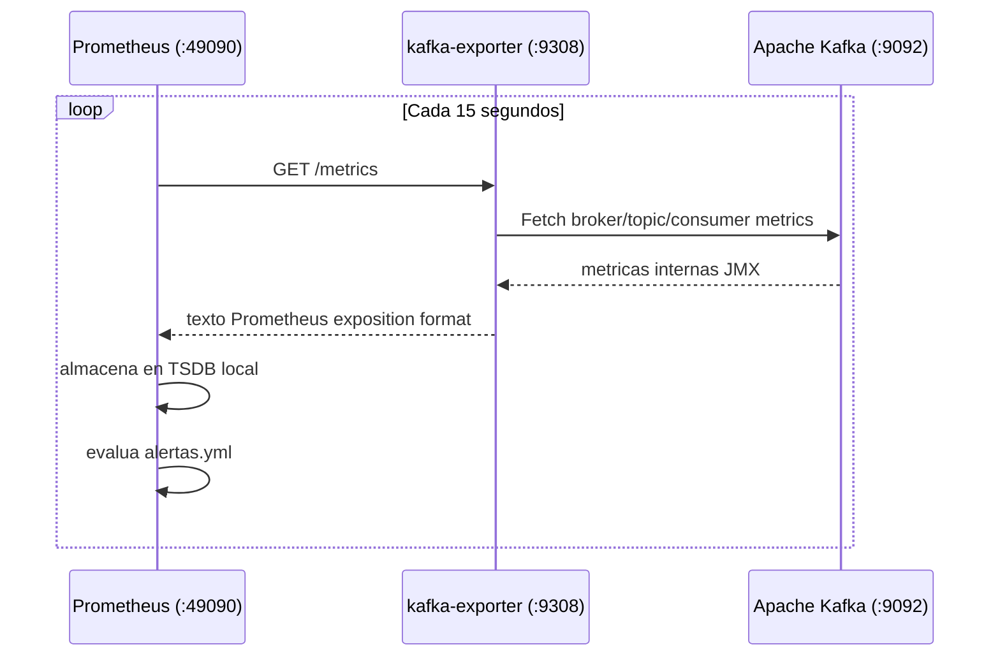

# Prometheus

**Imagen:** `prom/prometheus:latest`  
**Contenedor:** `prometheus`  
**Puerto host:** `49090`  
**URL:** `http://localhost:49090`

---

## Configuracion

**Archivo:** `observability/prometheus.yml`

```yaml
global:
  scrape_interval:     15s
  evaluation_interval: 15s

rule_files:
  - "alertas.yml"

scrape_configs:
  - job_name: "kafka-exporter"
    static_configs:
      - targets: ["kafka-exporter:9308"]

  - job_name: "prometheus"
    static_configs:
      - targets: ["prometheus:9090"]
```

---

## Metricas Expuestas por kafka-exporter

El contenedor `kafka-exporter` convierte las metricas internas de Kafka a formato Prometheus. Principales metricas disponibles:

### Metricas de Broker

| Metrica | Descripcion |
|---------|-------------|
| `kafka_brokers` | Numero de brokers activos |
| `up{job="kafka-exporter"}` | Estado del exporter (1=activo, 0=caido) |

### Metricas de Topics

| Metrica | Descripcion |
|---------|-------------|
| `kafka_topic_partitions` | Numero de particiones por topic |
| `kafka_topic_partition_current_offset` | Offset actual por particion |
| `kafka_topic_partition_oldest_offset` | Offset mas antiguo disponible |
| `kafka_topic_partition_leader` | ID del broker lider |
| `kafka_topic_partition_replicas` | Replicas configuradas |
| `kafka_topic_partition_in_sync_replica` | Replicas sincronizadas |

### Metricas de Consumer Groups

| Metrica | Descripcion |
|---------|-------------|
| `kafka_consumergroup_current_offset` | Offset comprometido por el consumer group |
| `kafka_consumergroup_lag` | Lag por particion |
| `kafka_consumergroup_lag_sum` | Lag total del consumer group |

---

## Consultas PromQL Utiles

```promql
# Estado del broker
up{job="kafka-exporter"}

# Lag total del consumer downloader
kafka_consumergroup_lag_sum{consumergroup="casamarket-downloader"}

# Rate de mensajes por segundo en ventas.raw
rate(kafka_topic_partition_current_offset{topic="casamarket.ventas.raw"}[5m])

# Offset actual del topic de documentos
kafka_topic_partition_current_offset{topic="casamarket.documento.detectado"}

# Diferencia entre offset producido y consumido (lag manual)
kafka_topic_partition_current_offset{topic="casamarket.ventas.raw"}
- kafka_consumergroup_current_offset{topic="casamarket.ventas.raw"}
```

---

## Retencion de Datos

| Parametro | Valor |
|-----------|-------|
| Almacenamiento | `/prometheus` (volumen Docker) |
| Retencion default | 15 dias |
| Formato | TSDB (bloques de 2h) |

---

## Diagrama de Scrape


