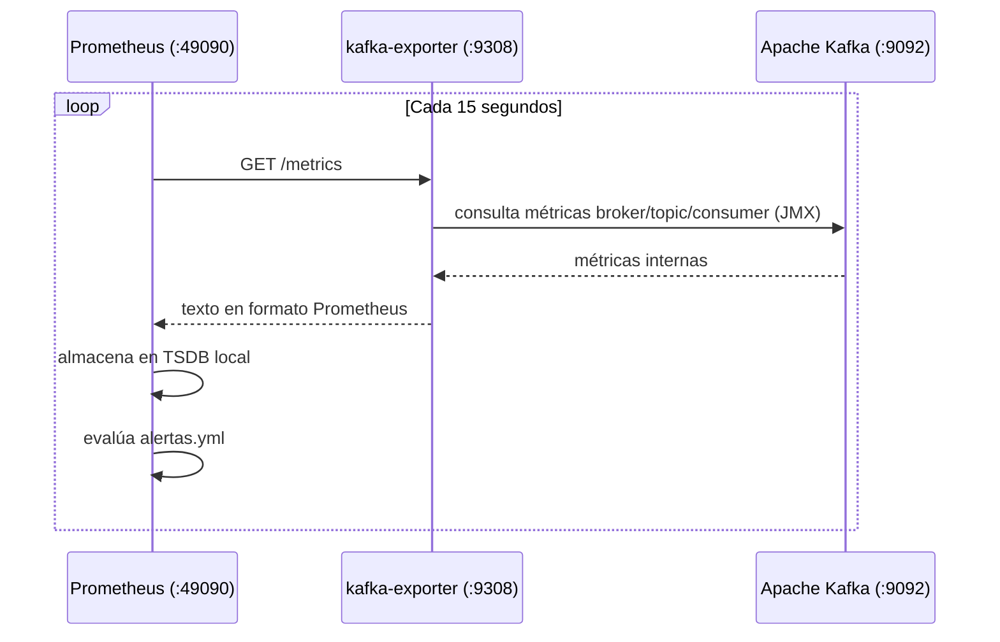

# Prometheus

**Imagen:** `prom/prometheus:latest` · **Contenedor:** `prometheus`
**Puerto host:** `49090` · **URL:** `http://localhost:49090`

---

## Configuración

**Archivo:** `observability/prometheus.yml`

```yaml
global:
  scrape_interval: 15s
  evaluation_interval: 15s

rule_files:
  - alertas.yml

scrape_configs:
  - job_name: 'kafka-exporter'
    static_configs:
      - targets: ['kafka-exporter:9308']
    metrics_path: /metrics

  - job_name: 'prometheus'
    static_configs:
      - targets: ['localhost:9090']
```

---

## Métricas expuestas por kafka-exporter

`kafka-exporter` traduce las métricas internas de Kafka (JMX) a formato Prometheus.

### Métricas de broker

| Métrica | Descripción |
|---------|-------------|
| `kafka_brokers` | Número de brokers activos |
| `up{job="kafka-exporter"}` | Estado del exporter (1=activo, 0=caído) |

### Métricas de topics

| Métrica | Descripción |
|---------|-------------|
| `kafka_topic_partitions` | Número de particiones por topic |
| `kafka_topic_partition_current_offset` | Offset actual por partición |
| `kafka_topic_partition_oldest_offset` | Offset más antiguo disponible |

### Métricas de consumer groups

| Métrica | Descripción |
|---------|-------------|
| `kafka_consumergroup_current_offset` | Offset comprometido por el consumer group |
| `kafka_consumergroup_lag` | Lag por partición |
| `kafka_consumergroup_lag_sum` | Lag total del consumer group |

---

## Consultas PromQL usadas en el dashboard S8

```promql
# Estado del broker
up{job="kafka-exporter"}

# Lag total del consumer downloader
kafka_consumergroup_lag_sum{consumergroup="casamarket-downloader"}

# Rate de mensajes por segundo en ventas.raw
rate(kafka_topic_partition_current_offset{topic="casamarket.ventas.raw"}[5m])

# Offset actual de cada topic
kafka_topic_partition_current_offset{topic="casamarket.documento.detectado"}
kafka_topic_partition_current_offset{topic="casamarket.ventas.raw"}
```

---

## Retención de datos

| Parámetro | Valor |
|-----------|-------|
| Almacenamiento | volumen Docker `prometheus_data` |
| Retención | default de Prometheus (15 días) |
| Formato | TSDB (bloques de 2h) |

---

## Ciclo de scrape


