# Resultados del Sistema

## Periodo de Datos

**Transacciones:** Abril 27 — Mayo 19, 2026  
**Empresa:** Fernandez Cala Tomas (IFERSAN)  
**Rubro:** Distribucion de bebidas (gaseosas, aguas, cervezas)

---

## Resumen Ejecutivo

```mermaid
flowchart LR
    subgraph REAL["Datos Reales — Abr/May 2026"]
        R1["16.794 transacciones"]
        R2["S/ 406.150,50 ingresos"]
        R3["62 productos"]
        R4["1.106 clientes"]
        R5["6 vendedores"]
    end

    subgraph PIPELINE["Pipeline Procesado"]
        P1["84 archivos descargados\n44 MB desde S3"]
        P2["30.372 msgs en Kafka\ndocumento.detectado"]
        P3["16.794 msgs en Kafka\nventas.raw"]
        P4["Throughput: 6.074 msg/s\nen Spark"]
    end

    subgraph ML_OUT["Predicciones 2026"]
        M1["S/ 1.614.943,32\nproyeccion top 15"]
        M2["180 registros\n15 productos x 12 meses"]
        M3["PEPSI 2000ML lider\nS/ 334.800 (Dic 2026)"]
    end

    REAL --> PIPELINE --> ML_OUT

    style REAL fill:#E3F2FD,stroke:#1565C0
    style PIPELINE fill:#E8F5E9,stroke:#1B5E20
    style ML_OUT fill:#FCE4EC,stroke:#880E4F
```

---

## KPIs del Negocio

| Indicador | Valor |
|-----------|-------|
| Ingresos totales registrados | **S/ 406.150,50** |
| Total de transacciones | **16.794** |
| Ticket promedio por transaccion | **S/ 24,18** |
| Productos catalogados | **62** |
| Clientes activos | **1.106** |
| Vendedores activos | **6** |
| Periodo cubierto | **23 dias** |
| Ingresos diarios promedio | **S/ 17.658** |

## KPIs del Pipeline

| Indicador | Valor |
|-----------|-------|
| Documentos detectados en ERP | **175** |
| Archivos descargados desde S3 | **84 (44 MB)** |
| Mensajes en documento.detectado | **30.372** |
| Mensajes en ventas.raw | **16.794** |
| Throughput Spark (re-proceso) | **6.074 msg/s** |
| Latencia batch Spark | **30 segundos** |
| Consumer lag final | **0 mensajes** |
| Uptime del pipeline | Continuo (restart: unless-stopped) |
