# Resultados del Sistema

## Periodo de datos

**Transacciones:** 27 abril – 19 mayo 2026
**Empresa:** IFERSAN (razón social: FERNANDEZ CALA TOMAS)
**Rubro:** Distribución de bebidas (gaseosas, aguas, cervezas) — Juliaca, Puno

---

## Resumen ejecutivo

```mermaid
flowchart LR
    subgraph REAL["Datos reales — 27 abr al 19 may"]
        R1["16,794 transacciones"]
        R2["S/ 406,150.50 ingresos"]
        R3["62 productos"]
        R4["1,106 clientes"]
    end

    subgraph PIPELINE["Pipeline procesado"]
        P1["84 archivos descargados\n44 MB"]
        P2["30,372 msgs en Kafka\ndocumento.detectado"]
        P3["16,794 msgs en Kafka\nventas.raw"]
        P4["Throughput: 6,074 msg/s"]
    end

    subgraph ML_OUT["6 modelos de ML"]
        M1["GBM diario: MAPE 6.9%\n51/62 productos"]
        M2["Forecast mensual\nP10/P90"]
        M3["203 VIP / 204 Regular\n699 En Riesgo"]
        M4["155 anomalías\nen 56 productos"]
    end

    REAL --> PIPELINE --> ML_OUT

    style REAL fill:#E3F2FD,stroke:#1565C0
    style PIPELINE fill:#E8F5E9,stroke:#1B5E20
    style ML_OUT fill:#FCE4EC,stroke:#880E4F
```

---

## KPIs del negocio

| Indicador | Valor |
|-----------|-------|
| Ingresos totales registrados | **S/ 406,150.50** |
| Total de transacciones | **16,794** |
| Ticket promedio por transacción | **S/ 24.18** |
| Productos catalogados | **62** |
| Clientes atendidos | **1,106** |
| Periodo cubierto | **23 días** |
| Producto líder por ingresos | PEPSI 2000ML — S/ 76,400 |
| Vendedora líder | ROSA CUSILAYME — S/ 101,500 |

## KPIs del pipeline

| Indicador | Valor |
|-----------|-------|
| Documentos únicos detectados en el ERP | **175** |
| Archivos descargados | **84 (44 MB)** |
| Mensajes en `documento.detectado` | **30,372** |
| Mensajes en `ventas.raw` | **16,794** |
| Throughput Spark (re-proceso completo) | **6,074 msg/s** |
| Trigger de los 3 jobs de Spark | **30 segundos** |
| Consumer lag final | **0 mensajes** |
| Latencia extremo a extremo (venta → Grafana) | **&lt; 8 minutos** |

## KPIs de los 6 modelos de ML

| Modelo | Resultado clave |
|---|---|
| 1 — GBM diario por producto | MAPE 6.9% promedio, 51/62 productos entrenados con confianza, R² -0.34 (antes -351) |
| 2 — Forecast mensual agregado | Proyección con banda P10/P90 heredada del Modelo 1 |
| 3 — Modelo mensual directo | Mayoría en confianza BAJA/MEDIA (solo ~1 mes de historia — mejora con el tiempo) |
| 4 — Segmentación de clientes | 203 VIP · 204 Regular · 699 En Riesgo |
| 5 — Detección de anomalías | 155 anomalías detectadas en 56 productos |
| 6 — Predicción por vendedor | Forecast semanal a 8 semanas por cada vendedor activo |

El detalle completo de cómo se llegó a estos números (y qué se rompió en el camino) está en [Los 6 Modelos de ML](../componentes/ml-prediccion.md).
