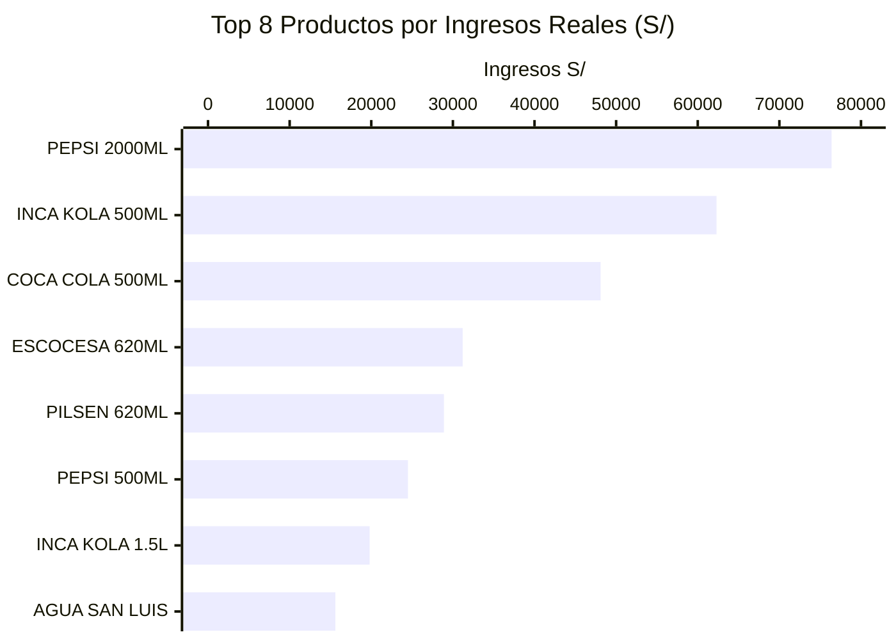
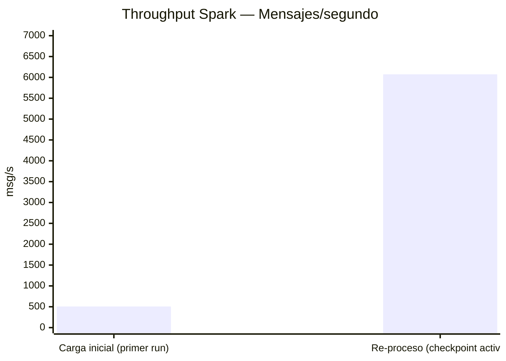
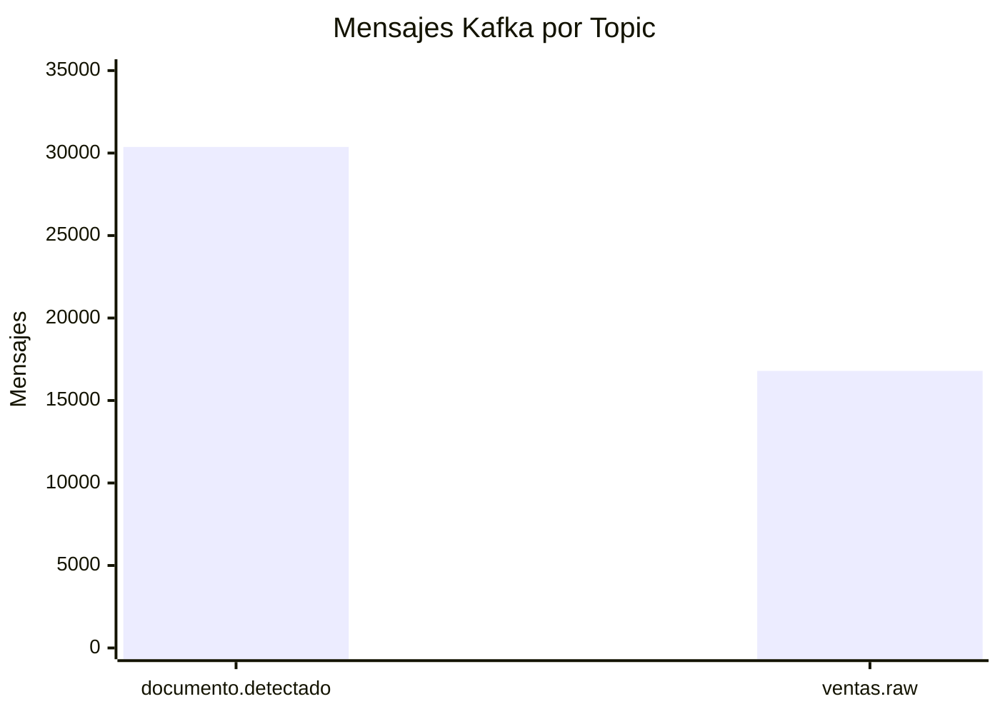

# Métricas del Sistema

## Top productos por ingresos reales



> Los valores exactos y actualizados se consultan directamente en el panel "Top 15 Productos por Ingresos Totales" del dashboard Grafana `ventas_casamarket.json`, o vía `SELECT * FROM top_productos LIMIT 15;`.

---

## Ventas por vendedor

| Vendedor | Ingresos aproximados |
|---------|---------|
| ROSA CUSILAYME | ~S/ 101,500 |
| JHONATAN | ~S/ 92,000 |
| Otros vendedores activos | resto del total (S/ 406,150.50) |

El detalle exacto y actualizado por vendedor está en el panel "Desempeño por Vendedor" del dashboard de Grafana, y alimenta directamente el Modelo 6 (predicción semanal por vendedor).

---

## Rendimiento del pipeline

### Throughput de Spark Structured Streaming



La diferencia entre la carga inicial y el re-proceso se debe a que, en el segundo caso, Spark no necesita re-evaluar el schema ni reinicializar las conexiones JDBC — simplemente retoma desde el offset del checkpoint.

### Latencia extremo a extremo

```mermaid
flowchart LR
    ERP["Vendedor cierra\nla venta"] -->|"hasta 300s\n(ciclo del producer)"| K1["Kafka\ndocumento.detectado"]
    K1 -->|"streaming inmediato"| DL["Descarga\ndel archivo"]
    DL -->|"variable, según tamaño"| FS["Filesystem\noutput/descargas"]
    FS -->|"hasta 60s\n(ciclo del parser)"| PARSE["Parser\npublica filas"]
    PARSE -->|"inmediato"| K2["Kafka\nventas.raw"]
    K2 -->|"hasta 30s\n(trigger Spark)"| PG["PostgreSQL\nventas"]
    PG -->|"inmediato"| GF["Grafana / ml-web"]
```



| Etapa | Latencia típica |
|-------|----------------|
| Venta → Kafka (detección de documento) | hasta 300 s (ciclo del producer) |
| Kafka → Filesystem (descarga) | 5–60 s (según tamaño del archivo) |
| Filesystem → Kafka (parseo) | hasta 60 s (ciclo del scanner) |
| Kafka → PostgreSQL (Spark) | hasta 30 s (trigger) |
| PostgreSQL → Grafana / ml-web | &lt; 1 s (consulta en vivo) |
| **Total extremo a extremo** | **&lt; 8 minutos** |
| Reentrenamiento de los 6 modelos de ML | cada 30 minutos |

---

## Volúmenes de datos procesados



| Métrica | Valor |
|---------|-------|
| Documentos únicos en el ERP | 175 |
| Mensajes en `documento.detectado` | 30,372 |
| Diferencia (ciclos de desarrollo/pruebas del producer) | 30,197 mensajes extra |

> La diferencia entre 175 documentos únicos y 30,372 mensajes se debe a que el producer ejecutó muchos ciclos de polling durante desarrollo y pruebas. El consumer downloader evita re-descargar gracias a su estado persistente (`state_downloads.json`).

---

## Checkpoints de Spark

```
output/checkpoints/
├── raw/                 # job_documentos.py — eventos raw
├── agg/                 # job_documentos.py — conteo por extensión
├── ventanas/             # job_documentos.py — ventanas de 5 min
├── metricas/              # job_documentos.py — latencia
├── ventas_raw/           # job_ventas.py — ventas -> Parquet
├── ventas_agg/            # job_ventas.py — ventas -> PostgreSQL/MySQL
└── ml_streaming_v2/       # job_ml_streaming.py — scoring en tiempo real
```

El consumer lag final de **0 mensajes** confirma que Spark procesó todos los mensajes disponibles en ambos topics principales.
