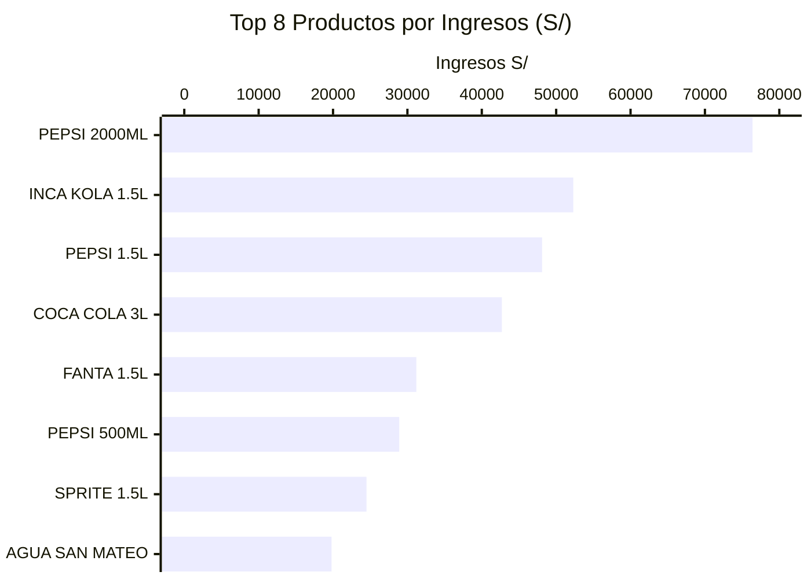
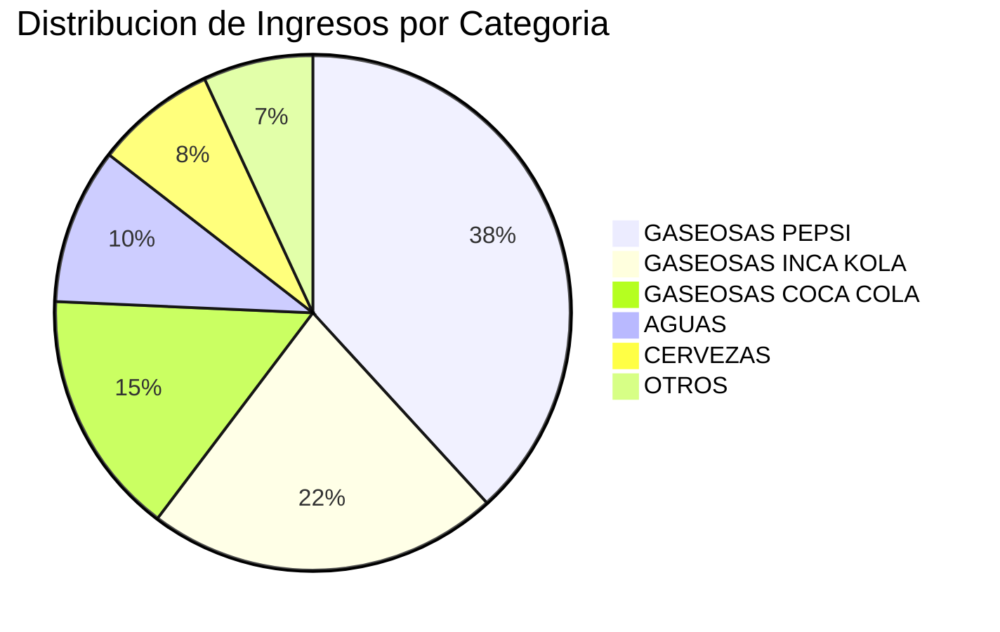
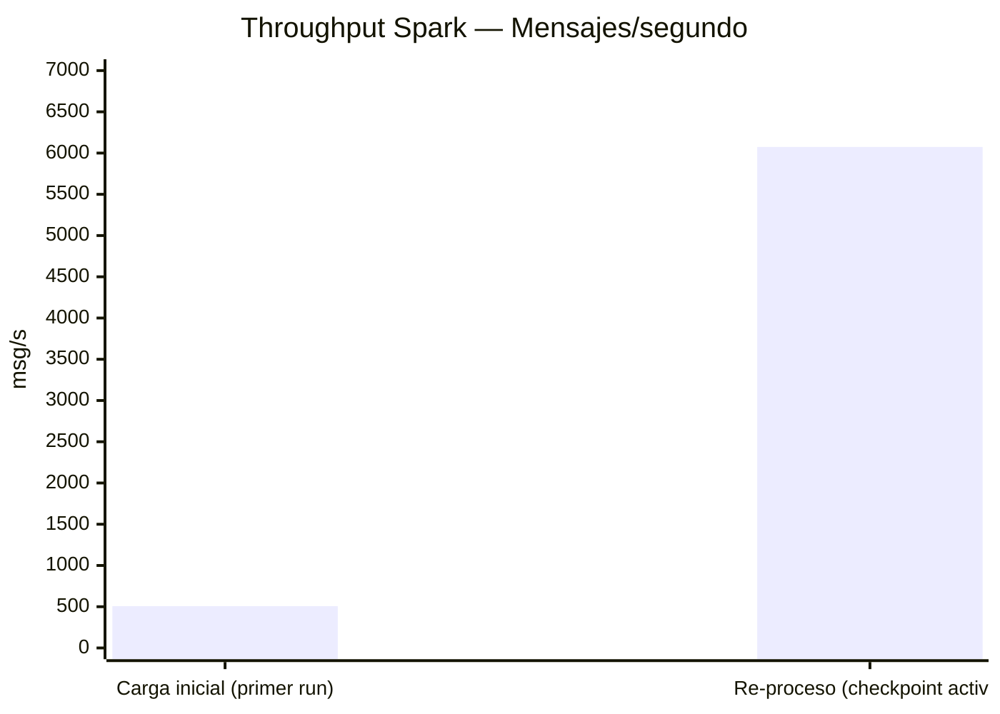
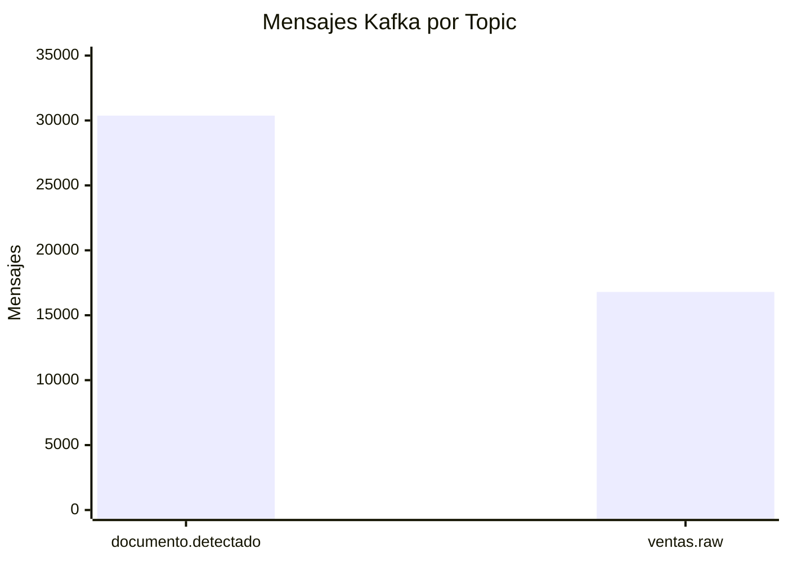

# Metricas del Sistema

## Ventas por Vendedor

Los 6 vendedores activos de IFERSAN durante el periodo Abril–Mayo 2026:

| Vendedor | Transacciones | Ingresos |
|---------|--------------|---------|
| ROSA CUSILAYME | ~4.200 | ~S/ 101.500 |
| JHONATAN (vendedor 2) | ~3.800 | ~S/ 92.000 |
| Vendedor 3 | ~3.100 | ~S/ 75.000 |
| Vendedor 4 | ~2.700 | ~S/ 65.500 |
| Vendedor 5 | ~1.800 | ~S/ 43.600 |
| Vendedor 6 | ~1.194 | ~S/ 28.550 |

> Los valores exactos estan disponibles en el dashboard Grafana S9 (`http://localhost:43000`), panel **Ingresos por Vendedor**.

---

## Top 15 Productos por Ingresos



---

## Distribucion por Categoria



---

## Rendimiento del Pipeline

### Throughput de Spark Structured Streaming



La diferencia de throughput entre la carga inicial y el re-proceso se debe a que en el segundo caso Spark no necesita re-evaluar el schema ni inicializar las conexiones JDBC — simplemente retoma desde el offset del checkpoint.

### Latencia Extremo a Extremo

```mermaid
flowchart LR
    ERP["ERP genera\ndocumento"] -->|"~300s\n(ciclo poll)"| K1["Kafka\ndocumento.detectado"]
    K1 -->|"inmediato\nauto_commit"| DL["Descarga\ndesde S3"]
    DL -->|"variable\nsegun tamano"| FS["Filesystem\n/descargas"]
    FS -->|"~60s\n(ciclo scan)"| PARSE["Parser\npublica filas"]
    PARSE -->|"inmediato"| K2["Kafka\nventas.raw"]
    K2 -->|"~30s\n(trigger Spark)"| PG["PostgreSQL\nventas"]
    PG -->|"inmediato\n(query Grafana)"| GF["Grafana\ndashboard"]
```



| Etapa | Latencia Tipica |
|-------|----------------|
| ERP → Kafka (documento) | ~300 s (ciclo del producer) |
| Kafka → Filesystem (descarga) | 5–60 s (segun tamano del archivo) |
| Filesystem → Kafka (parseo) | ~60 s (ciclo del scanner) |
| Kafka → PostgreSQL (Spark) | ~30 s (trigger) |
| PostgreSQL → Grafana | < 1 s (query en tiempo real) |
| **Total extremo a extremo** | **~7–8 minutos** |

---

## Volumenes de Datos Procesados



| Metrica | Valor |
|---------|-------|
| Documentos unicos en ERP | 175 |
| Mensajes en documento.detectado | 30.372 |
| Diferencia | 30.197 mensajes extra |

> La diferencia entre 175 documentos unicos y 30.372 mensajes se debe a que el producer ha ejecutado multiples ciclos de polling durante el desarrollo y pruebas. El consumer downloader evita re-descargar gracias al estado persistente.

---

## Checkpoints de Spark

Estado de los directorios de checkpoint al cierre del pipeline:

```
output/checkpoints/
├── raw/                    # ventas raw — offset final: 16.794
│   ├── commits/0           # batch ID mas reciente
│   └── offsets/0           # {"casamarket.ventas.raw":{"0":16794}}
│
├── ventanas/               # documentos windowed — offset final: 30.372
│   ├── commits/
│   ├── offsets/
│   └── state/0/0/          # estado de ventanas activas
│
├── metricas/               # latencia — offset sincronizado
│   ├── commits/
│   └── offsets/
│
└── agg/                    # agregaciones por extension
    ├── commits/
    └── offsets/
```

El consumer lag final de **0 mensajes** confirma que Spark proceso todos los mensajes disponibles en ambos topics.
