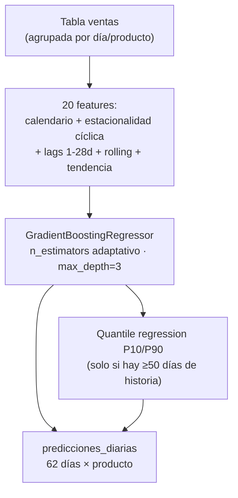

# Predicciones ML

Esta página resume qué produce cada uno de los 6 modelos. El detalle de algoritmos, hiperparámetros y decisiones de diseño está en [Los 6 Modelos de ML](../componentes/ml-prediccion.md); esta página se enfoca en **qué sale** de cada uno.

---

## Modelo 1 — GBM diario por producto

**Salida:** 62 días de predicción por producto, con banda P10/P90, en la tabla `predicciones_diarias`.



**Resultado medido:** MAPE promedio 6.9% (rango 0.4%–33.3%) sobre 51 de 62 productos entrenados — los 11 restantes no tenían historial suficiente en el régimen de ventas estable y quedaron correctamente excluidos en vez de forzar un modelo poco confiable.

---

## Modelo 2 — Forecast mensual agregado

**Salida:** suma de las predicciones diarias del Modelo 1 para el mes calendario siguiente completo, con banda de confianza acumulada, en `predicciones_mes_siguiente`.

No es un modelo nuevo — es agregación SQL sobre la salida del Modelo 1, con una vista adicional (`forecast_top_productos_mes`) que compara la predicción contra lo que va del mes en curso.

---

## Modelo 3 — Modelo mensual directo

**Salida:** predicción del total mensual por producto entrenada directamente sobre series mensuales (no acumulando 31 predicciones diarias), en `predicciones_mensuales`.

| Historia disponible | Método usado |
|:---|:---|
| 1 mes | Baseline: promedio diario × días del mes |
| 2 meses | Fórmula de tendencia simple |
| 3–4 meses | Regresión Ridge |
| ≥5 meses | GradientBoosting (con quantile P10/P90 desde 9 meses) |

Cada predicción trae una etiqueta de **confianza** (ALTA/MEDIA/BAJA) calculada con Leave-One-Out cross-validation — no con el error de entrenamiento, que sería engañosamente optimista con tan pocos puntos.

> Con el volumen de datos de este proyecto (poco más de un mes completo de historia), la mayoría de productos caen todavía en confianza BAJA o MEDIA. Es el comportamiento esperado y documentado del modelo, no un error: mejora automáticamente mes a mes sin cambiar código, a medida que se acumula más historial real.

---

## Modelo 4 — Segmentación de clientes

**Salida:** cada uno de los 1,106 clientes clasificado en VIP / Regular / En Riesgo, en `segmentos_clientes`.

| Segmento | Clientes | Valor medio |
|:---:|:---:|:---:|
| VIP | 203 | S/ 7,662 |
| Regular | 204 | S/ 439 |
| En Riesgo | 699 | S/ 329 |

---

## Modelo 5 — Detección de anomalías

**Salida:** días con ventas anormales por producto, clasificados como `ALTA_VENTA`, `CAIDA_VENTAS` o `INUSUAL`, en `anomalias_detectadas`.

**Resultado:** 155 anomalías detectadas en 56 productos, usando siempre los últimos 60 días *de datos reales* como referencia (no días de calendario), para no confundir "sin datos todavía" con "venta en cero".

---

## Modelo 6 — Predicción por vendedor

**Salida:** forecast de ingresos semanales por vendedor para las próximas 8 semanas, en `predicciones_vendedor`.

Arranca siempre desde la semana inmediatamente posterior al último dato real disponible — no desde "la semana actual del calendario" — para que los lags del modelo no queden desalineados si hay un salto entre el fin de los datos y la fecha de ejecución.

---

## De la predicción a la alerta operativa

Las predicciones del Modelo 1 no se quedan estáticas hasta el próximo reentrenamiento: `job_ml_streaming.py` las usa **cada 30 segundos** para comparar el acumulado real del día contra la banda P10/P90 y clasificar cada producto en `SOBRE_META` / `EN_META` / `EN_RIESGO` / `BAJO_META`, escribiendo en `ventas_ml_scored`. Esa es la diferencia entre "un reporte que se genera cada 30 minutos" y "una alerta que reacciona en el mismo minuto en que entra una venta".

---

## Consulta de verificación

```sql
-- Forecast del mes siguiente, top 10 por producto
SELECT producto,
       ROUND(total_pred::NUMERIC, 0) AS pred,
       ROUND(total_low::NUMERIC,  0) AS p10,
       ROUND(total_high::NUMERIC, 0) AS p90,
       confianza, metodo
FROM ranking_mes_siguiente
LIMIT 10;

-- Calidad del modelo GBM por producto
SELECT producto,
       ROUND(r2::NUMERIC, 3)   AS r2,
       ROUND(mape::NUMERIC, 1) AS mape_pct,
       n_muestras
FROM model_metadata
WHERE modelo = 'productos'
ORDER BY mape;
```

---

## Limitaciones honestas

- El modelo mensual directo (Modelo 3) y el modelo por vendedor (Modelo 6) todavía tienen poco historial — sus bandas de confianza se van a estrechar a medida que el pipeline siga corriendo y acumule meses.
- Todos los modelos entrenan exclusivamente sobre datos de IFERSAN; no hay transferencia de conocimiento entre empresas ni generalización a otros rubros.
- El pico de ventas de mediados de mayo (un cambio temporal y real en un límite de la API del ERP, no un error del pipeline) sigue siendo la razón por la que el Modelo 1 usa una ventana de entrenamiento corta (35 días) en vez de todo el historial disponible — ver el detalle en [Los 6 Modelos de ML](../componentes/ml-prediccion.md).
