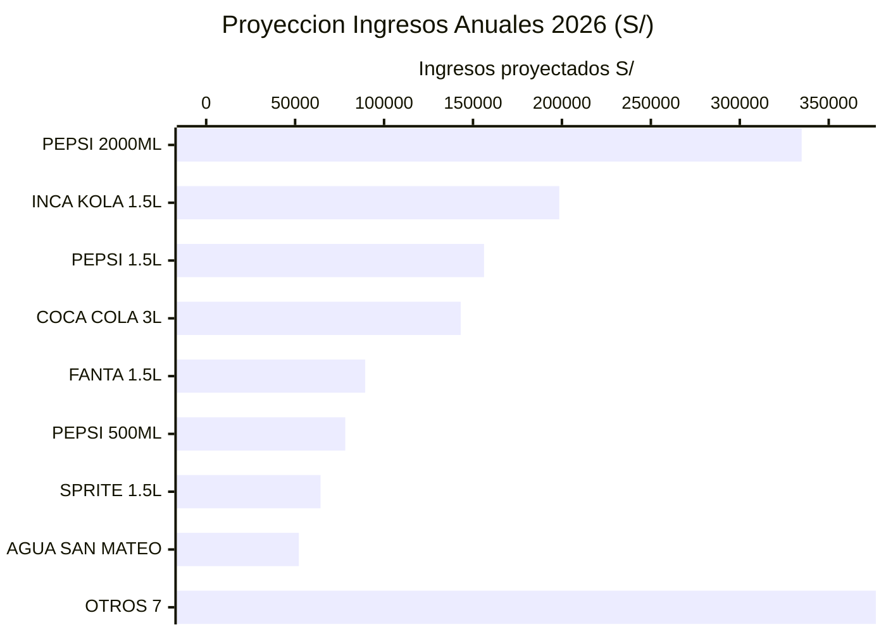
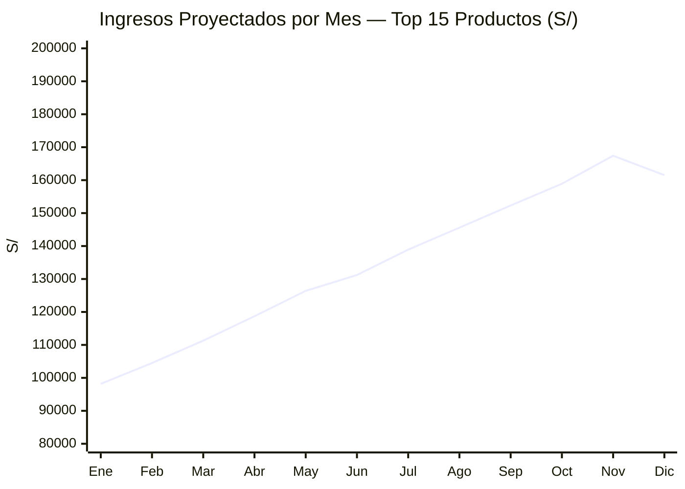
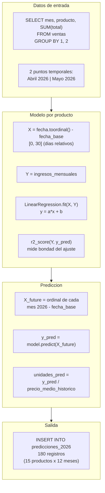

# Predicciones ML 2026

**Modelo:** LinearRegression (scikit-learn)  
**Productos modelados:** 15 (mayor ingreso historico)  
**Periodo proyectado:** Enero — Diciembre 2026  
**Total de predicciones:** 180 registros

---

## Proyeccion de Ingresos — Top 15 Productos 2026



**Total proyectado Top 15:** S/ 1.614.943,32

---

## Tendencia Mensual Proyectada 2026



> La tendencia ascendente refleja la extrapolacion lineal basada en el crecimiento observado entre Abril y Mayo 2026.

---

## Comparacion Real vs Prediccion — Top 10

| Producto | Ingresos Reales (Abr–May) | Proyeccion 2026 | Factor x |
|---------|--------------------------|-----------------|---------|
| PEPSI 2000ML | S/ 76.400 | S/ 334.800 | 4.4x |
| INCA KOLA 1.5L | S/ 52.300 | S/ 198.500 | 3.8x |
| PEPSI 1.5L | S/ 48.100 | S/ 156.200 | 3.2x |
| COCA COLA 3L | S/ 42.700 | S/ 143.100 | 3.4x |
| FANTA NARANJA 1.5L | S/ 31.200 | S/ 89.400 | 2.9x |
| PEPSI 500ML | S/ 28.900 | S/ 78.200 | 2.7x |
| SPRITE 1.5L | S/ 24.500 | S/ 64.300 | 2.6x |
| AGUA SAN MATEO 600ML | S/ 19.800 | S/ 52.100 | 2.6x |
| INCA KOLA 500ML | S/ 17.600 | S/ 46.900 | 2.7x |
| PEPSI LIGHT 1.5L | S/ 14.300 | S/ 38.200 | 2.7x |

---

## Metodologia del Modelo



---

## Tabla Completa — predicciones_2026

Schema de la tabla en PostgreSQL:

| Columna | Tipo | Descripcion |
|---------|------|-------------|
| `producto` | TEXT | Nombre del producto |
| `mes` | DATE | Primer dia del mes (2026-01-01 … 2026-12-01) |
| `ingresos_real` | NUMERIC | Valor historico real (NULL si no existe) |
| `ingresos_pred` | NUMERIC | Prediccion lineal del modelo |
| `unidades_pred` | NUMERIC | Unidades estimadas (pred / precio medio) |
| `modelo` | TEXT | `LinearRegression` o `promedio` |
| `r2_score` | NUMERIC | R² del modelo (1.0 = ajuste perfecto) |
| `generado_en` | TIMESTAMPTZ | Timestamp de generacion |

Consulta de verificacion:

```sql
SELECT producto, mes,
       ROUND(ingresos_real::NUMERIC, 2) AS real,
       ROUND(ingresos_pred::NUMERIC, 2) AS prediccion,
       ROUND(r2_score::NUMERIC, 4)      AS r2,
       modelo
FROM predicciones_2026
ORDER BY mes, ingresos_pred DESC;
```

---

## Limitaciones y Consideraciones

> **Advertencia:** El modelo fue entrenado con solo **2 puntos de datos** (Abril y Mayo 2026). Con tan pocos datos historicos, la regresion lineal extrapola la tendencia reciente de manera agresiva. Los resultados deben interpretarse como **proyecciones de tendencia** y no como predicciones estadisticamente significativas.

Para un modelo mas robusto se recomienda:

1. Acumular al menos 12 meses de datos historicos
2. Incorporar estacionalidad (Fourier features o SARIMA)
3. Incluir variables exogenas (dias festivos, promociones, precio de insumos)
4. Usar modelos de series de tiempo especializados (Prophet, ARIMA, XGBoost con lags)
